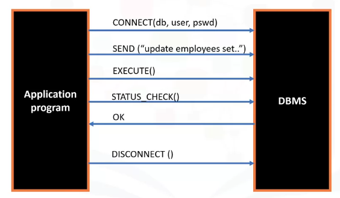

# Importing Datasets

### Colab Link

[Google Colaboratory](https://colab.research.google.com/drive/1JPx1X19bHSvet4L2U0tbz0BlCpAHnn5s)

### Key Concepts

- Understand the Data
- Importing and Exporting Data with Python
- Getting Started Analyzing Data with Python
- Python Packages for Data Science

---

# Understanding the Data

<aside>
🔥 Attributes are the Columns header or data name
Target is the data label we want to find information about through analysis

</aside>

# Importing Datasets

Data is usually stored in plain formats that facilitate teh delivery and use of it. With python libraries like pandas the call and processing to a dataframe is eased while having a convenient way of manipulating the data like matrices and tensors in a fluid fashion with the flexible embedded functions.

Some basic/useful commands:

```python
import pandas as pd
df = pd.read_csv("path_to_datafile") #can swap the "_csv" with _json, _excel, _hdf, _sql
df.describe(include = "all") # Returns a dataframe with basic statistics from the dataset columns like count, mean, std, min, max and quartiles
df.[['col1','col2']].describe()
df.info() # Provides a concise summary of the dataframe
df.head(n) # shows "n" first values
df.tail(n) # shows "n" last values
df.columns = headers # Strings arrays with names, ej. headers = [col1, col2, col3, col4, coln]
df.dropna(subset = ["col_name"], axis = 0)
df.to_csv("path_to_file_export") # exports dataframe to csv, can also swap to other data formats
df.dtypes # shows dataframe data types
```

# Python Packages for Data Science

- Scientific Computing:
    - Pandas (Data structures and tools)
    - NumPy (Arrays and Matrices)
    - SciPy (Integrals, solving differential equations, optimization)
- Visulization:
    - Matplotlib (Plots and Graphs)
    - Seaborn (Plots, avanced (?))
- Algorithmic:
    - Scikit-learn (Machine Learning, regression, classification)
    - Statsmodels
    

# Basic Data Types


# Connecting to Databases

Python can connect to databases and extract data using SQL API's. Basic functionality is shown:



A basic code template is like:

```python
from dbmodule import connect

# Create connection object
connection = connect('database_name','username','password')

# Create a cursor object
cursor = connection.cursor()

# Run queries
cursor.execute('select * from table')
results = cursor.fetchall()

# Free resources
cursor.close()
connection.close()
```