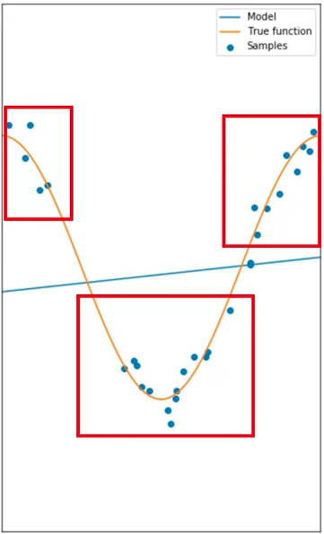

# Model Evaluation and Refinement


## Colab Link

[Google Colaboratory](https://colab.research.google.com/drive/12h2U-pLXFMIHz9O9DPPliG0r35G4Ylxv)

# Model Evaluation

This process returns a metric of how the model performs in the real world. In the previous module, it was all about in-sample evaluation, which tells how well the model fits the data given to training it, yet it does not provide an estimate of how well it will perform with new data. The solution is splitting the data, using the in-sample data or training data to train the model and the rest of it as test data, used as out-of-sample data; this data will show an approximate of how well the model will perform in the real world. Some literature recommends also obtaining validation data, i.e, splitting into train/validation/test.

## Training/Testing Sets

The process goes like this:

- Split dataset into:
    - Training set (70%)
    - Testing set (30%)
- Build and train the model with a training set
- Use testing set to assess the performance of a predictive model
- When testing is complete, use all the data to train the model to get the best performance (without overfitting, that is)

Use train_test_split() method to randomly split into train and test sets

```python
from skelearn.model_selection import train_test_split
x_train, x_test, y_train, y_test = train_test_split(x_data, y_data, test_size=0.3, random_state=0)
```

The random_state parameter is a random seed for random data set splitting

## Generalization Performance

Generalization error is a measure of how well our data does at predicting previously unseen data. The error we obtain using our testing data is an approximation of this error. From the data used for training and testing, there will always be a tradeoff between precision and accuracy. A good model should have high precision and high accuracy. To get good results, cross validation is a good approach.

## Cross Validation

It's one of the most common out-of-sample evaluation metrics and it's a more effective use of the date since each observation is used both for training and testing.

With this method, the whole dataset is split into K groups, know as folds. Some of the folds are then used for training while the remaining are used for testing, then the fitting process occurs and metrics and errors are obtained; the process is repeated until all folds (or partition of folds) are used both for training and testing, having in return, at the end, an array of metrics, which is then averaged to get an estimate of out-of-sample error. This can be done using cross_val_score functions, which performs multiple out-of-sample evaluations and returns an array of scores which can be then averaged

```python
from sklearn.model_selection import cross_val_score
scores = cross_val_score(model_object, x_data, y_data, cv=3)
# With cv=3, the data is split into three equal partitions
np.mean(scores)
```

This returns a predictions array, instead of scores

```python
from sklearn.model_selection import cross_val_predict
yhat = cross_val_predict(model_object, x_data, y_data, cv=3)
```

# Overfitting, Underfitting and Model Selection

For polynomial model, the goal of model selection is to determine the best order of the polynomial that gives an estimate of the function embed in the data. If the model is to simple in order to account for the diversity in the data, it would not be able to give a good estimate of the underlying dynamics, for example, selecting a linear model when the data is representing a non-linear relationship. That is underfitting, when the model is too simple to fit the data:



When a good model is selected, it will not underfit, but rather, it will be able to give a good estimate for the range in the data. This is an example of an 8th order polynomial:


Overfitting occurs when the model gets too complex or takes into account every single datapoint trying to fit all, and looses generalization, which in return damages the overall performance. This is an example of a 16th order polynomial:


With this example, the model does extremely well at tracking the training point but performs poorly at estimating the function. This is especially apparent where there is little training data. The estimated function oscillates not tracking the function. This is called overfitting, where the model is too flexible and fits the noise rather than the function.

Via metrics, a good model can be selected. Plotting the MSE of both the train and test can lead to tell where does the under/overfitting occurs, and find a good point :


Anything too to the left would be underfitting, anything to right would be overfitting. Selecting the best fit does not guarantees optimal performance, since there's still error that comes from the noise, which is random and cannot be predicted; this is also called irreducible error. Other sources of error can also be present, for example, a wrong assumption for the model dynamics. For example, in the following plot, the data is created by a sine wave, therefore, a polynomial model will perform poorly:


Plotting $R^2$ over different polynomial orders as we train and test the data can show the relationship between polynomial order and model precision: 


```python
Rsqu_test=[]
oder = [1,2,3,4]
for n in order:
	pr = PolynomialFeatures(degree=n)
	x_train_pr = pr.fit_transform(x_train[["feature"]])
	x_test_pr = pr.fit_transfrom(x_test[["feature"]])
	pr.fit(x_train, y_train)
	Rsqu_test.append(pr.score(x_test_pr,y_test))
```

# Ridge Regression

This prevents overfitting in polynomial regression by controlling the magnitude of the polynomial coefficients by introducing the parameter alpha. Alpha is a parameter selected before fitting the model. For polynomial functions in high orders, outliers might make the function to fit out-of-dynamic data (outliers), thus, affecting the overall performance; with alpha, the effect of the outliers can be diminished without removing them (either because are unforeseen or rather unremovable).


As alpha increases the parameters get smaller and it's evident the most for the higher order polynomial features. Careful selection must be made, since using an alpha value too large will make the parameters approach zero, thus, underfitting. Conversely, if alpha is zero, overfitting might be evident. In order to select alpha, use cross-validation.

```python
from sklearn.linear_model import Ridge
RidgeModel = Ridge(alpha=0.1)
RidgeModel.fit(X,y)
Yhat = RidgeModel.predict(X)
```

In order to determine the parameter alpha, we use some data for training. We use a second set called validation data. This is similar to test data, but it is used to select parameters like alpha. We start with a small value of alpha. We train the model, make a prediction using the validation data, then calculate the R-squared and store the values. Repeat the value for a different values of alpha.

Plotting $R^2$ vs Alpha yields a metric for selecting a good alpha model


# Grid Search

This method allows scanning through multiple hyper-parameters like alpha using cross-validation. Grid search takes the model that is to be trained and different values of the hyperparameters, it then calculates the MSE o $R^2$ metrics for various hyperparameter values, therefore, allowing the best model selection via selecting the model that minimizes the error the best. To select the hyperparameter, the dataset is split into three parts, training, validation and testing.

The model is fitted with the training portion of the data and various hyperparameters, then, we select the model that optimizes the error on the validation set. Finally, test the model performance with the test set.

The value of the grid search is a python list that contains a python dictionary:

```python
params = [{'hyper_param_1':[1,10,100,1000,n],'hyper_param_2':[True,False]}]
```

```python
from sklearn.linear_model import Ridge
from sklearn.model_selection import GridSearchCV

parameters1 = [{'alpha':[0.001,0.1,1,10,100,1000,10000,100000]}]
RR = Ridge()

Grid1 = GridSearchCV(RR, parameters1, cv=4)
Grid1.fit(x_data[["feature_1","feature_2","feature_n"]],y_data)
Grid1.best_estimator_

scores = Grid1.cv_results_
scores['mean_test_score']
```

# Code Snipplets

### Filter to Numeric Data only

```python
df = df._get_numeric_data()
df.head()
```

### Libraries for plotting

```python
%%capture
! pip install ipywidgets

from IPython.display import display
from IPython.html import widgets 
from IPython.display import display
from ipywidgets import interact, interactive, fixed, interact_manual
```

## Functions for Plotting

### Distribution Plot

```python
def DistributionPlot(RedFunction, BlueFunction, RedName, BlueName, Title):
    width = 12
    height = 10
    plt.figure(figsize=(width, height))

    ax1 = sns.distplot(RedFunction, hist=False, color="r", label=RedName)
    ax2 = sns.distplot(BlueFunction, hist=False, color="b", label=BlueName, ax=ax1)

    plt.title(Title)
    plt.xlabel('Price (in dollars)')
    plt.ylabel('Proportion of Cars')

    plt.show()
    plt.close()
```

### Polynomial Plot

```python
def PollyPlot(xtrain, xtest, y_train, y_test, lr,poly_transform):
    width = 12
    height = 10
    plt.figure(figsize=(width, height))
    
    
    #training data 
    #testing data 
    # lr:  linear regression object 
    #poly_transform:  polynomial transformation object 
 
    xmax=max([xtrain.values.max(), xtest.values.max()])

    xmin=min([xtrain.values.min(), xtest.values.min()])

    x=np.arange(xmin, xmax, 0.1)

    plt.plot(xtrain, y_train, 'ro', label='Training Data')
    plt.plot(xtest, y_test, 'go', label='Test Data')
    plt.plot(x, lr.predict(poly_transform.fit_transform(x.reshape(-1, 1))), label='Predicted Function')
    plt.ylim([-10000, 60000])
    plt.ylabel('Price')
    plt.legend()
```

## Split Target and Features Data

```python
y_data = df['price']
x_data = df.drop('price',axis=1)
```

## Obtain Test and Train Data

```python
from sklearn.model_selection import train_test_split

x_train, x_test, y_train, y_test = train_test_split(x_data, y_data, test_size=0.15, random_state=1)

print("number of test samples :", x_test.shape[0])
print("number of training samples:",x_train.shape[0])
```

## Fit and Obtain Scores

```python
from sklearn.linear_model import LinearRegression

lre=LinearRegression()
lre.fit(x_train[['horsepower']], y_train)

lre.score(x_train[['horsepower']], y_train)
lre.score(x_test[['horsepower']], y_test)
```

## Cross Validation

```python
from sklearn.model_selection import cross_val_score

Rcross = cross_val_score(lre, x_data[['horsepower']], y_data, cv=4)
print("The mean of the folds are", Rcross.mean(), "and the standard deviation is" , Rcross.std())
```

Can use negative squared error as a score by setting the parameter 'scoring' metric to 'neg_mean_squared_error'

```python
-1 * cross_val_score(lre,x_data[['horsepower']], y_data,cv=4,scoring='neg_mean_squared_error')
```

Use cross validation to predict

```python
from sklearn.model_selection import cross_val_predict

yhat = cross_val_predict(lre,x_data[['horsepower']], y_data,cv=4)
yhat[0:5]
```

## Overfitting

### Multiple Linear Regression

An example using multiple linear regression. Create the object, fit, predict and store:

```python
lr = LinearRegression()
lr.fit(x_train[['horsepower', 'curb-weight', 'engine-size', 'highway-mpg']], y_train)
yhat_train = lr.predict(x_train[['horsepower', 'curb-weight', 'engine-size', 'highway-mpg']])
yhat_test = lr.predict(x_test[['horsepower', 'curb-weight', 'engine-size', 'highway-mpg']])
```

and plot, using the previous functions definition:

```python
import matplotlib.pyplot as plt
%matplotlib inline
import seaborn as sns

Title = 'Distribution  Plot of  Predicted Value Using Training Data vs Training Data Distribution'
DistributionPlot(y_train, yhat_train, "Actual Values (Train)", "Predicted Values (Train)", Title)

Title = 'Distribution  Plot of  Predicted Value Using Test Data vs Data Distribution of Test Data'
DistributionPlot(y_test,yhat_test,"Actual Values (Test)","Predicted Values (Test)",Title)
```

### Polynomial Regression

Same exercise with polynomial:

```python
from sklearn.preprocessing import PolynomialFeatures
pr = PolynomialFeatures(degree=5)
x_train_pr = pr.fit_transform(x_train[['horsepower']])
x_test_pr = pr.fit_transform(x_test[['horsepower']])
pr

poly = LinearRegression()
poly.fit(x_train_pr, y_train)

yhat = poly.predict(x_test_pr)

print("Predicted values:", yhat[0:4])
print("True values:", y_test[0:4].values)

PollyPlot(x_train[['horsepower']], x_test[['horsepower']], y_train, y_test, poly,pr)

poly.score(x_train_pr, y_train)
poly.score(x_test_pr, y_test)
```

Calculate Score for different polynomials order:

```python
Rsqu_test = []

order = [1, 2, 3, 4]
for n in order:
    pr = PolynomialFeatures(degree=n)
    
    x_train_pr = pr.fit_transform(x_train[['horsepower']])
    
    x_test_pr = pr.fit_transform(x_test[['horsepower']])    
    
    lr.fit(x_train_pr, y_train)
    
    Rsqu_test.append(lr.score(x_test_pr, y_test))

plt.plot(order, Rsqu_test)
plt.xlabel('order')
plt.ylabel('R^2')
plt.title('R^2 Using Test Data')
plt.text(3, 0.75, 'Maximum R^2 ')
```

## Interactive Fitting and Plotting Function

Using Jupyter Notebooks:

```python
def f(order, test_data):
    x_train, x_test, y_train, y_test = train_test_split(x_data, y_data, test_size=test_data, random_state=0)
    pr = PolynomialFeatures(degree=order)
    x_train_pr = pr.fit_transform(x_train[['horsepower']])
    x_test_pr = pr.fit_transform(x_test[['horsepower']])
    poly = LinearRegression()
    poly.fit(x_train_pr,y_train)
    PollyPlot(x_train[['horsepower']], x_test[['horsepower']], y_train,y_test, poly, pr)

interact(f, order=(0, 6, 1), test_data=(0.05, 0.95, 0.05))
```

## Multiple Features Polynomial

```python
pr1=PolynomialFeatures(degree=2)
x_train_pr1=pr1.fit_transform(x_train[['horsepower', 'curb-weight', 'engine-size', 'highway-mpg']])
x_test_pr1=pr1.fit_transform(x_test[['horsepower', 'curb-weight', 'engine-size', 'highway-mpg']])

poly1=linear_model.LinearRegression().fit(x_train_pr1,y_train)

yhat_test1=poly1.predict(x_test_pr1)
Title='Distribution  Plot of  Predicted Value Using Test Data vs Data Distribution of Test Data'
DistributionPlot(y_test, yhat_test1, "Actual Values (Test)", "Predicted Values (Test)", Title)
```

## Ridge Regression

```python
pr=PolynomialFeatures(degree=2)
x_train_pr=pr.fit_transform(x_train[['horsepower', 'curb-weight', 'engine-size', 'highway-mpg','normalized-losses','symboling']])
x_test_pr=pr.fit_transform(x_test[['horsepower', 'curb-weight', 'engine-size', 'highway-mpg','normalized-losses','symboling']])
```

```python
from sklearn.linear_model import Ridge
RigeModel=Ridge(alpha=0.1)
RigeModel.fit(x_train_pr, y_train)
yhat = RigeModel.predict(x_test_pr)
print('predicted:', yhat[0:4])
print('test set :', y_test[0:4].values)
```

```python
Rsqu_test = []
Rsqu_train = []
dummy1 = []
Alpha = 10 * np.array(range(0,1000))
for alpha in Alpha:
    RigeModel = Ridge(alpha=alpha) 
    RigeModel.fit(x_train_pr, y_train)
    Rsqu_test.append(RigeModel.score(x_test_pr, y_test))
    Rsqu_train.append(RigeModel.score(x_train_pr, y_train))

width = 12
height = 10
plt.figure(figsize=(width, height))

plt.plot(Alpha,Rsqu_test, label='validation data  ')
plt.plot(Alpha,Rsqu_train, 'r', label='training Data ')
plt.xlabel('alpha')
plt.ylabel('R^2')
plt.legend()
```

## Grid Search

```python
from sklearn.model_selection import GridSearchCV
parameters1= [{'alpha': [0.001,0.1,1, 10, 100, 1000, 10000, 100000, 100000]}]
parameters1

RR=Ridge()
RR

Grid1 = GridSearchCV(RR, parameters1,cv=4)
Grid1.fit(x_data[['horsepower', 'curb-weight', 'engine-size', 'highway-mpg']], y_data)

BestRR=Grid1.best_estimator_
BestRR

BestRR.score(x_test[['horsepower', 'curb-weight', 'engine-size', 'highway-mpg']], y_test)
```

```python
parameters2= [{'alpha': [0.001,0.1,1, 10, 100, 1000,10000,100000,100000],'normalize':[True,False]} ]
Grid2 = GridSearchCV(Ridge(), parameters2,cv=4)
Grid2.fit(x_data[['horsepower', 'curb-weight', 'engine-size', 'highway-mpg']],y_data)
Grid2.best_estimator_
```