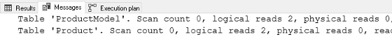
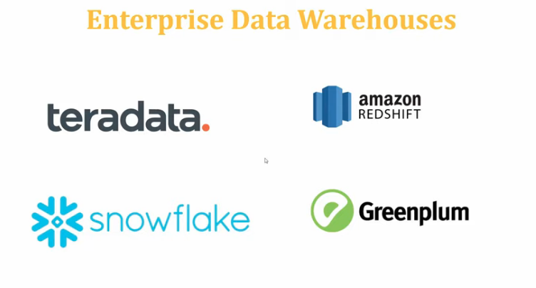

# Data Engineer


Tons of SQL

# Execution Plans

To be able to execute queries, the SQL Server Database Engine must analyze the statement to determine the most efficient way to access the required data. This analysis is handled by a component called the Query Optimizer. The input to the Query Optimizer consists of the query, the database schema (table and index definitions), and the database statistics. The output of the Query Optimizer is a query execution plan, sometimes referred to as a query plan, or execution plan.

A query execution plan is a definition of the following:

- **The sequence in which the source tables are accessed.** Typically, there are many sequences in which the database server can access the base tables to build the result set. For example, if a `SELECT` statement references three tables, the database server could first access `TableA`, use the data from `TableA` to extract matching rows from `TableB`, and then use the data from `TableB` to extract data from `TableC`. The other sequences in which the database server could access the tables are:`TableC`, `TableB`, `TableA`, or`TableB`, `TableA`, `TableC`, or`TableB`, `TableC`, `TableA`, or`TableC`, `TableA`, `TableB`
- **The methods used to extract data from each table.** Generally, there are different methods for accessing the data in each table. If only a few rows with specific key values are required, the database server can use an index. If all the rows in the table are required, the database server can ignore the indexes and perform a table scan. If all the rows in a table are required but there is an index whose key columns are in an `ORDER BY`, performing an index scan instead of a table scan may save a separate sort of the result set. If a table is very small, table scans may be the most efficient method for almost all access to the table.
- **The methods used to compute calculations, and how to filter, aggregate, and sort data from each table.** As data is accessed from tables, there are different methods to perform calculations over data such as computing scalar values, and to aggregate and sort data as defined in the query text, for example when using a `GROUP BY` or `ORDER BY` clause, and how to filter data, for example when using a `WHERE` or `HAVING` clause.

SQL Server Management Studio has three options to display execution plans:

- The ***[Estimated Execution Plan](https://docs.microsoft.com/es-es/sql/relational-databases/performance/display-the-estimated-execution-plan?view=sql-server-ver15)*** is the compiled plan, as produced by the Query Optimizer based on estimations. This is the query plan that is stored in the plan cache.
- The ***[Actual Execution Plan](https://docs.microsoft.com/es-es/sql/relational-databases/performance/display-an-actual-execution-plan?view=sql-server-ver15)*** is the compiled plan plus its **[execution context](https://docs.microsoft.com/es-es/sql/relational-databases/query-processing-architecture-guide?view=sql-server-ver15#execution-plan-caching-and-reuse)**. It becomes available **after the query execution has completed**. This includes actual runtime information such as execution warnings, or in newer versions of the Database Engine, the elapsed and CPU time used during execution.
- The ***[Live Query Statistics](https://docs.microsoft.com/es-es/sql/relational-databases/performance/live-query-statistics?view=sql-server-ver15)*** is the compiled plan plus its execution context. It is available for **in-flight query executions**, and updated every second. This includes runtime information such as the actual number of rows flowing through the **[operators](https://docs.microsoft.com/es-es/sql/relational-databases/showplan-logical-and-physical-operators-reference?view=sql-server-ver15)**, elapsed time, and the estimated query progress.

# Query Optimization

In SSMS - Tools | Database Engine Tuning Advisor

Step #1 is to step back and understand the query. Some helpful questions that can aid in optimization:

- **How large is the result set?** Should we brace ourselves for a million rows returned, or just a few?
- **Are there any parameters that have limited values?** Will a given parameter always have the same value, or are there other limitations on values that can simplify our work by eliminating avenues of research.
- **How often is the query executed?** Something that occurs once a day will be treated very differently than one that is run every second.
- **Are there any invalid or unusual input values that are indicative of an application problem?** Is one input set to NULL, but never should be NULL? Are any other inputs set to values that make no sense, are contradictory, or otherwise go against the use-case of the query?
- **Are there any obvious logical, syntactical, or optimization problems staring us in the face?**Do we see any immediate performance bombs that will always perform poorly, regardless of parameter values or other variables? More on these later when we discuss optimization techniques.
- **What is acceptable query performance?** How fast must the query be for its consumers to be happy? If server performance is poor, how much do we need to decrease resource consumption for it to be acceptable? Lastly, what is the current performance of the query? This will provide us with a baseline so we know how much improvement is needed.

The results of this additional foresight will often lead us to more innovative solutions. Maybe a new index isn’t needed and we can break a big query into a few smaller ones. Maybe one parameter value is incorrect and there is a problem in code or the UI that needs to be resolved. Maybe a report is run once a week, so we can pre-cache the data set and send the results to an email, dashboard, or file, rather than force a user wait 10 minutes for it interactively.

## Tools

### Execution Plans

An execution plan provides a graphical representation of how the query optimizer chose to execute a query:


The execution plan shows us which tables were accessed, how they were accessed, how they were joined together, and any other operations that occurred along the way. Included are query costs, which are estimates of the overall expense of any query component. A treasure trove of data is also included, such as row size, CPU cost, I/O cost, and details on which indexes were utilized.

### Statistics IO

This allows us to see how many logical and physical reads are made when a query is executed and may be turned on interactively in SQL Server Management Studio by running the following TSQL:

SET STATISTICS IO ON;

Once on, we will see additional data included in the Messages pane:



Logical reads tell us how many reads were made from the buffer cache. This is the number that we will refer to whenever we talk about how many reads a query is responsible for, or how much IO it is causing.

Physical reads tell us how much data was read from a storage device as it was not yet present in memory. This can be a useful indication of buffer cache/memory capacity problems if data is very frequently being read from storage devices, rather than memory.

In general, IO will be the primary cause of latency and bottlenecks when analyzing slow queries. The unit of measurement of STATISTICS IO = 1 read = a single 8kb page = 8192 bytes.

## What Does the Query Optimizer Do?

Every query follows the same basic process from TSQL to completing execution on a SQL Server:


### **Parsing**

is the process by which query syntax is checked. Are keywords valid and are the rules of the TSQL language being followed correctly. If you made a spelling error, named a column using a reserved word, or forgot a semicolon before a common table expression, this is where you’ll get error messages informing you of those problems.

### **Binding**

checks all objects referenced in your TQL against the system catalogs and any temporary objects defined within your code to determine if they are both valid and referenced correctly. Information about these objects is retrieved, such as data types, constraints, and if a column allows NULL or not. The result of this step is a query tree that is composed of a basic list of the processes needed to execute the query. This provides basic instructions, but does not yet include specifics, such as which indexes or joins to use.

### **Optimization**

is the process that we will reference most often here. The optimizer operates similarly to a chess (or any gaming) computer. It needs to consider an immense number of possible moves as quickly as possible, remove the poor choices, and finish with the best possible move. At any point in time, there may be millions of combinations of moves available for the computer to consider, of which only a handful will be the best possible moves. Anyone that has played chess against a computer knows that the less time the computer has, the more likely it is to make an error.

In the world of SQL Server, we will talk about execution plans instead of chess moves. The execution plan is the set of specific steps that the execution engine will follow to process a query. Every query has many choices to make to arrive at that execution plan and must do so in a very short span of time.

These choices include questions such as:

- What order should tables be joined?
- What joins should be applied to tables?
- Which indexes should be used?
- Should a seek or scan be used against a given table?
- Is there a benefit in caching data in a worktable or spooling data for future use?

Any execution plan that is considered by the optimizer must return the same results, but the performance of each plan may differ due to those questions above (and many more!).

Query optimization is a CPU-intensive operation. The process to sift through plans requires significant computing resources and to find the best plan may require more time than is available. As a result, a balance must be maintained between the resources needed to optimize the query, the resources required to execute the query, and the time we must wait for the entire process to complete. As a result, the optimizer is not built to select the best execution plan, but instead to search and find the best possible plan after a set amount of time passes. It may not be the perfect execution plan, but we accept that as a limitation of how a process with so many possibilities must operate.

The metric used to judge execution plans and decide which to consider or not is query cost. The cost has no unit and is a relative measure of the resources required to execute each step of an execution plan. The overall query cost is the sum of the costs of each step within a query.

### Execution

is the final step. SQL Server takes the execution plan that was identified in the optimization step and follows those instructions in order to execute the query.

A note on **plan reuse**: Because optimizing is an inherently expensive process, SQL Server maintains an execution plan cache that stores details about each query executed on a server and the plan that was chosen for it. Typically, databases experience the same queries executed over and over again, such as a web search, order placement, or social media post. Reuse allows us to avoid the expensive optimization process and rely on the work we have previously done to optimize a query.

When a query is executed that already has a valid plan in cache, that plan will be chosen, rather than going through the process of building a new one. This saves computing resources and speeds up query execution immensely. We’ll discuss plan reuse more in a future article when we tackle parameter sniffing.

# Views

A view is a virtual table whose contents are defined by a query. Like a table, a view consists of a set of named columns and rows of data. Unless indexed, a view does not exist as a stored set of data values in a database. The rows and columns of data come from tables referenced in the query defining the view and are produced dynamically when the view is referenced.

A view acts as a filter on the underlying tables referenced in the view. The query that defines the view can be from one or more tables or from other views in the current or other databases. Distributed queries can also be used to define views that use data from multiple heterogeneous sources. This is useful, for example, if you want to combine similarly structured data from different servers, each of which stores data for a different region of your organization.

## **Types of Views**

Besides the standard role of basic user-defined views, SQL Server provides the following types of views that serve special purposes in a database.

### Indexed Views

An indexed view is a view that has been materialized. This means the view definition has been computed and the resulting data stored just like a table. You index a view by creating a unique clustered index on it. Indexed views can dramatically improve the performance of some types of queries. Indexed views work best for queries that aggregate many rows. They are not well-suited for underlying data sets that are frequently updated.

### Partitioned Views

A partitioned view joins horizontally partitioned data from a set of member tables across one or more servers. This makes the data appear as if from one table. A view that joins member tables on the same instance of SQL Server is a local partitioned view.

### System Views

System views expose catalog metadata. You can use system views to return information about the instance of SQL Server or the objects defined in the instance. For example, you can query the sys.databases catalog view to return information about the user-defined databases available in the instance. For more information, see [System Views (Transact-SQL)](https://docs.microsoft.com/en-us/sql/t-sql/language-reference?view=sql-server-ver15)

You can create views in SQL Server 2019 (15.x) by using SQL Server Management Studio or Transact-SQL. A view can be used for the following purposes:

- To focus, simplify, and customize the perception each user has of the database.
- As a security mechanism by allowing users to access data through the view, without granting the users permissions to directly access the underlying base tables.
- To provide a backward compatible interface to emulate a table whose schema has changed.

### **Limitations and Restrictions**

A view can be created only in the current database.

A view can have a maximum of 1,024 columns.

### **Permissions**

Requires CREATE VIEW permission in the database and ALTER permission on the schema in which the view is being created.

## **Using SQL Server Management Studio**

### **To create a view by using the Query and View Designer**

1. In **Object Explorer**, expand the database where you want to create your new view.
2. Right-click the **Views** folder, then click **New View...**.
3. In the **Add Table** dialog box, select the element or elements that you want to include in your new view from one of the following tabs: Tables, Views, Functions, and Synonyms.
4. Click **Add**, then click **Close**.
5. In the **Diagram Pane**, select the columns or other elements to include in the new view.
6. In the **Criteria Pane**, select additional sort or filter criteria for the columns.
7. On the **File** menu, click **Save***view name*.
8. In the **Choose Name** dialog box, enter a name for the new view and click **OK**.

## Ejemplo

Puede utilizar SQL para crear una vista en las tablas y clases de entidad en una geodatabase corporativa.

Los ejemplos en este tema muestran cómo se puede utilizar una vista simple creada en Microsoft SQL Server para restringir el acceso de usuario a columnas específicas. El ejemplo se basa en una tabla con la siguiente definición:

```sql
CREATE TABLE employees(   emp_id integer not null,    name nvarchar(32),    department smallint not null,    hire_date datetime2 not null );
```

### **Otorgar privilegios en la tabla**

Si el usuario que crea la vista no es el propietario de la tabla o las tablas en las que se basa la vista, el propietario de la tabla debe otorgarle al creador de la vista como mínimo el privilegio de selección en la tabla.

En este ejemplo, la tabla en la que se basa la vista (empleados) pertenece al usuario gdb. El usuario que crea la vista es el usuario rocket.

```sql
GRANT SELECT 
 ON employees 
 TO rocket;
```

### **Crear una vista**

En este ejemplo, el usuario rocket crea una vista en la tabla de empleados para restringir el acceso solo a aquellos registros en los que el departamento es 201:

```sql
CREATE VIEW view_dept_201
 AS SELECT emp_id, name, hire_date
 FROM gdb.employees
 WHERE department = 201;
```

### **Otorgar privilegios en la vista**

Puede otorgar privilegios en la vista a usuarios específicos sin tener que otorgarle a estos usuarios acceso a la tabla base (empleados). En este ejemplo, al usuario mgr200 se le otorgan privilegios SELECT en la vista, view_dept_201:

```sql
GRANT SELECT
ON view_dept_201
TO mgr200;
```

### **Probar privilegios**

Inicie sesión como mgr200 y seleccione registros en view_dept_201:

```sql
EXECUTE AS mgr200;

SELECT * FROM rocket.view_dept_201;

emp_id   name        hire_date 
112      LOLLI POP   06/30/2007 
134      VAN CHIN    10/15/2007 
150      DON GUN     03/01/2009
```

# Materialized Views

In [computing](https://en.wikipedia.org/wiki/computing), a **materialized view** is a [database](https://en.wikipedia.org/wiki/database) object that contains the results of a [query](https://en.wikipedia.org/wiki/query_(databases)). For example, it may be a local copy of data located remotely, or may be a subset of the rows and/or columns of a table or [join](https://en.wikipedia.org/wiki/join_(sql)) result, or may be a summary using an [aggregate function](https://en.wikipedia.org/wiki/aggregate_function).

The process of setting up a materialized view is sometimes called **materialization**.[[1]](https://en.wikipedia.org/wiki/Materialized_view#cite_note-Date2006-1) This is a form of [caching](https://en.wikipedia.org/wiki/cache_(computing)) the results of a query, similar to [memoization](https://en.wikipedia.org/wiki/memoization) of the value of a function in functional languages, and it is sometimes described as a form of [precomputation](https://en.wikipedia.org/wiki/precomputation).[[2]](https://en.wikipedia.org/wiki/Materialized_view#cite_note-MortonOsborne2013-2)[[3]](https://en.wikipedia.org/wiki/Materialized_view#cite_note-AufaureZim%C3%A1nyi2012-3) As with other forms of precomputation, database users typically use materialized views for performance reasons, i.e. as a form of optimization.[[4]](https://en.wikipedia.org/wiki/Materialized_view#cite_note-Gonzales2003-4)

Materialized views which store data based on remote tables were also known as [snapshots](https://en.wikipedia.org/wiki/snapshot_(computer_storage)#In_databases)[[5]](https://en.wikipedia.org/wiki/Materialized_view#cite_note-5), (deprecated Oracle terminology).

In any database management system following the relational model, a view is a virtual table representing the result of a database query. Whenever a query or an update addresses an ordinary view's virtual table, the DBMS converts these into queries or updates against the underlying base tables. A materialized view takes a different approach: the query result is cached as a concrete ("materialized") table (rather than a view as such) that may be updated from the original base tables from time to time. This enables much more efficient access, at the cost of extra storage and of some data being potentially out-of-date. Materialized views find use especially in data warehousing scenarios, where frequent queries of the actual base tables can be expensive.

A Materialized View persists the data returned from the view definition query and automatically gets updated as data changes in the underlying tables. It improves the performance of complex queries (typically queries with joins and aggregations) while offering simple maintenance operations. With its execution plan automatching capability, a materialized view does not have to be referenced in the query for the optimizer to consider the view for substitution. This capability allows data engineers to implement materialized views as a mechanism for improving query response time, without having to change queries.

## Implementations

### **Oracle**

Materialized views were implemented first by the [Oracle Database](https://en.wikipedia.org/wiki/oracle_database): the Query rewrite feature was added from version 8i.[[6]](https://en.wikipedia.org/wiki/Materialized_view#cite_note-6)

Example syntax to create a materialized view in Oracle:

```sql
**CREATE** **MATERIALIZED** **VIEW** MV_MY_VIEW
**REFRESH** FAST **START** **WITH** SYSDATE 
**NEXT** SYSDATE + 1 
**AS** **SELECT** * **FROM** <table_name>;
```

### **PostgreSQL**

In [PostgreSQL](https://en.wikipedia.org/wiki/postgresql), version 9.3 and newer natively support materialized views.[[7]](https://en.wikipedia.org/wiki/Materialized_view#cite_note-7) In version 9.3, a materialized view is not auto-refreshed, and is populated only at time of creation (unless `WITH NO DATA` is used). It may be refreshed later manually using `REFRESH MATERIALIZED VIEW`.[[8]](https://en.wikipedia.org/wiki/Materialized_view#cite_note-8) In version 9.4, the refresh may be concurrent with selects on the materialized view if `CONCURRENTLY` is used.[[9]](https://en.wikipedia.org/wiki/Materialized_view#cite_note-9)

Example syntax to create a materialized view in PostgreSQL:

```sql
**CREATE** **MATERIALIZED** **VIEW** MV_MY_VIEW 
[ **WITH** (storage_parameter [= **value**] [, ... ]) ] 
[ **TABLESPACE** tablespace_name ] 
**AS** **SELECT** * **FROM** <table_name>;
```

### **SQL Server**

Microsoft SQL Server differs from other RDBMS by the way of implementing materialized view via a concept known as "Indexed Views". The main difference is that such views do not require a refresh because they are in fact always synchronized to the original data of the tables that compound the view. To achieve this, it is necessary that the lines of origin and destination are "deterministic" in their mapping which limits the types of possible queries to do this. This mechanism has been realised since the 2000 version of SQL Server.

Example syntax to create a materialized view in SQL Server:

```sql
**CREATE** **VIEW** MV_MY_VIEW
**WITH** SCHEMABINDING
**AS SELECT** COL1, SUM(COL2) **AS** TOTAL
**FROM** <table_name>
**GROUP** **BY** COL1;
**GO
CREATE** **UNIQUE** **CLUSTERED** **INDEX** XV **ON** MV_MY_VIEW (COL1);
```

# ETL

ETL stands for Extract, Transform and Load. It is the process in which the Data is extracted from any data sources and transformed into a proper format for storing and future reference purpose. Finally, this data is loaded into the database. Modern applications and working methodology require real-time data for processing purposes and in order to satisfy this purpose, there are various ETL tools available in the market. Using such databases and ETL tools makes the data management task much easier and simultaneously improves data warehousing.

Some examples of tools for ETL are Informatica, Azure Data Factory




# Data Models

is an abstract model that organizes elements of data and standardizes how they relate to one another and to the properties of real-world entities. For instance, a data model may specify that the data element representing a car be composed of a number of other elements which, in turn, represent the color and size of the car and define its owner.  A data model explicitly determines the structure of data. Data models are typically specified by a data specialist, data librarian, or a digital humanities scholar in a data modeling notation. These notations are often represented in graphical form. 

### **Three perspectives**


The ANSI/SPARC [three level architecture](https://en.wikipedia.org/wiki/three_schema_approach)

This shows that a data model can be an external model (or view), a conceptual model, or a physical model. This is not the only way to look at data models, but it is a useful way, particularly when comparing models.

A data model instance may be one of three kinds according to [ANSI](https://en.wikipedia.org/wiki/ansi) in 1975:[[9]](https://en.wikipedia.org/wiki/Data_model#cite_note-9)

- [Conceptual data model](https://en.wikipedia.org/wiki/conceptual_data_model) : describes the semantics of a domain, being the scope of the model. For example, it may be a model of the interest area of an organization or industry. This consists of entity classes, representing kinds of things of significance in the domain, and relationship assertions about associations between pairs of entity classes. A conceptual schema specifies the kinds of facts or propositions that can be expressed using the model. In that sense, it defines the allowed expressions in an artificial 'language' with a scope that is limited by the scope of the model.
- [Logical data model](https://en.wikipedia.org/wiki/logical_data_model) : describes the semantics, as represented by a particular data manipulation technology. This consists of descriptions of tables and columns, object oriented classes, and XML tags, among other things.
- [Physical data model](https://en.wikipedia.org/wiki/physical.md) : describes the physical means by which data are stored. This is concerned with partitions, CPUs, tablespaces, and the like.

### **Database model**

*Main article: [Database model](https://en.wikipedia.org/wiki/acid_vs_base_model.md)*

A database model is a specification describing how a database is structured and used.

Several such models have been suggested. Common models include:

**[Flat model](https://en.wikipedia.org/wiki/flat_file_database)** This may not strictly qualify as a data model. The flat (or table) model consists of a single, two-dimensional array of data elements, where all members of a given column are assumed to be similar values, and all members of a row are assumed to be related to one another.

**[Hierarchical model](https://en.wikipedia.org/wiki/hierarchical_data_storage.md)** The hierarchical model is similar to the network model except that links in the hierarchical model form a tree structure, while the network model allows arbitrary graph.

**[Network model](https://en.wikipedia.org/wiki/network.md)** This model organizes data using two fundamental constructs, called records and sets. Records contain fields, and sets define one-to-many relationships between records: one owner, many members. The network data model is an abstraction of the design concept used in the implementation of databases.

**[Relational model](https://en.wikipedia.org/wiki/relational_model)** is a database model based on first-order predicate logic. Its core idea is to describe a database as a collection of predicates over a finite set of predicate variables, describing constraints on the possible values and combinations of values. The power of the relational data model lies in its mathematical foundations and a simple user-level paradigm.

**[Object-relational model](https://en.wikipedia.org/wiki/object-relational_model)** Similar to a relational database model, but objects, classes and inheritance are directly supported in [database schemas](https://en.wikipedia.org/wiki/database_schema) and in the query language. 

**[Object-role modeling](https://en.wikipedia.org/wiki/object-role_modeling)** A method of data modeling that has been defined as "attribute free", and "fact based". The result is a verifiably correct system, from which other common artifacts, such as ERD, UML, and semantic models may be derived. Associations between data objects are described during the database design procedure, such that normalization is an inevitable result of the process.

**[Star schema](https://en.wikipedia.org/wiki/schema.md)** The simplest style of data warehouse schema. The star schema consists of a few "fact tables" (possibly only one, justifying the name) referencing any number of "dimension tables". The star schema is considered an important special case of the [snowflake schema](https://en.wikipedia.org/wiki/snowflake_schema).


# Business Intelligence

Business intelligence (BI) combines business analytics, data mining, data visualization, data tools and infrastructure, and best practices to help organizations to make more data-driven decisions. In practice, you know you’ve got modern business intelligence when you have a comprehensive view of your organization’s data and use that data to drive change, eliminate inefficiencies, and quickly adapt to market or supply changes.

The use of tools like Tableau, Power BI, Google Data Studio, among other empowers the analysis of data

Much more than a specific “thing,” business intelligence is rather an umbrella term that covers the processes and methods of collecting, storing, and analyzing data from business operations or activities to optimize performance. All of these things come together to create a comprehensive view of a business to help people make better, actionable decisions.

Over the past few years, business intelligence has evolved to include more processes and activities to help improve performance. These processes include:

- **Data mining:** Using databases, statistics and machine learning to uncover trends in large datasets.
- **Reporting:** Sharing data analysis to stakeholders so they can draw conclusions and make decisions.
- **Performance metrics and benchmarking:** Comparing current performance data to historical data to track performance against goals, typically using customized dashboards.
- **Descriptive analytics:** Using preliminary data analysis to find out what happened.
- **Querying:** Asking the data specific questions, BI pulling the answers from the datasets.
- **Statistical analysis:** Taking the results from descriptive analytics and further exploring the data using statistics such as how this trend happened and why.
- **Data visualization:** Turning data analysis into visual representations such as charts, graphs, and histograms to more easily consume data.
- **Visual analysis:** Exploring data through visual storytelling to communicate insights on the fly and stay in the flow of analysis.
- **Data preparation:** Compiling multiple data sources, identifying the dimensions and measurements, preparing it for data analysis.

**A few ways that business intelligence can help companies make smarter, data-driven decisions:**

- Identify ways to increase profit
- Analyze customer behavior
- Compare data with competitors
- Track performance
- Optimize operations
- Predict success
- Spot market trends
- Discover issues or problems

Businesses and organizations have questions and goals. To answer these questions and track performance against these goals, they gather the necessary data, analyze it, and determine which actions to take to reach their goals.

