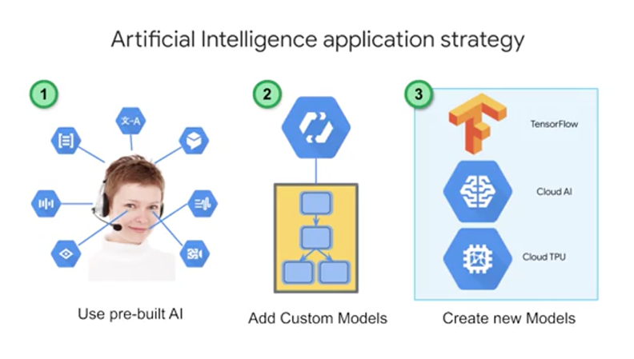

# Week 5: Deriving Insights from Unstructured Data with ML


# Cloud AutoML and Classification with Precompiled Vision API

# How Does ML on Unstructured Data Work?

That's where deep learning comes into play. As this Wired article states, Iif you want to teach a neural network to recognize a cat, you simply show it thousands of photos of cats and let it figure it out." This is similar to how we teach children to recognize and classify new objects. In 2012, that's exactly what the Google Research team with Jeff Dean and Andrew Ng did.


Deep learning, remember, that's a sub-discipline of machine learning, is incredibly useful when we as humans can't even map out our intuition about what makes a prediction correct or not. That's where we just show the computer at 10,000 images of a cat and hope it figures it out. With recent leaps in ML research at Google, Computer Vision has come a very long way.


# Choosing the Right ML Approach



There are three approaches to AI that you should consider. You have already seen and built custom models with BigQuery ML, and we have a separate set of courses on TensorFlow for even deeper model building. A good rule of thumb is to consider custom model building only when you have a lot of data, like 100,000 plus to millions of examples. But what if you don't? Consider using a pre-built AI which are models like the Video Intelligence and Cloud Vision APIs that you saw before. In addition, if you're looking to build a chat bot, start with Dialogflow, which is a full fledged application with ML built in. But what about if the building blocks don't work well for the specificity, you need on your data? That's when you should consider Auto ML as a good candidate. It can even work with just a little bit of data like 10-100 images per label.

First step is using pre-built AI building blocks for your use case. Pre-built models are offered as services. In many cases, these building blocks can be used to create the application you want without the expense or complexity of creating your own models. Cloud-Speech-to-Text converts audio to text for data processing, Cloud Natural Language API recognizes parts of speech called entities and sentiment, Cloud Translation converts text in one language to another, Dialogflow Enterprise Edition is used to build chatbots to conduct conversations, Cloud Text-to-Speech converts text into high-quality voice audio, Cloud Vision API is for working with and recognizing content in still images, and Cloud Video Intelligence API is for recognizing motion and action in video. Good machine-learning models require lots of high-quality training data. As we mentioned before, you should aim for 100,000 plus records to train on for custom model. If you don't have that kind of data, pre-built models are a great place to start.


So precision is the number of photos correctly classified as a particular label divided by the total number of photos classified with that label. So for all photos that our model classified as cumulus what percentage were correctly classified? Recall is number of photos classified as a particular label divided by the total number of photos with that label.


AutoML is powered by the latest ML research. While your model trains, the AutoML platform actually trains and evaluates multiple models and compares them against each other. This NASNet approach or neural architecture search produces an ensemble of ML models and chooses the best one.


# Text Classification

Base Query

```sql
WITH extracted AS (
SELECT 
	source, 
	REGEXP_REPLACE(LOWER(REGEXP_REPLACE(title, '[^a-zA-Z0-9 &.~]', ' ')),"   ", " ") AS title 
FROM
	(SELECT
		ARRAY_REVERSE(SPLIT(REGEXP_EXTRACT(url, '.*://.[^/]+)/'), '.'))[OFFSET(1)] AS source,
		title
	 FROM
		'bigquery-public-data.hacker_new.stories'
	 WHERE
		REGEXP_CONTAINS(REGEXP_EXTRACT(url, '.*//(.[*/]+)/'), '.com$')
		AND LENGTH(title) > 10
	)
), ds AS(
SELECT 
	ARRAY_CONCAT(SPLIT(title, " "), ['NULL','NULL','NULL','NULL','NULL']) AS words,
	source
FROM 
	extracted
WHERE (source = 'github' OR source = 'nytimes' OR source = 'techcrunch')
)
SELECT
	source,
	words[OFFSET(0)] AS word1,
	words[OFFSET(1)] AS word2,
	words[OFFSET(2)] AS word3,
	words[OFFSET(3)] AS word4,
	words[OFFSET(4)] AS word5
FROM 
	ds
```

With BigQuery ML, create model

```sql
CREATE OR REPLACE MODEL advdata.txtclass
OPTIONS(model_type = 'logistic_reg', input_label_cols = ['source'])
AS
# query above. advdata is the dataset name manually created in bigquery
```

Query the model parameters

```sql
SELECT * FROM ML.EVALUATE(MODEL advdata.txtclass)
```

Query for prediction

```sql
SELECT * FROM ML.PREDICT(MODEL advdata.txtclass, (
	SELECT 'government' AS word1, 'shutdown' AS word2, 'leaves' AS word3, 'workers' AS word4, 'reeling' AS word5
	UNION ALL SELECT 'downloading', 'the', 'android', 'studio', 'project'
))
```

## **Documentación:**

**[Cloud AutoML](https://cloud.google.com/automl/?hl=es-419)**

**[BigQuery ML](https://cloud.google.com/bigquery/docs/bigqueryml-intro?hl=es-419)**

**[Cómo compilar modelos personalizados de AA con TensorFlow](https://www.tensorflow.org/tutorials/?hl=es-419)**

- [Documentación de AutoML Vision](https://cloud.google.com/vision/automl/docs/?hl=es-419)
- [Documentación de la API de Vision](https://cloud.google.com/vision/?hl=es-419#resources)
- [Curso de Coursera sobre AA en GCP (aprenda a usar TensorFlow)](https://www.coursera.org/specializations/machine-learning-tensorflow-gcp)