# Week 1

# Competition Concepts

A variety of machinery competition is very high. In some, participants are asked to process texts. In others, to classify picture or select the best advertising. Despite the variety, all of these competitions are very similar in structure. Usually, they consist of the same elements or concepts:

## Data

Data is what the organizers give us as training material. We will use it in order to produce our solution. Data can be represented in a variety of formats. SSV file with several columns , a text file, an archive with pictures, a database dump, a disabled code or even all together. With the data, usually there is a description. It's useful to read it in order to understand what we'll work with and which feature can be extracted.

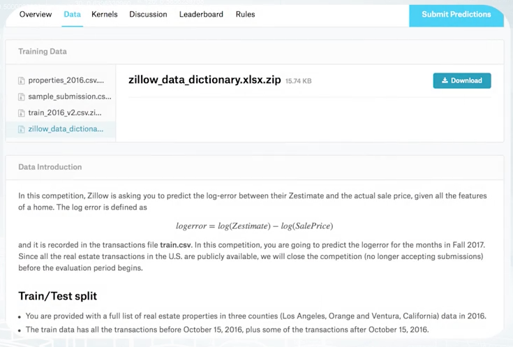

Here is an example from Kaggle. From the top, we see several files with data, and below, is their description. Sometimes in addition to data issued by organizers, we can use other data. For example, in order to improve image classification model, one may use a publicly available data set of images. But this depends on a particular competition and you need to check the rules.

## Model

This is exactly what we will build during the competition. It's better to think about model not as one specific algorithm, but something that transforms data into answers. The model should have two main properties. It should produce best possible prediction and be reproducible. In fact, it can be very complicated and contain a lot of algorithms, handcrafted features, use a variety of libraries as this model of the winners of the Homesite competition shown on this slide. It's large and includes many components. 

## Submission

To compare our model with the model of other participants, we will send our predictions to the server or in other words, make the submission. Usually, you're asked about predictions only. Sources or models are not required. And also there are some exceptions, cool competitions, where participants submit their code. An example of how the submission file should look like, look at the sample submission from the Zillow competition. In it is the first column. We must specify the ID of the object and then specify our prediction for it. This is typical format that is used in many competitions.

## Evaluation

When you submit predictions, you need to know how good is your model. The quality of the model is defined by evaluation function. In essence and simply the function, the text prediction and correct answers and returns a score characterizes the performance of the solution. The simplest example of such a function is the accurate score. This is just a rate of correct answers. In general, there are a lot of such functions. The description of the competition always indicates which evaluation function is used. I strongly suggest you to pay attention to this function because it is what we will try to optimize.

## Leaderboard

The leaderboard is the rate which provides you with information about performance of all participating teams. Most machine learning competition platforms keep your submission history, but the leaderboard usually shows only your best score and position. They cannot as that submission score, reveal some information about data set. And, in extreme cases, one can obtain ground truth targets after sending a lot of submissions. In order to handle this, the set is divided into two parts, public and private. This split is hidden from users and during the competition, we see the score calculated only on public subset of the data. The second part of data set is used for private leaderboard which is revealed after the end of the competition.

Only this second part is used for final rating. Therefore, a standard competition routine looks like that. You as the competition, you analyze the data, improve model, prepare submission, send it, see leaderboard score. You repeat this action several times. All this time, only public leaderboard is available. By the end of the competition, you should select submissions which will be used for final scoring. Usually, you are allowed to select two final submissions. Choose wisely. Sometimes public leaderboard scores might be misleading. After the competition deadline, public leaderboard is revealed, and its used for the final rating and defining the winners.

## Platfroms

Although Kaggle is the biggest and most famous one, there is a number of smaller platforms or even single-competition sites like KDD and VizDooM. Although this list will change over time, I believe you will find the competition which is most relevant and interesting for you. Finally, I want to tell you about the reasons to participate in data science competition. The main reason is that competition is a great opportunity for learning. You communicate with other participants, try new approaches and get a lot of experience. Second reason is that competition often offer you non-trivial problems and state-of-the-art approaches. It allows you to broaden the horizons and look at some everyday task from a different point of view. It's also a great way to become recognizable, get some kind of frame inside data science community and receive a nice job offer. The last reason to participate is that you have a chance for winning some money. It shouldn't be the main goal, just a pleasant bonus.

# Real World Applications vs Competition

Real world machine learning problems are very complicated. They include several stages, each of them is very important and require attention. Let's imagine that we need to build an an anti-spam system and consider the basic steps that arise when building such a system. First of all, before doing any machine learning stuff, you need to understand the problem from a business point of view. What do you want to do? For what? How can it help your users? Next, you need to formalize the task. What is the definition of spam? What exactly is to be predicted? The next step is to collect data. You should ask yourself, what data can we use? How to mine examples of spam and non-spam? Next, you need to take care of how to clean your data and pre-process it. After that, you need to move on to building models. To do this, you need to answer the questions, which class of model is appropriate for this particular task? How to measure performance? How to select the best model? The next steps are to check the effectiveness on the model in real scenario, to make sure that it works as expected and there was no bias introduced by learning process. Does the model actually block spam? How often does it block non-spam emails? If everything is fine, then the next step is to deploy the model. Or in other words, make it available to users. However, the process doesn't end here. Your need to monitor the model performance and re-train it on new data. In addition, you need to periodically revise your understanding of the problem and go for the cycle again and again.

In contrast, in competitions we have a much simpler situation. All things about formalization and evaluation are already done. All data collected and target metrics fixed. Therefore your mainly focus on pre-processing the data, picking models and selecting the best ones. But, sometimes you need to understand the business problem in order to get insights or generate a new feature. Also sometimes organizers allow the usage of external data. In such cases, data collection become a crucial part of the solution.

# Recap on Main ML Algorithms

## Linear Methods

Imagine that we have two sets of points, gray points belong to one class and green ones to another. It is very intuitive to separate them with a line. In this case, it's quite simple to do since we have only two dimensional points. But this approach can be generalized for a high dimensional space. This is the main idea behind Linear Models. They try to separate objects with a plane which divides space into two parts. You can remember several examples from this model class like logistic regression or SVM. They all are Linear Models with different loss functions. I want to emphasize that Linear Models are especially good for sparse high dimensional data. But you should keep in mind the limitations of Linear Models. Often, point cannot be separated by such a simple approach. As an example, you can imagine two sets of points that form rings, one inside the other. Although it's pretty obvious how to separate them, Linear Models are not an appropriate choice either and will fail in this case. You can find implementations of Linear Models in almost every machine learning library. Most known implementation in Scikit-Learn library. Another implementation which deserves our attention is Vowpal Wabbit, because it is designed to handle really large data sets.

## Three-Based Methods

Tree-Based Methods use decision tree as a basic block for building more complicated models. Let's consider an example of how decision tree works. Imagine that we have two sets of points similar to a linear case. Let's separate one class from the other by a line parallel to the one of the axes. We use such restrictions as it significantly reduces the number of possible lines and allows us to describe the line in a simple way. After setting the split as shown at that picture, we will get two sub spaces, upper will have probability of gray=1, and lower will have probability of gray=0.2. Upper sub-space doesn't require any further splitting. Let's continue splitting for the lower sub-space. Now, we have zero probability on gray for the left sub-space and one for the right. This was a brief overview of how decision tree works. It uses divide-and-conquer approach to recur sub-split spaces into sub-spaces. Intuitively, single decision tree can be imagined as dividing space into boxes and approximating data with a constant inside of these boxes. The way of true axis splits and corresponding constants produces several approaches for building decision trees. Moreover, such trees can be combined together in a lot of ways. All this leads to a wide variety of tree-based algorithms, most famous of them being random forest and Gradient Boosted Decision Trees. In case if you don't know what are that, I strongly encourage you to remember these topics using links from additional materials. In general, tree-based models are very powerful and can be a good default method for tabular data. In almost every competitions, winners use this approach. But keep in mind that for Tree-Based Methods, it's hard to capture linear dependencies since it requires a lot of splits.

 We can imagine two sets of points which can be separated with a line. In this case, we need to grow a tree with a lot of splits in order to separate points. Even in such case, our tree could be inaccurate near decision border, as shown on the picture. Similar to Linear Models, you can find implementations of tree-based models in almost every machine learning library. Scikit-Learn contains quite good implementation of random forest which I personally prefer. All the Scikit-Learn contain implementation of gradient boost decision trees. I prefer to use libraries like XGBoost and LightGBM for their higher speed and accuracy.

## kNN Methods

Imagine that we need to predict label for the points shown with question mark at this slide. We assume that points close to each other are likely to have similar labels. So, we need to find the closest point which displayed by arrow and pick its label as an answer. This is how nearest neighbor's method generally works. It can be easily generalized for k-NN, if we will find k-nearest objects and select plus labeled by majority vote. The intuition behind k-NN is very simple. Closer objects will likely to have same labels. In this particular example, we use square distance to find the closest object. In general case, it can be meaningless to use such a distance function. For example, square distance over images is unable to capture semantic meaning. Despite simplicity of the approach, features based on nearest neighbors are often very informative. We will discuss them in more details later in our course. Implementations of k-NN can be found in a lot of machine learning libraries. I suggest you to use implementation from Scikit-Learn since it use algorithm matrix to speedup recollections and allows you to use several predefined distance functions. Also, it allows you to implement your own distance function.

What is the difference between RandomForest and ExtraTrees models from sklearn?

**ExtraTrees classifier always tests random splits over fraction of features (in contrast to RandomForest, which tests all possible splits over fraction of features)**

## Neural Networks Models

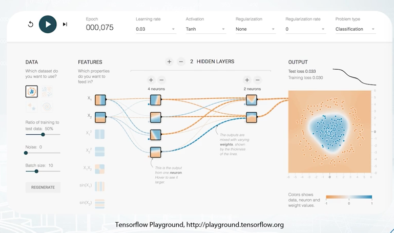

Neural Nets is a special class of machine learning models, which deserve a separate topic. In general, such methods can be seen in this Black-Box which produce a smooth separating curve in contrast to decision trees. I encourage you to visit TensorFlow playground which is shown on the slide, and play with different parameters of the simple feed-forward network in order to get some intuition about how feed-forward Neural Nets works. Some types of Neural Nets are especially good for images, sounds, text, and sequences. We won't cover details of Neural Nets in this course. Since Neural Nets attracted a lot of attention over the last few years, there are a lot of frameworks to work with them. Packages like TensorFlow, Keras, MXNet, PyTorch, and Lasagne can be used to feed Neural Nets. I personally prefer PyTorch since it's provides flexible and user-friendly way to define complex networks.

## No Free Lunch Theorem

Basically, No Free Lunch Theorem states that there is no methods which outperform all others on all tasks, or in other words, for every method, we can construct a task for which this particular method will not be the best. The reason for that is that every method relies on some assumptions about data or task. If these assumptions fail, Limited will perform poorly. For us, this means that we cannot every competition with just a single algorithm. So we need to have a variety of tools based off different assumptions.

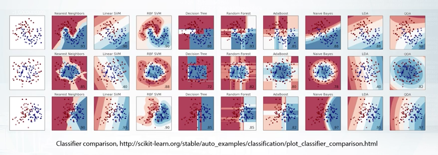

First of all, there is no silver bullet algorithm which outperforms all the other in all and every task. Next, is that Linear Model can be imagined as splitting space into two sub-spaces separated by a hyper plane. Tree-Based Methods split space into boxes and use constant the predictions in every box. k-NN methods are based on the assumptions that close objects are likely to have same labels. So we need to find closest objects and pick their labels. Also, k-NN approach heavily relies on how to measure point closeness. Feed-forward Neural Nets are harder to interpret but they produce smooth non-linear decision boundary. The most powerful methods are Gradient Boosted Decision Trees and Neural Networks. But we shouldn't underestimate Linear Models and k-NN because sometimes, they may be better.

- [Explanation of Random Forest](http://www.datasciencecentral.com/profiles/blogs/random-forests-explained-intuitively)
- [Explanation/Demonstration of Gradient Boosting](http://arogozhnikov.github.io/2016/06/24/gradient_boosting_explained.html)
- [Example of kNN](https://www.analyticsvidhya.com/blog/2014/10/introduction-k-neighbours-algorithm-clustering/)

# Feature Preprocessing and Generation

To get an idea of following topics, let's start with an example of data similar to what we may encounter in competition. And take a look at well known Titanic dataset. It stores the data about people who were on the Titanic liner during its last trip. Here we have a typical dataframe to work with in competitions. Each row represents a person and each column is a feature. 

We have different kinds of features here. For example, the values in Survived column are either 0 or 1. The feature is binary. And by the way, it is what we need to predict in this task. It is our target. So, age and fare are numeric features. Sibims p and parch accounts statement and embarked a categorical features. Ticket is just an ID and name is text. So indeed, we have different feature types here, but do we understand why we should care about different features having different types? Well, there are two main reasons for it, namely, strong connection between preprocessing at our model and common feature generation methods for each feature type.

Most of times, we can just take our features, fit our favorite model and expect it to get great results. Each type of feature has its own ways to be preprocessed in order to improve quality of the model. In other words, choice of preprocessing matter, depends on the model we're going to use. For example, let's suppose that target has nonlinear dependency on the pclass feature.

Pclass linear of 1 usually leads to target of 1, 2 leads to 0, and 3 leads to 1 again. Clearly, because this is not a linear dependency linear model, one get a good result here. So in order to improve a linear model's quality, we would want to preprocess pclass feature in some way. For example, with the so-called one hot encoder which will replace our feature with three, one for each of pclass values. The linear model will fit much better now than in the previous case.

The second reason why we should be aware of different feature text is to ease generation of new features. Feature types different in this and comprehends in common feature generation methods. While gaining an ability to improve your model through them. Also understanding of basics of feature generation will aid you greatly in upcoming advanced feature topics from our course. Our approach to feature generation should rely on understanding of employed model.

## Numeric Features

First thing you need to know about handling numeric features is that there are models which do and don't depend on feature scale. For now, we will broadly divide all models into tree-based models and non-tree-based models.

For example, decision trees classifier tries to find the most useful split for each feature, and it won't change its behavior and its predictions. It can multiply the feature by a constant and to retrain the model. On the other side, there are models which depend on these kind of transformations. The model based on your nearest neighbors, linear models, and neural network.

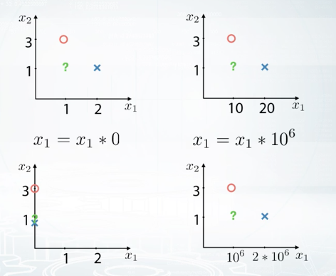

Let's consider the following example. We have a binary classification test with two features. The object in the picture belong to different classes. The red circle to class zero, and the blue cross to class one, and finally, the class of the green object is unknown. Here, we will use a one nearest neighbor's model to predict the class of the green object. We will measure distance using square distance, which is also called altometric. Now, if we calculate distances to the red circle and to the blue cross, we will see that our model will predict class one for the green object because the blue cross of class one is much closer than the red circle. But if we multiply the first feature by 10, the red circle will became the closest object, and we will get an opposite prediction. Let's now consider two extreme cases. What will happen if we multiply the first feature by zero and by one million? If the feature is multiplied by zero, then every object will have feature relay of zero, which results in KNN ignoring that feature. On the opposite, if the feature is multiplied by one million, slightest differences in that features values will impact prediction, and this will result in KNN favoring that feature over all others. Great, but what about other models? Linear models are also experiencing difficulties with differently scaled features. First, we want regularization to be applied to linear models coefficients for features in equal amount. But in fact, regularization impact turns out to be proportional to feature scale. And second, gradient descent methods can go crazy without a proper scaling. Due to the same reasons, neural networks are similar to linear models in the requirements for feature preprocessing. It is important to understand that different features scalings result in different models quality. In this sense, it is just another hyper parameter you need to optimize. The easiest way to do this is to rescale all features to the same scale.

For example, to make the minimum of a feature equal to zero and the maximum equal to one, you can achieve this in two steps. First, we sector at minimum value. And second, we divide the difference base maximum. It can be done with MinMaxScaler from sklearn.

To give you another example, we can apply a scalar named StandardScaler in sklearn, which basically first subtract mean value from the feature, and then divides the result by feature standard deviation. In this way, we'll get standardized distribution, with a mean of zero and standard deviation of one. After either of MinMaxScaling or StandardScaling transformations, features impacts on non-tree-based models will be roughly similar.

Even more, if you want to use KNN, we can go one step ahead and recall that the bigger feature is, the more important it will be for KNN. So, we can optimize scaling parameter to boost features which seems to be more important for us and see if this helps. When we work with linear models, there is another important moment that influences model training results. I'm talking about outiers. For example, in this plot, we have one feature, X, and a target variable, Y. If you fit a simple linear model, its predictions can look just like the red line. But if you do have one outlier with X feature equal to some huge value, predictions of the linear model will look more like the purple line. The same holds, not only for features values, but also for target values. For example, let's imagine we have a model trained on the data with target values between zero and one. Let's think what happens if we add a new sample in the training data with a target value of 1,000. When we retrain the model, the model will predict abnormally high values. Obviously, we have to fix this somehow. To protect linear models from outliers, we can clip features values between two chosen values of lower bound and upper bound.

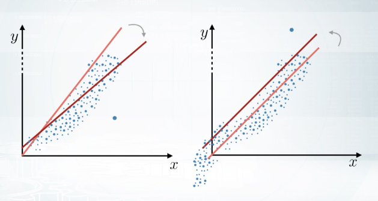

We can choose them as some percentiles of that feature. For example, first and 99s percentiles. This procedure of clipping is well-known in financial data and it is called winsorization. Let's take a look at this histogram for an example. We see that the majority of feature values are between zero and 400. But there is a number of outliers with values around -1,000. They can make life a lot harder for our nice and simple linear model. Let's clip this feature's value range and to do so, first, we will calculate lower bound and upper bound values as features values at first and 99s percentiles. After we clip the features values, we can see that features distribution looks fine, and we hope now this feature will be more useful for our model.

Another effective preprocessing for numeric features is the rank transformation. Basically, it sets spaces between proper assorted values to be equal. This transformation, for example, can be a better option than MinMaxScaler if we have outliers, because rank transformation will move the outliers closer to other objects. Let's understand rank using this example. If we apply a rank to the source of array, it will just change values to their indices. Now, if we apply a rank to the not-sorted array, it will sort this array, define mapping between values and indices in this source of array, and apply this mapping to the initial array. Linear models, KNN, and neural networks can benefit from this kind of transformation if we have no time to handle outliers manually. Rank can be imported as a random data function from scipy. One more important note about the rank transformation is that to apply to the test data, you need to store the creative mapping from features values to their rank values. Or alternatively, you can concatenate, train, and test data before applying the rank transformation.

There is one more example of numeric features preprocessing which often helps non-tree-based models and especially neural networks. You can apply log transformation through your data, or there's another possibility. You can extract a square root of the data. Both these transformations can be useful because they drive too big values closer to the features' average value. Along with this, the values near zero are becoming a bit more distinguishable. Despite the simplicity, one of these transformations can improve your neural network's results significantly. Another important moment which holds true for all preprocessings is that sometimes, it is beneficial to train a model on concatenated data frames produced by different preprocessings, or to mix models training differently-preprocessed data.

Again, linear models, KNN, and neural networks can benefit hugely from this. To this end, we have discussed numeric feature preprocessing, how model choice impacts feature preprocessing, and what are the most commonly used preprocessing methods.

---

Feature generation is a process of creating new features using knowledge about the features and the task. It helps us by making model training more simple and effective. Sometimes, we can engineer these features using prior knowledge and logic. Sometimes we have to dig into the data, create and check hypothesis, and use this derived knowledge and our intuition to derive new features.

First, let's start with a simple one. If you have columns, Real Estate price and Real Estate squared area in the dataset, we can quickly add one more feature, price per meter square. Easy, and this seems quite reasonable. 

Or, let me give you another quick example from the Forest Cover Type Prediction dataset. If we have a horizontal distance to a water source and the vertical difference in heights within the point and the water source, we as well may add combined feature indicating the direct distance to the water from this point. Among other things, it is useful to know that adding, multiplications, divisions, and other features interactions can be of help not only for linear models. For example, although gradient within decision tree is a very powerful model, it still experiences difficulties with approximation of multiplications and divisions. And adding size features explicitly can lead to a more robust model with less amount of trees.

The third example of feature generation for numeric features is also very interesting. Sometimes, if we have prices of products as a feature, we can add new feature indicating fractional part of these prices. For example, if some product costs 2.49, the fractional part of its price is 0.49. This feature can help the model utilize the differences in people's perception of these prices. Also, we can find similar patterns in tasks which require distinguishing between a human and a robot. For example, if we will have some kind of financial data like auctions, we could observe that people tend to set round numbers as prices, and there are something like 0.935, blah, blah,, blah, very long number here. Or, if we are trying to find spambots on social networks, we can be sure that no human ever read messages with an exact interval of one second.

## Categorical Features

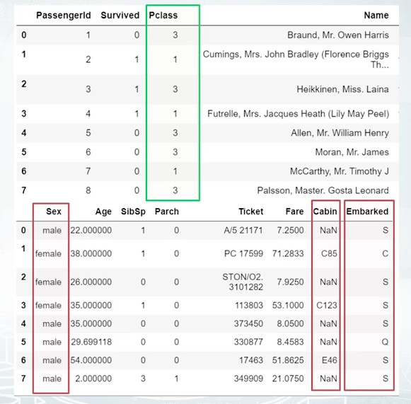

First, let's look at several rows from the Titanic dataset and find categorical features here. Their names are: Sex, Cabin and Embarked. These are usual categorical features but there is one more special, the Pclass feature. Pclass stands for ticket class, and has three unique values: one, two, and three. It is ordinal or, in other words, order categorical feature. This basically means that it is ordered in some meaningful way. For example, if the first class was more expensive than the second, or the more the first should be more expensive than the third. We should make an important note here about differences between ordinal and numeric features. If Pclass would have been a numeric feature, we could say that the difference between first, and the second class is equal to the difference between second and the third class, but because Pclass is ordinal, we don't know which difference is bigger. As these numeric features, we can't sort and integrate an ordinal feature the other way, and expect to get similar performance. Another example for ordinal feature is a driver's license type. It's either A, B, C, or D. Or another example, level of education, kindergarten, school, undergraduate, bachelor, master, and doctoral. These categories are sorted in increasingly complex order, which can prove to be useful.

The simplest way to encode a categorical feature is to map it's unique values to different numbers. Usually, people referred to this procedure as label encoding. This method works fine with two ways because tree-methods can split feature, and extract most of the useful values in categories on its own. Non-tree-based-models, on the other side, usually can't use this feature effectively. And if you want to train linear model kNN on neural network, you need to treat a categorical feature differently.

Let's take now the categorical feature and again, apply label encoding. Let this be the feature Embarked. Although, we didn't have to encode the previous feature Pclass before using it in the model. Here, we definitely need to do this with embarked. It can be achieved in several ways. First, we can apply encoding in the alphabetical or sorted order. Unique way to solve of this feature namely S, C, Q. Thus, can be encoded as two,one, three. This is called label encoder from sklearn works by default. The second way is also labeling coding but slightly different. Here, we encode a categorical feature by order of appearance. For example, s will change to one because it was meant first in the data. Second then c, and we will change c to two. And the last is q, which will be changed to three. This can make sense if all were sorted in some meaningful way. This is the default behavior of pandas.factorize function. The third method that I will tell you about is called frequency encoding. We can encode this feature via mapping values to their frequencies. Even 30 percent for us embarked is equal to c and 50 to s and the rest 20 is equal to q. We can change this values accordingly: c to 0.3, s to 0. 5, and q to 0.2. This will preserve some information about values distribution, and can help both linear and three models. First ones, can find this feature useful if value frequency is correlated to it's target value. While the second ones can help with less number of split because of the same reason. There is another important moment about frequency encoding. If you have multiple categories with the same frequency, they won't be distinguishable in this new feature. We might a apply or run categorization here in order to deal with such ties.

Okay. We just discussed label encoding, frequency encoding, and why this works fine for tree-based-methods. But we also have seen that linear models can struggle with label encoded feature. The way to identify categorical features to non-tree-based-models is also quite straightforward. We need to make new code for each unique value in the future, and put one in the appropriate place. Everything else will be zeroes. This method is called, one-hot encoding. As I said, this works well for linear methods, kNN, or neural networks. Furthermore, one -hot encoding feature is already scaled because minimum this feature is zero, and maximum is one. Note that if you care for a fewer important numeric features, and hundreds of binary features are used by one-hot encoding, it could become difficult for tree-methods they use first ones efficiently. More precisely, tree-methods will slow down, not always improving their results. Also, it's easy to imply that if categorical feature has too many unique values, we will add too many new columns with a few non-zero values. 

To store these new array efficiently, we must know about sparse matrices. In a nutshell, instead of allocating space in RAM for every element of an array, we can store only non-zero elements and thus, save a lot of memory. Going with sparse matrices makes sense if number of non-zero values is far less than half of all the values. Sparse matrices are often useful when they work with categorical features or text data. Most of the popular libraries can work with these sparse matrices directly namely, XGBoost, LightGBM, sklearn, and others.

---

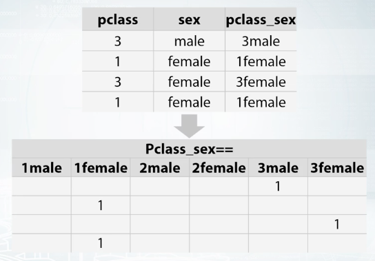

One of most useful examples of feature generation is feature interaction between several categorical features. This is usually useful for non tree based models namely, linear model, kNN. For example, let's hypothesize that target depends on both Pclass feature, and sex feature. If this is true, linear model could adjust its predictions for every possible combination of these two features, and get a better result. How can we make this happen? Let's add this interaction by simply concatenating strings from both columns and one-hot encoding get. Now linear model can find optimal coefficient for every interaction and improve.

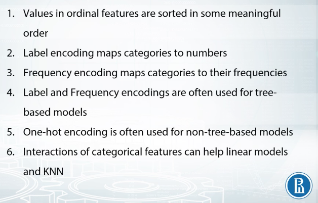

## DateTime and Coordinates

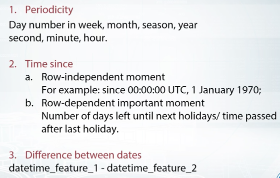

Datetime is quite a distinct feature because it isn't relying on your nature, it also has several different tiers like year, day or week. Most new features generated from datetime can be divided into two categories. The first one, time moments in a period, and the second one, time passed since particular event. First one is very simple. We can add features like second, minute, hour, day in a week, in a month, on the year and so on and so forth. This is useful to capture repetitive patterns in the data. If we know about some non-common materials which influence the data, we can add them as well. For example, if we are to predict efficiency of medication, but patients receive pills one time every three days, we can consider this as a special time period.

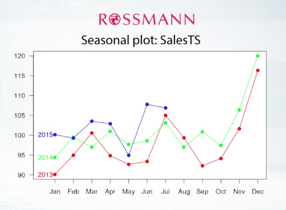

Okay now, time since particular event. This event can be either row-independent or row-dependent. In the first case, we just calculate time passed from one general moment for all data. For example, from here to thousand. Here, all samples will become pairable between each other on one time scale. As the second variant of time since particular event, that date will depend on the sample we are calculating this for. For example, if we are to predict sales in a shop, like in the ROSSMANN's store sales competition. We can add the number of days passed since the last holiday, weekend or since the last sales campaign, or maybe the number of days left to these events. So, after adding these features, our dataframe can look like this.

Date is obviously a date, and sales are the target of this task. While other columns are generated features. Week day feature indicates which day in the week is this, daynumber since year 2014 indicates how many days have passed since January 1st, 2014. is_holiday is a binary feature indicating whether this day is a holiday and days_ till_ holidays indicate how many days are left before the closest holiday.

Time moment inside the period or time passed in zero dependent events. One simple example of third generation can be found in churn prediction task. Basically churn prediction is about estimating the likelihood that customers will churn. We may receive a valuable feature here by subtracting user registration date from the date of some action of his, like purchasing a product, or calling to the customer service. We can see how this works on this data dataframe. For every user, we know last_purchase_date and last_call_date. Here we add the difference between them as new feature named date_diff. For every user, we have his last_purchase_date and his last_call_date. Thus, we can add date_diff feature which indicates number of days between these events. Note that after generation feature is from date time, you usually will get either numeric features like time passed since the year 2000, or categorical features like day of week. And these features now are need to be treated accordingly with necessary pre-processings we have discussed earlier.

---

Let's imagine that we're trying to estimate the real estate price. Like in the Deloitte competition named Western Australia Rental Prices, or in the Sberbank Russian Housing Market competition. Generally, you can calculate distances to important points on the map. Keep this wonderful map. If you have additional data with infrastructural buildings, you can add as a feature distance to the nearest shop to the second by distance hospital, to the best school in the neighborhood and so on. If you do not have such data, you can extract interesting points on the map from your trained test data. For example, you can do a new map to squares, with a grid, and within each square, find the most expensive flat, and for every other object in this square, add the distance to that flat. Or you can organize your data points into clusters, and then use centers of clusters as such important points. Or again, another way. You can find some special areas, like the area with very old buildings and add distance to this one. Another major approach to use coordinates is to calculate aggregated statistics for objects surrounding area. This can include number of lets around this particular point, which can then be interpreted as areas or polarity. Or we can add mean realty price, which will indicate how expensive area around selected point is. Both distances and aggregate statistics are often useful in tasks with coordinates. One more trick you need to know about coordinates, that if you train decision trees from them, you can add slightly rotated coordinates is new features. And this will help a model make more precise selections on the map. 

It can be hard to know what exact rotation we should make, so we may want to add all rotations to 45 or 22.5 degrees. Here the street is dividing an area in two parts. The high priced district above the street, and the low priced district below it. If the street is slightly rotated, trees will try to make a lot of space here. But if we will add new coordinates in which these two districts can be divided by a single split, this will hugely facilitate the rebuilding process.

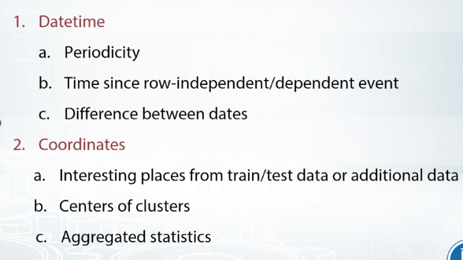

## Handling Missing Values

Often we have to deal with missing values in our data. They could look like not numbers, empty strings, or outliers like minus 999. Sometimes they can contain useful information by themselves, like what was the reason of missing value occurring here? How to use them effectively? How to engineer new features from them?

So what kind of information missing values might contain? How can they look like? Let's take a look at missing values in the Springfield competition.

This is metrics of samples and features. People mainly reviewed each feature, and found missing values for each column. This latest could be not a number, empty string, minus 1, 99, and so on. For example, how can we found out that -1 can be the missing value? We could draw a histogram and see this variable has uniform distribution between 0 and 1. And that it has small peak of -1 values. So if there are no not numbers there, we can assume that they were replaced by -1. Or the feature distribution plot can look like the second figure. Note that x axis has lock scale. In this case, not a numbers probably were few by features mean value. You can easily generalize this logic to apply to other cases. Okay on this example we just learned this, missing values can be hidden from us. And by hidden I mean replaced by some other value beside not a number.

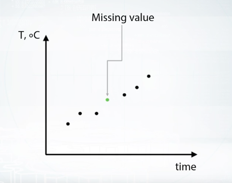

Great, let's talk about missing value importation. The most often examples are first, replacing not a number with some value outside fixed value range. Second, replacing not a number with mean or median. And third, trying to reconstruct value somehow. First method is useful in a way that it gives three possibility to take missing value into separate category. The downside of this is that performance of linear networks can suffer. Second method usually beneficial for simple linear models and neural networks. But again for trees it can be harder to select object which had missing values in the first place. The third one, and the last one we will discuss here, is to reconstruct each value if possible. One example of such possibility is having missing values in time series. For example, we could have everyday temperature for a month but several values in the middle of months are missing. Well of course, we can approximate them using nearby observations. But obviously, this kind of opportunity is rarely the case. In most typical scenario rows of our data set are independent. And we usually will not find any proper logic to reconstruct them.

Well there's one general concern about generating new features from one with missing values. That is, if we do this, we should be very careful with replacing missing values before our feature generation. To illustrate this, let's imagine we have a year long data set with two features. Daytime feature and temperature which had missing values. We can see all of this on the figure. Now we fill missing values with some value, for example with median. If you have data over the whole year median probably will be near zero so it should look like that. Now we want to add feature like difference between temperature today and yesterday, let's do this. As we can see, near the missing values this difference usually will be abnormally huge. And this can be misleading our model. But hey, we already know that we can approximate missing values sometimes here by interpolation the error by points, great. But unfortunately, we usually don't have enough time to be so careful here. And more importantly, these problems can occur in cases when we can't come up with such specific solution.

# Feature Extraction from Text and Images

## Bag of Words

Here we create new column for each unique word from the data, then we simply count number of occurences for each word, and place this value in the appropriate column. After applying the separation to each row, we will have usual dataframe of samples and features. In a scalar, this can be done with CountVectorizer. We also can post process calculated metrics using some pre-defined methods. To make out why we need post-processing let's remember that some models like kNN, like neural regression, and neural networks, depend on scaling of features. So the main goal of post-processing here is to make samples more comparable on one side, and on the other, boost more important features while decreasing the scale of useless ones.

One way to achieve the first goal of making a sample small comparable is to normalize sum of values in a row. In this way, we will count not occurrences but frequencies of words. Thus, texts of different sizes will be more comparable. This is the exact purpose of term frequency transformation.

To achieve the second goal, that is to boost more important features, we'll make post process our matrix by normalizing data column wise. A good idea is to normalize each feature by the inverse fraction of documents, which contain the exact word corresponding to this feature.

It's worth mentioning that there are plenty of other variants of TFiDF which may work better depending on the specific data. Another very useful technique is Ngrams. The concept of Ngram is simple, you add not only column corresponding to the word, but also columns corresponding to inconsequent words. This concept can also be applied to sequence of chars, and in cases with low N, we'll have a column for each possible combination of N chars. As we can see, for N = 1, number of these columns will be equal to 28. Let's calculate number of these columns for N = 2. Well, it will be 28 squared. Note that sometimes it can be cheaper to have every possible char Ngram as a feature, instead of having a feature for each unique word from the dataset. Using char Ngrams also helps our model to handle unseen words.

In a scalared count vectorizor has appropriate parameter for using Ngrams, it is called Ngram_range. To change from word Ngrams to char Ngrams, you may use parameter named analyzer. Usually, you may want to preprocess text, even before applying bag of words, and sometimes, careful text preprocessing can help bag of words drastically.

Stemming usually refers to a heuristic process that chops off ending of words and thus unite duration of related words like democracy, democratic, and democratization, producing something like, democr, for each of these words. Lemmatization, on the hand, usually means that you have want to do this carefully using knowledge or vocabulary, and morphological analogies of force, returning democracy for each of the words below.

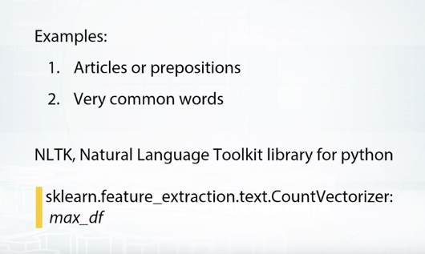

Let's look at another example that shows the difference between stemming and lemmatization by applying them to word saw. While stemming will return on the letter s, lemmatization will try to return either see or saw, dependent on the word's meaning. The last technique for text preprocessing, which we will discuss here, is usage of stopwords. Basically, stopwords are words which do not contain important information for our model. They are either insignificant like articles or prepositions, or so common they do not help to solve our task. Most languages have predefined list of stopwords which can be found on the Internet or logged from NLTK, which stands for Natural Language Toolkit Library for Python.

## Word2Vec

Just as the Bag of Words approach, we want to get vector representations of words and texts, but now more concise than before. Word2vec is doing exactly that. It converts each word to some vector in some sophisticated space, which usually have several hundred dimensions. To learn the word embedding, Word2vec uses nearby words. Basically, different words, which often are used in the same context, will be very close in these vectoring representation, which, of course, will benefit our models. Furthermore, there are some prominent examples showing that we can apply basic operations like addition and subtraction on these vectors and expect results of such operations to be interpretable.

You should already have seen this example by now somewhere. Basically, if we calculate differences between the vectors of words queen and king, and differences between the vectors of words woman and man, we will find that these differences are very similar to each other. And, if we try to see this from another perspective, and subtract the vector of woman from the vector of king and then and the vector of man, will pretty much again the vector of the word queen.

Training of Word2vec can take quite a long time, and if you work with text or some common origin, you may find useful pre-trained models on the internet. For example, ones which are trained on the Wikipedia. Otherwise, remember, the training of Word2vec doesn't require target values from your text. It only requires text to extract context for each word.

## CNN

Similar to Word2vec for words, convolutional neural networks can give us compressed representation for an image. Let me provide you a quick explanation. When we calculate network output for the image, beside getting output on the last layer, we also have outputs from inner layers. Here, we will call these outputs descriptors. Descriptors from later layers are better way to solve texts similar to one network was trained on. In contrary, descriptors from early layers have more text independent information. For example, if your network was trained on images and data set, you may successfully use its last layer representation in some Kar model classification text. But if you want to use your network in some medical specific text, you probably will do better if you will use an earlier for connected layer or even retrain network from scratch. 

Sometimes, we can slightly tune network to receive more suitable representations using targets values associated with our images. In general, process of pre-trained model tuning is called fine-tuning. As in the previous example, when we are solving some medical specific task, we can find tune VGG RestNet or any other pre-trained network and specify it to solve these particular task. Fine-tuning, especially for small data sets, is usually better than training standalone model on descriptors or a training network from scratch. The intuition here is pretty straightforward. On the one hand, fine-tuning is better than training standalone model on descriptors because it allows to tune all networks parameters and thus extract more effective image representations. On the other hand, fine-tuning is better than training network from scratch if we have too little data, or if the text we are solving is similar to the text model was trained on. In this case, model can you use the my knowledge already encoded in networks parameters, which can lead to better results and the faster retraining procedure.

In general case, augmentation of images can include groups, rotations, and the noise and so on. Overall, this reduces over fitting and allows you to train more robust models with better results. One last note about the extracting vectors from images and this note is important one. If you want to fine-tuning convolutional neural network or train it from scratch, you usually will need to use labels from images in the trained set. So be careful with validation here and do not over fit.

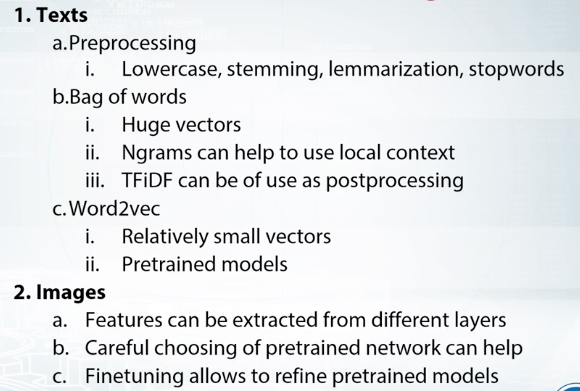

# Recap Quiz

Suppose we've trained a RandomForest model with 100 trees. Consider two cases:

1. We drop the first tree in the model

2. We drop the last tree in the model

We then compare models performance *on the train set*. Select the right answer.

**Correct answers:**

- In the case1 performance **will be roughly the same** as in the case2. In RandomForest model we average 100 similar performing trees, trained independently. So the order of trees does not matter in RandomForest and performance drop will be very similar on average.

Suppose we've trained a GBDT model with 100 trees with a fairly high learning rate. Consider two cases:

1. We drop the first tree in the model

2. We drop the last tree in the model

We then compare models performance *on the train set*. Select the right answer.

**Correct answers:**

In the case1 performance **will drop more** than in the case2. In GBDT model we have sequence of trees, each improve predictions of all previous. So, if we drop first tree — sum of all the rest trees will be biased and overall performance should drop. If we drop the last tree -- sum of all previous tree won't be affected, so performance will change insignificantly (in case we have enough trees)

Consider the two cases:

1. We fit two RandomForestClassifiers 500 trees each and average their predicted probabilities on the test set.

2. We fit a RandomForestClassifier with 1000 trees and use it to get test set probabilities.

All hyperparameters except number of trees are the same for all models.Select the right answer.

**Correct answers:**

The quality of predictions in the case1 **will be roughly the same** as the quality of the predictions in the case2. Each tree in forest is independent from the others, so two RF with 500 trees is essentially the same as single RF model with 1000 trees

Suppose we have a feature with all the values between 0 and 1 except few outliers larger than 1. What can help us to decrease outliers' influence on non-tree models?

**Correct answers:**

Apply rank transform to the features. Yes, because after applying rank distance between all adjacent objects in a sorted array is 1, outliers now will be very close to other samples.

Apply np.log1p(x) transform to the data. This transformation is non-linear and will move outliers relatively closer to other samples.

Apply np.sqrt(x) transform to the data. This transformation is non-linear and will move outliers relatively closer to other samples.

Winsorization. The main purpose of winsorization is to remove outliers by clipping feature's values.

Suppose we fit a tree-based model. In which cases label encoding can be better to use than one-hot encoding?

**Correct answers:**

When categorical feature is ordinal. Correct! Label encoding can lead to better quality if it preserves correct order of values. In this case a split made by a tree will divide the feature to values 'lower' and 'higher' that the value chosen for this split.

When we can come up with label encoder, that assigns close labels to similar (in terms of target) categories. Correct! First, in this case tree will achieve the same quality with less amount of splits, and second, this encoding will help to treat rare categories.

When the number of categorical features in the dataset is huge. One-hot encoding a categorical feature with huge number of values can lead to (1) high memory consumption and (2) the case when non-categorical features are rarely used by model. You can deal with the 1st case if you employ sparse matrices. The 2nd case can occur if you build a tree using only a subset of features. For example, if you have 9 numeric features and 1 categorical with 100 unique values and you one-hot-encoded that categorical feature, you will get 109 features. If a tree is built with only a subset of features, initial 9 numeric features will rarely be used. In this case, you can increase the parameter controlling size of this subset. In xgboost it is called *colsample_bytree,* in sklearn's Random Forest *max_features.*

Suppose we fit a tree-based model on several categorical features. In which cases applying one-hot encoding can be better to use than label-encoding?

**Correct answers:**

If target dependence on the label encoded feature is very non-linear, i.e. values that are close to each other in the label encode feature correspond to target values that aren't close. Correct! If this feature is important, a tree would try to make a lot of splits and select each feature' value in a category on its own. But because tree is build in a greedy way, it can be hard to select one important value in label encoded vector. This won't be the problem if you use OHE.

Suppose we have a categorical feature and a linear model. We need to somehow encode this feature. Which of the following statements are true?

**Correct answers:**

Depending on the dataset either of label encoder or one-hot encoder could be better. Correct! Although one-hot-encoding is usually gives better results in this case, we can come up with examples when one-hot-encoded feature will not lead to a better performance of a linear model.

**Incorrect answers:**

Label encoding is always better than one-hot encoding. Incorrect. Usually the dependence between the feature and the target is non-linear. In this case a linear model will not be able to utilize Label Encoded feature efficiently.

One-hot encoding is always better than label encoding. Incorrect. Consider the toy example when the label encoded feature and the target are equal. In this case a linear model on this feature will have the perfect quality.

Select true statements about n-grams.

**Correct answers:**

N-grams can help utilize local context around each word. Correct, because ngrams encode sequences of words.

N-grams features are typically sparse. Correct. Ngrams deal with counts of words occurrences, and not every word can be found in a document. For example, if we count occurrences of words from an english dictionary in our everyday speech, a lot of words won't be there, and that is sparsity.

Select true statements.

**Correct answers:**

Bag of words usually produces longer vectors than Word2vec. Correct! Number of features in Bag of words approach is usually equal to number of unique words, while number of features in w2v is restricted to a constant, like 300 or so.

Semantically similar words usually have similar word2vec embeddings. Correct. This is one of the main benefits of w2v in competitions.

Suppose in a new competition we are given a dataset of 2D medical images. We want to extract image descriptors from a hidden layer of a neural network pretrained on the ImageNet dataset. We will then use extracted descriptors to train a simple logistic regression model to classify images from our dataset.

We consider to use two networks: ResNet-50 with imagenet accuracy of X and VGG-16 with imageNet accuracy of Y (X < Y). Select true statements.

**Correct answers:**

It is not clear what descriptors are better on our dataset. We should evaluate both. Correct! This depends on the a specific dataset and a specific task, so you should evaluate both!

**Incorrect answers:**

With one pretrained CNN model you can get only one vector of descriptors for an image. Incorrect. With one CNN you can get different descriptors from different layers.

Descriptors from ResNet 50 will always be better than the ones from VGG-16 in our pipeline. Incorrect. Although, ResNet50 shows better performance on Imagenet, this depends on the a specific dataset and a specific task.

For any image descriptors from the last hidden layer of ResNet-50 are the same as the descriptors from the last hidden layer of VGG-16. Incorrect in general. Moreover it is hard to come up with an image that will have the same descriptors in both networks.

Descriptors from ResNet-50 and from VGG-16 are always very similar in cosine distance. Incorrect. This depends on the a specific dataset and a specific task.

Data augmentation can be used at (1) train time (2) test time

**Correct answer:** 

True, True. Data augmentation can be used (1) to increase the amount of training data and (2) to average predictions for one augmented sample.

# Additional Material

## Overview of methods

- [Scikit-Learn (or sklearn) library](http://scikit-learn.org/)
- [Overview of k-NN](http://scikit-learn.org/stable/modules/neighbors.html) (sklearn's documentation)
- [Overview of Linear Models](http://scikit-learn.org/stable/modules/linear_model.html) (sklearn's documentation)
- [Overview of Decision Trees](http://scikit-learn.org/stable/modules/tree.html) (sklearn's documentation)
- Overview of algorithms and parameters in [H2O documentation](http://docs.h2o.ai/h2o/latest-stable/h2o-docs/data-science.html)

## Additional Tools

- [Vowpal Wabbit](https://github.com/johnlangford/vowpal_wabbit) repository
- [XGBoost](https://github.com/dmlc/xgboost) repository
- [LightGBM](https://github.com/microsoft/lightgbm) repository
- [Interactive demo](http://playground.tensorflow.org/) of simple feed-forward Neural Net
- Frameworks for Neural Nets: [Keras](https://keras.io/)[,](https://keras.io%2c/)[PyTorch](http://pytorch.org/)[,](http://pytorch.org%2c/)[TensorFlow](https://www.tensorflow.org/)[,](https://www.tensorflow.org%2c/)[MXNet](http://mxnet.io/), [Lasagne](http://lasagne.readthedocs.io/)
- [Example from sklearn with different decision surfaces](http://scikit-learn.org/stable/auto_examples/classification/plot_classifier_comparison.html)
- [Arbitrary order factorization machines](https://github.com/geffy/tffm)

## StandCloud Computing:

- [AWS](https://aws.amazon.com/), [Google Cloud](https://cloud.google.com/), [Microsoft Azure](https://azure.microsoft.com/)

## AWS spot option:

- [Overview of Spot mechanism](http://docs.aws.amazon.com/awsec2/latest/userguide/using-spot-instances.html)
- [Spot Setup Guide](http://www.datasciencebowl.com/aws_guide/)

## Stack and packages:

- [Basic SciPy stack (ipython, numpy, pandas, matplotlib)](https://www.scipy.org/)
- [Jupyter Notebook](http://jupyter.org/)
- [Stand-alone python tSNE package](https://github.com/danielfrg/tsne)
- Libraries to work with sparse CTR-like data: [LibFM](http://www.libfm.org/), [LibFFM](https://www.csie.ntu.edu.tw/~cjlin/libffm/)
- Another tree-based method: RGF ([implemetation](https://github.com/baidu/fast_rgf), [paper](https://arxiv.org/pdf/1109.0887.pdf))
- Python distribution with all-included packages: [Anaconda](https://www.continuum.io/what-is-anaconda)
- [Blog "datas-frame" (contains posts about effective Pandas usage)](https://tomaugspurger.github.io/)

## Feature preprocessing

- [Preprocessing in Sklearn](http://scikit-learn.org/stable/modules/preprocessing.html)
- [Andrew NG about gradient descent and feature scaling](https://www.coursera.org/learn/machine-learning/lecture/xx3da/gradient-descent-in-practice-i-feature-scaling)
- [Feature Scaling and the effect of standardization for machine learning algorithms](http://sebastianraschka.com/articles/2014_about_feature_scaling.html)

## Feature generation

- [Discover Feature Engineering, How to Engineer Features and How to Get Good at It](https://machinelearningmastery.com/discover-feature-engineering-how-to-engineer-features-and-how-to-get-good-at-it/)
- [Discussion of feature engineering on Quora](https://www.quora.com/what-are-some-best-practices-in-feature-engineering)

## Feature extraction from text

### Bag of words

- [Feature extraction from text with Sklearn](http://scikit-learn.org/stable/modules/feature_extraction.html)
- [More examples of using Sklearn](https://andhint.github.io/machine-learning/nlp/feature-extraction-from-text/)

### Word2vec

- [Tutorial to Word2vec](https://www.tensorflow.org/tutorials/word2vec)
- [Tutorial to word2vec usage](https://rare-technologies.com/word2vec-tutorial/)
- [Text Classification With Word2Vec](http://nadbordrozd.github.io/blog/2016/05/20/text-classification-with-word2vec/)
- [Introduction to Word Embedding Models with Word2Vec](https://taylorwhitten.github.io/blog/word2vec)

NLP Libraries

- [NLTK](http://www.nltk.org/)
- [TextBlob](https://github.com/sloria/textblob)

## Feature extraction from images

### Pretrained models

- [Using pretrained models in Keras](https://keras.io/applications/)
- [Image classification with a pre-trained deep neural network](https://www.kernix.com/blog/image-classification-with-a-pre-trained-deep-neural-network_p11)

### Finetuning

- [How to Retrain Inception's Final Layer for New Categories in Tensorflow](https://www.tensorflow.org/tutorials/image_retraining)
- [Fine-tuning Deep Learning Models in Keras](https://flyyufelix.github.io/2016/10/08/fine-tuning-in-keras-part2.html)

# Example Notebooks

## "Will performance of GBDT model drop dramatically if we remove the first tree?"

[GBM_drop_tree.ipynb](week_1/gbm_drop_tree.ipynb)

## Pandas Basics

[PandasBasics.ipynb](week_1/pandasbasics2.ipynb)