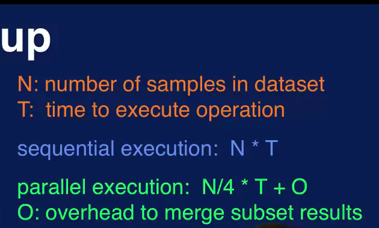
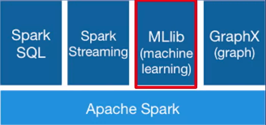

# Week 1: Introduction to Machine Learning with Big Data


# Machine Learning Overview

Machine learning is the field of study that focuses on computer systems that can learn from data. That is the system's often called models can learn to perform a specific task by analyzing lots of examples for a particular problem. For example, a machine learning model can learn to recognize an image of a cat by being shown lots and lots of images of cats. This notion of learning from data means that a machine learning model can learn a specific task without being explicitly programmed. In other words, the machine learning model is not given the step by step instructions on how to recognize the image of a cat. Instead, the model learns what features are important in determining whether it picture contains a cat from the data that has analyzed. Because the model learns to perform this task from data it's good to know that the amount and quality of data available for building the model are important factors in how well the model learns the task.

Because machine learning models can learn from data that can be used to discover hidden patterns and trends in the data. These patterns and trends lead to valuable insights into the data. Thus the use of machine learning allows for data driven decisions to be made for a particular problem. So to summarize, the field of machine learning focuses on the study and construction of computer systems that can learn from data without being explicitly programmed. Machine learning algorithms and techniques are used to build models, to discover hidden patterns and trends in the data allowing for data-driven decisions to be made.

Machine learning combines concepts and methods from many disciplines, including math, statistics, computer science, artificial intelligence, and optimization. In applying machine learning to a problem, domain knowledge is essential to the success of end results. By domain knowledge we mean an understanding of the application or business domain. Knowledge about the application, the data related to the application, and how the outcomes will be used are crucial to driving the process of building the machine learning model. So domain knowledge is also an integral part of a machine learning solution.

Machine learning encompasses the algorithms and techniques used to learn from data. The term data mining became popular around the time that the use databases became common place. So data mining was used to refer to activities related to finding patterns in databases and data warehouses. There are some practical data management aspects to data mining related to accessing data from databases. But the process of finding patterns in data is similar, and can use the same algorithms and techniques as machine learning. Predictive analytics refers to analyzing data in order to predict future outcomes. This term is usually used in the business context to describe activities such as sales forecasting or predicting the purchasing behavior of a customer. But again the techniques used to make these predictions are the same techniques from machine learning. Data science is a new term that is used to describe processing and analyzing data to extract meaning. Again machine learning techniques can also be used here. Because the term data science became popular at the same time that big data began appearing, data science usually refers to extracting meaning from big data and so includes approaches for collecting, storing and managing big data. 

These terms evolved at different times and may have encompassed different sets of activities. But there have always been more similarities than differences between them. Now they are often used interchangeably and have come to mean essentially the same thing. The process of extracting valuable insight from data, the core algorithms and techniques for doing this do not change with different terms.

# Categories of Machine Learning Techniques

In supervised approaches the target, which is what the model is predicting, is provided. This is referred to as having labeled data because the target is labeled for every sample that you have in your data set. In unsupervised approaches on the other hand, the target that the model is predicting is unknown or unavailable. This means that you have unlabeled data.

There are different categories of machine learning techniques for different types of problems. They are classification, regression, cluster analysis, and association analysis. 

## Supervised Learning

### Classification

In classification, the goal is to predict the category of the input data. An example of this is predicting the weather as being sunny, rainy, windy, or cloudy. The input data in this case would be sensor data specifying the temperature, relative humidity, atmospheric pressure, wind speed, wind direction, etc. The target or what you're trying to predict would be the different weather categories, sunny, windy, rainy, and cloudy. Another example is to classify a tumor as either benign or malignant. In this case, the classification is referred to as binary classification since there are only two categories. Another example is to identify hand written digits as being in one of ten categories, zero to nine.

### Regression

When your model has to predict a numeric value instead of a category, then the task becomes a regression problem. An example of regression is to predict the price of a stock. The stock price is a numeric value, not a category. So this is a regression task instead of a classification task. If you were to predict whether the stock price will rise or fall, then that would be a classification problem. But if you're predicting the actual price of the stock, then that is a regression problem. Some other examples of regression are estimating the demand of a product based on time or season of the year. Predicting a score on a test, determining the likelihood of how effective a drug will be for a particular patient, predicting the amount of rain for a region.

## Unsupervised Learning

### Cluster Analysis

In cluster analysis, the goal is to organize similar items in your data set into groups. A very common application of cluster analysis is referred to as customer segmentation. This means that you're separating your customer base into different groups or segments based on customer types. For example it would be very beneficial to segment your customers into seniors, adults and teenagers. These groups have different likes and dislikes and have different purchasing behaviors. By segmenting your customers to different groups you can more effectively provide marketing adds targeted for each groups particular interests. Note that cluster analysis is also referred to as clustering. Some other examples of cluster analysis are, identifying areas of similar topography, such as desert region, grassy areas, mountains etc. Categorizing different types of tissues from medical images. Determining different groups of weather patterns, such as snowy, dry, monsoon.

### Association Analysis

The goal in association analysis is to come up with a set of rules to capture associations between items or events. The rules are used to determine when items or events occur together. A common application of association analysis is known as market basket analysis. Which is used to understand customer purchasing behavior. For example, association analysis can reveal that banking customers who have CDs, or Certificates of Deposits, also tend to be interested in other investment vehicles such as money market accounts. This information can be used for cross selling. If you advertise money market accounts to your customers with CDs they are likely to open such an account. Some other applications of association analysis are recommending similar items based on the purchasing behavior or browsing histories of customers. Finding items that are often purchased together, such as garden hose and potting soil, and offer sales on these related items at the same time to drive sales of both items. Identifying web pages that are often accessed together so that you can more efficiently offer up these related web pages at the same time.

# Machine Learning Process

It should be kept in mind that all of these steps need to be carried out with a clear purpose in mind. That is, the problem or opportunity that is being addressed must be defined with clearly stated goals and objectives. For example, the purpose of a project may be to study customer purchasing behavior to come up with a more effective marketing strategy in order to increase sales revenue. The purpose behind the project will drive the machine learning process.

## Step 1: Acquire Data

The first step in the machine learning process is to get all available data related to the problem at hand. Here, we need to identify all data sources, collect the data, and finally integrate data from these multiple sources.

The goal of the step is to identify and obtain all data related to the problem at hand. First, we need to identify all related data and the sources. Keep in mind, that data can come from different sources such as files, databases, the internet, mobile devices. So remember to include all data related to the problem you're addressing. 

After you've identified your data and data sources, the next step is to collect the data and integrate data from the different sources. This may require conversion, as data can come in different formats. And it may also require aligning the data, as data from different sources may have different time or spacial resolutions. Once you’ve collected and integrated your data, you now have a coherent data set for your analysis.

## Step 2: Prepare the Date

This step is further divided into two parts, explore data and pre-process data.

### Explore Data

The first part of data preparation involves preliminary exploration of the data to understand the nature of the data that we have to work with. Things we want to understand about the data are its characteristics, format, and quality. A good understanding of the data leads to a more informed analysis and a more successful outcome. 

In data exploration, you want to do some preliminary investigation in order to gain a better understanding of the specific characteristics of your data. This in turn will guide the rest of the process. With data exploration, you'll want to look for things like correlations, general trends, outliers, etc. Correlations provide information about the relationship between variables in your data. Trends in your data will reveal if the variable is moving in a certain direction, such as transaction volume increasing throughout the year. Outliers indicate potential problems with the data, or may indicate an interesting data point that needs further examination. Without this data exploration activity, you will not be able to use your data effectively. One way to explore your data is to calculate summary statistics to numerically describe the data.

Summary statistics are quantities that capture various characteristics of a set of values with a single number, or a small set of numbers. Some basic summary statistics that you should compute for your data set are mean, median, mode, range and standard deviation. Mean and median are measures of the location of a set of values. Mode is the value that occurs most frequently in your data set, and range and standard deviation are measures of spread in your data. Looking at these measures will give you an idea of the nature of your data. They can tell you if there's something wrong with your data. For example, if the range of the values for age in your data includes negative numbers, or a number much greater than a hundred, there's something suspicious in the data that needs to be examined.

Visualization techniques also provide quick and effective ways to explore your data. Some examples are, a histogram, such as the plot shown here, shows the distribution of the data and can show skewness or unusual dispersion in outliers. A line plot, like the one in the lower left, can be used to look at trends in the data, such as, the change in the price of a stock. A heat map can give you an idea of where the hot spots are. A scatter plot effectively shows correlation between two variables. Overall, there are many types of plots to visualize data. They are very useful in helping you understand the data you have.

### Pre-processing

This includes cleaning data, selecting the variables to use, and transforming data to make the data more suitable for analysis. The goal here is to create the data that will be used for analysis. The main activities on this part are to clean the data, select the appropriate variables to use and transform the data as needed. 

A very important part of data preparation is to clean the data to address quality issues. Real world data is nothing. There are many examples of quality issues with data from real applications including missing values, such as income in a survey, duplicate data, such as two different records for the same customer with different addresses. Inconsistent or invalid data, such as a six digit zip code. Noise in the collection of data that distorts the true values. Outliers, such as a number much larger than 100 for someone's age. It is essential to detect and address these issues that can negatively affect the quality of the data.

Other activities in data preprocessing can be broadly categorized as feature selection and feature transformation. Feature selection refers to choosing the set of features to use that is appropriate for the application. Feature selection can involve removing redundant or irrelevant features, combining features, or creating new features. During the exploring data step, you may have discovered that two features are very correlated. In that case, one of these features can be removed without negatively effecting the analysis results. For example, the purchase price of a product and the amount of sales tax pain are very likely to be correlated. Eliminating the sales tax amount then will be beneficial. Removing redundant or irrelevant features will make the subsequent analysis simpler. You may also want to combine features or create new ones. For example, adding the applicants education level as a feature to a loan approval application would make sense.

Feature transformation maps the data from one format to another. Various transformation operations exist. For example, scaling maps the data values to a specified range to prevent any one feature from dominating the analysis results. Filtering or aggregation can be used to reduce noise and variability in the data. Dimensionality reduction maps the data to a smaller subset of dimensions to simplify the subsequent analysis.

## Step 3: Analyze Data

This step involves selecting the analytical techniques to use, building a model using the data, and assessing the results. he goals of the staff are to build a machine learning model, to analyze the data and to evaluate the results that you get from the model. The analyze steps starts with this determining the type of problem you have. You begin by selecting appropriate machine learning techniques to analyze the data. Then you construct the model using the data that you've prepared. Once the model is built, you will want to apply it to new data samples to evaluate how well the model performs. 

## Step 4: Communicate Results

This includes evaluating the results with respect to the goal set for the project. presenting the results in a easy to understand way and communicating the results to others. In reporting your results, it is important to communicate your insights and make a case for what actions should follow. You will want to think about what to present, as well as how to present. In deciding what to present, you should consider what the main results are, what insights were gained from your analysis, and what added value do these insights bring to the application. Keep in mind that even negative results are valuable lessons learned, and suggest further avenues for additional analysis. Remember that all findings must be presented so that informs decisions can be made for next steps. Plots and summary statistics discussing the explore step can be used effectively here as well. You should also have tables with details from your analysis as backup, if someone wants to take a deeper dive into the results.

## Step 5: Apply Results

The last step is to apply the results. This brings us back to the purpose of the project. How can the insights from our analysis be used to provide effective marketing to increase sales revenue? Determining actions from insights gained from analysis is the main focus of the act step. What action should be taken based on the results of your analysis? Should you market certain products to a specific customer segment to increase sales? What inefficiency is can be removed from your process? What incentives would be effective in attracting new customers? Once a specific action has been determined, the next step is to implement the action. Things to consider here include, how can the action be added to your application? How will end users be affected? Assessing the impact of the implemented action is then necessary to evaluate the benefits gained. The results of this assessment determine next steps, which could suggest additional analysis or further opportunities, which would begin another cycle of the machine learning process.

Note that the machine learning process is a very iterative one. Findings from one step may require a previous step to be repeated with new information. For example, during the prepare step, we may find some data quality issues that may require us to go back to the acquire step to address some issues with data collection or to get additional data that we didn't include in the first go around. Each step may also require several iterations. For example, it is common to try different analysis techniques in the analyze step in order to get reasonable results from the model. So, it is important to recognize that this is a highly iterative process, and not a linear one.

## Cross Industry Standard Process for Data Mining (CRISP-DM)

CRISP-DM is a process model that describes the steps in a data mining process. The phases are, business understanding, data understanding, data preparation, modeling, evaluation and deployment:


## Business Understanding

As with any project, the first step is to understand why we're doing this. We need to find the business problem. What is the problem or opportunity being addressed? What do we hope to gain by undertaking this project? We then need to assess the situation. What are the available resources? What are the requirements, the risks, the costs, the benefits? We also need to formulate goals and objectives and define the success criteria. What do we hope to achieve by the end of the project? At the end of this phase, we should understand the problem we want to address. Once we know the question we want to address, then we can formulate the plan to come up with the answer. In other words, the solution to our problem.

### Data Understanding

This phase has two parts, data acquisition and data exploration:

#### Data Acquistion

Data acquisition involves identifying, collecting, and integrating all data related to the problem being addressed

#### Data Exploration

Data exploration means preliminary exploration of the data to understand what you have to work with.

### Data Preparation

The goal here is to prepare data for modeling. The activities in this phase are to address data quality issues, select the features to use, and process the data to make it suitable for modeling in the next phase.

### Modeling

We first need to determine the type of problem we have. Is it a classification problem for example? Then the modeling techniques or algorithms need to be selected. Then the model is built using the prepared data to perform the necessary task.

### Evaluate Results

he model's performance needs to be assessed, and these results need to be evaluated with respect to the success criteria defined in the first phase. At the end of this phase a go or no go decision will need to be made regarding the model that has been built. If it's a go, then we proceed to the next phase. If a no go decision is decided, then we need to determine what the next steps are. Do we need to clean up the data more? Do we need to go back to phase two, which is data understanding, to collect more data?

### Deployment

Depending on the project requirements, deployment phase can be as simple as creating a final report, or as complex as implementing the model and integrating it into an existing process. In this phase, we want to produce a final report or presentation to document and communicate the findings of the project to others. This should include model performance and address business objectives that were set for the project. Deploy the model. This means integrating the model into the intended application or process. Create a plan to monitor the model. This is necessary to evaluate the impact of the model on our process or application.

## Scaling Up Machine Learning Algorithms

We need to be able to add scalability to machine learning techniques. How do we apply machine learning at scale?

One way, is to scale up by adding more memory, processors, and storage to our system so that it can store and process more data. This is not the big data approach. Specialized hardware such as graphical processing units, or GPUs for short, can also be added to speed up the miracle operations common in machine learning algorithms. Although this is a good approach, this is also not the big data approach. As we learned in our introductory course, one problem with this approach is that larger specialized hardware can be very costly. Another problem is that we eventually will hit a limit. There's only so much hardware you can add to a machine.

An alternative approach is to scale out. This means using many local commodity distribution systems together. Data is distributed over these systems to gain processing speed up. The idea is to divide the data into smaller subsets. The same processing is applied to each subset, or map, and the results are merged at the end to come up with the overall results for the original dataset.




Let's consider an example, where we want to apply the same operation to all the samples in a dataset of N samples. In this case, N is four. If it takes T time units to perform this operation on each sample, then with sequential processing the time to apply that operation to all samples, is N times T. If we have a cluster of four processors, we can distribute the data across the four processors. Each process performs the operation on the dataset subset of N over four samples. Processing of the four subsets of the data is done in parallel. That is, the subsets are processed at the same time. The processing time for the distributed approach is approximately N over 4 times T plus any overhead required to merge the subset results and maybe shuffle them. This is a speedup of nearly four times over the sequential approach.

On a distributed computing platform such as Spark or Hadoop, scalable machine learning algorithms use the same scale out approach. Data is distributed across different processors, which operate on the data subsets in parallel using map, reduce, and other distributed parallel transformations. This allows for machine learning techniques to be applied to large volumes of data. We will use Spark and its scalable machine learning library, MLF.

### Tools

#### KNIME

KNIME Analytics is a platform for data analytics, reporting, and visualization. The KNIME platform uses a graphical user interface based approach with drag and drop features to facilitate constructing an analytic solution. The basic components in KNIME are referred to as nodes. Each node provides a specific functionalities, such as reading in a file, creating a specific type of machine running model and generating a plot. Nodes can be connected to create machine running workflows or pipelines. KNIME stands for Konstanz Information Miner. The Konstanz is for the University of Konstanz in Germany. 

In KNIME you assemble the steps that need to be performed in a machine learning process by connecting nodes to create a workflow. To create a workflow the user chooses the appropriate nodes from the node repository and assembles them into a workflow. The workflow can then be executed in the KNIME work bench.


Each node can have input and output ports and can be connected to other nodes. When a node is executed, it takes data from its input port, performs some operations on the data and writes the results to the output port. Data is transferred between nodes that are connected. A node can be configured by opening up its configuration dialog. This is where the parameters for the node can be set.

The Node Repository is where you will find all the nodes available in your KNIME installation. The nodes are organized by categories. KNIME provides an array of nodes to perform operations for data access, data manipulation, analysis, visualization, and reporting. KNIME provides a visual approach to machine learning. It's GUI-based, drag-and-drop approach provides an easy way to create and execute a machine learning workflow. The open source version of KNIME however is limited in how large of a dataset it can handle.

#### Spark MLib

Spark is a distributed computing platform. MLlib is a scalable machine learning library that runs on top of Spark.



It provides distributed implementations of commonly used machine learning algorithms and utilities.

To implement machine learning operations in Spark MLlib, you need to write code. So MLlib is not a GUI-based approach. This segment of code reads and parses data from a file, then builds a decision tree classification model. MLlib, as with the base Spark core, provides an application programming interface, or API, for Java, Python, Scala and R. This means that you can write code in these programming languages to execute the base operations provided in Spark.

```python
# Readn and parse data
data = sc.textFile("data.txt")

# Decision tree for classification
dt = DecisionTreeClassifier(labelCol = "label", featuresCol = "features")
Pipeline = Pipeline(stages=(labelIndex, featureIndexer, dt)
model = pipeline.fit(trainingData)
```

Spark MLlib runs on a distributed platform. It provides machine learning algorithms and techniques that are implemented using distributed processing. So MLlib is used for processing and analyzing large datasets