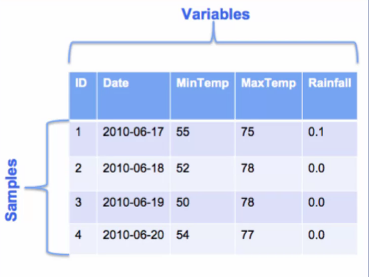
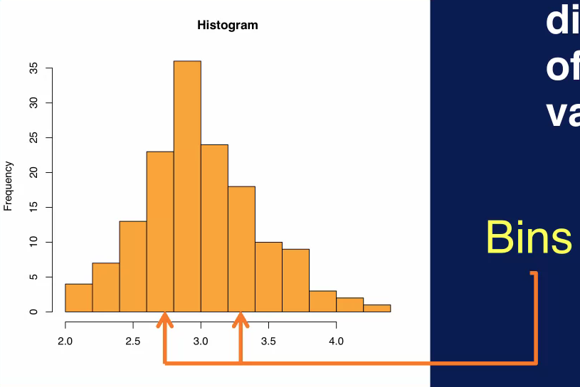
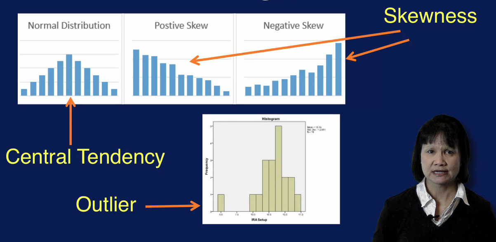
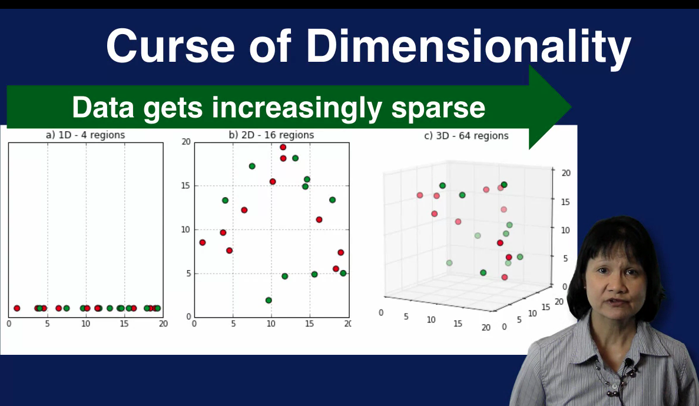
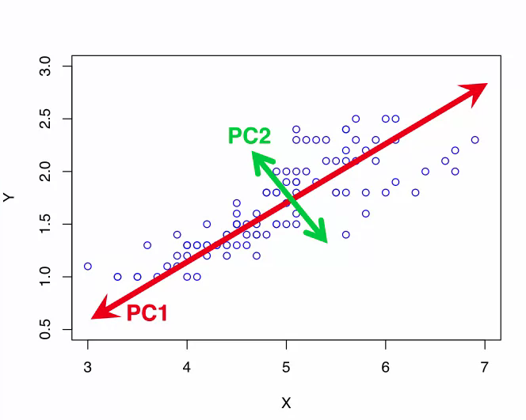

# Week 2: Data Exploration & Preparation

# Data Terminology

A sample is an instance or example of an entity in your data. This is typically a row in your dataset. This figure shows part of a dataset of values related to weather. Each row is a sample representing weather data for particular day. The table in the figure shows four samples of weather data, each for different day. In this table, each sample has five values associated with it. These values are different information pieces about the sample such as the sample ID, sample date, minimum temperature, maximum temperature, and rainfall on that day. We call these different values variables of the sample. 

There are many names for sample and variable. Some other terms for sample that you might hear in a machine learning context include record, example, row, instance and observation.

There are also many names for the term variable, such as feature, column, dimension, attribute, and field. All of these terms refer to specific characteristics for each sample in your dataset. An important point to emphasize about variable is that, they are additional values with a data type. Each variable has a data type associated with it. The most common data types are numeric and categorical. There are other data types as well such as string and date.

As the name implies, numeric variables are variables that take on number values. Numeric variables can be measured, and their values can be sorted in some way. Note that a numeric variable can take on just integer values or be continuous valued. It can also have just positive numbers, negative numbers or both. A person's height is a positive, continuous valued number. The score in an exam is a positive number that range between zero and a 100%. The number of transactions per hour is a positive integer, whereas the change in a stock price can be either positive or negative.

A variable with labels, names, or categories for values instead of numbers are called categorical variables. For example a variable that describes the color of an item, such as the color of a car, can have values such as red, silver, blue, white and black. These are non-numeric values that describes some quality or characteristic of an entity. These values can be thought of as names or labels that can be sorted into categories. Therefore, categorical variables are also referred to as qualitative variables, or nominal variables. Some examples of categorical variables are gender, marital status, type of customer, for example, teenager, adult, senior. Product categories, for example, electronics, kitchen, bathroom and color of an item.

To summarize, a sample is an instance or example of an entity in your data. A variable captures a specific characteristic of each entity. So a sample has many variables to describe it. Data from real applications are often multidimensional, meaning that there are many dimensions or variables describing each sample. Each variable has a data type associated with it, the most common data types are numeric and categorical.

# Data Exploration

Data exploration means doing some preliminary investigation of your data set. The goal is to gain a better understanding of the data that you have to work with. If you understand the characteristics of your data, you can make optimal use of it in whatever subsequent processing and analysis you do with the data. Note that data exploration is also called exploratory data analysis, or EDA for short. 

There are two main categories of techniques to explore your data, one based on summary statistics and the other based on visualization methods.

Summary statistics provide important information that summarizes a set of data values. There are many such statistics. Many of them you have probably heard of before, such as mean, median, and standard deviation. These are some very commonly used summary statistics. A summary statistic provides a single quantity that summarizes some aspects of the dataset. For example, the mean, is a single value that describes the average value of the dataset, no matter how large that dataset is. You can think of the mean as an indicator of where your dataset is centrally located on a number line, thus summary statistics provide a simple and quick way to summarize a dataset.

Data visualization techniques allow you to look at your data, graphically. There are several types of plots that you can use to visualize your data. Some examples are histogram, line plot, and scatter plot.

What should you look for when exploring your data? You use statistics and visual methods to summarize and describe your dataset, and some of the things you'll want to look for are correlations, general trends and outliers.

Correlations provide information about the relation took between variables in your data. By looking at correlations, you may be able to determine that two variables are very correlated. This means they provide the same or similar information about your data. Since this contain redundant information, this suggest that you may want to remove one of the variables to make the analysis simpler.

Trends in your data will reveal characteristics in your data. For example, you can see where the majority of the data values lie, whether your data is skilled or not, what the most frequent value or values are in a date set, etc. Looking at trends in your data can also reveal that a variable is moving in a certain direction, such as sales revenue increasing or decreasing over the years.

Calculating the minimum, the maximum and range of the data values are basic steps in exploring your data. Determining outliers is a also very important. Outliers indicate potential problems with the data and may need to be eliminated in some applications. In other applications, outliers represent interesting data points that should be looked at more closely. In either case, outliers usually require further examination.

## Summary Statistics

There are three main categories of summary statistics. Measures of location or centrality, measures of spread, and measures of shape.

### Measures of Location

Measures of location are summary statistics that describe the central or typical value in your dataset. These statistics give a sense of the middle or center of the dataset. Examples of these are mean, median and mode. The mean is just the average of the values in a dataset. The median is the value in the middle if you sorted the values in your dataset. In a sorted list, half of the values will be less than the median and half will be greater than the median. If the number of data values is even, then the median is the mean of the two middle values. The mode is a value that is repeated more often than any other value.

### Measures of Spread

Measures of spread describe how dispersed or varied your dataset is. Common measures of spread are minimum, maximum, range, standard deviation and variance. Minimum and maximum are of course the smallest and largest values in your dataset respectively. The range is simply the difference between the maximum and minimum and tells you how spread out your data is. Standard deviation describes the amount of variation in your dataset.

A low standard deviation value means that the samples in your dataset tend to be close to the mean. And a high standard deviation value means that the data samples are spread out. Variance is closely related to standard deviation. In fact the variance is the square of the standard deviation. So it also indicates how spread out the data samples are from the mean.

### Measures of Shape

Measures of shape describe the shape of the distribution of a set of values. Common members of shape are skewness and kurtosis. Skewness indicates whether the data values are asymmetrically distributed. A skewness value of around zero indicates that the data distribution is approximately normal, as shown in the middle figure in the top diagram. A negative skewness value indicates that the distribution is skewed to the left, as indicated in the left figure in the top diagram. A positive skewness value on the other hand indicates that the data distribution is skewed to the right.

Kurtosis measures the tailedness of the data distribution or how heavy or fat the tails of the distribution are. A high kurtosis value describes a distribution with longer and fatter tails and a higher and sharper central peak, indicating the presence of outliers. A low kurtosis value on the other hand, describes a distribution with shorter and lighter tails and lower and broader central peak, suggesting the lack of outliers.

### Measures of Dependence

Measures of dependence determine if any relationship exists between variables. Pairwise correlation is a commonly used measure of dependence. Note that correlation applies only to numerical variables. Correlations is between zero and one, with zero indicating no correlation, and one indicating a one to one correlation.

### Contingency Table

The summary statistics we just covered are useful for numerical variables. For categorical variables, we want to look at statistics that describe the number of categories and the frequency of each category. This is done using a contingency table. The contingency table also shows the distribution between the categories. 

### Data Validation

In addition to looking at the traditional summary statistics for numerical variables, and category count for categorical variables. For machine learning problems, we also want to examine some additional statistics to quickly validate the data. One of the first things to check is the number of rows and the number of columns in your dataset. Does the number of rows match the expected number of samples? Does the number of columns match the expected number of variables? These should be very quick and easy checks. Another easy data validation check is to look at the values in the first and last few samples in your dataset to see if they're reasonable. Are the data types for your variables correct? For example, is the date field captured as dates or timestamp. Or is it capture as a string or numerical value? These will have consequences in how these fields should be processed. Another important step is to check for missing values. You need to determine the number of samples with missing values. You also need to determine if there are any variables with a high percentage of missing values. Handling missing values is a very important step in data preparation.

## Plots

Data visualization is a nice complement to using summary statistics for exploring data. There are several types of plots that you can use to visualize your data. We will go over histogram, line plot, scatter plot, bar plot, and box plot. These are the most commonly used plots, but there are many others as well.

### Histogram

A histogram is used to display the distribution of a variable. The range of values for the variable is divided into the number of bins, and the number of values that fall into each bin is counted. Which determines the height of each bin. A histogram can reveal many things about a variable in your data, for example, you can usually determine the central tendency of a variable, that is where the majority of the values lie. You can also see the most frequent value of values for that variable. A histogram also shows whether the values for that variable are skewed and whether the skewness is to the left towards smaller values or to the right towards larger values. You can also pick outliers in the histogram as shown on the bottom plot.

### Line Plot

A line plot shows how data values change over time. The values of a variable or variables are shown on the Y axis and the X axis shows the motion of time. A line plot can show patterns in your variables. For example, a cyclical pattern can be detected as in this plot, where the values start high, then decrease and go back up again. Trends can also be detected as shown in the upper-right plot where the values fluctuate but show a general upward trend over time. It is also easy to compare how multiple variables change over time on a single line plot as displayed in the center bottom plot.

### Scatter Plot

A scatter plot is a great way to visualize the relationship between two variables. One variable is on the x axis. The other variable is on the y axis Each sample is a product using the values of the 2 variables aspects and Y coordinates. The resulting plot shows how one variable changes as the other is changed. A scatter plot can be used to display the correlation between 2 variables. For example, 2 variables such as the high temperature of the day, and the low temperature of the day, can have a positive correlation as shown in this plot.

A positive correlation means that as the value of one variable increases, the value of the other variable also increases by a similar amount. The upper right scatter plot shows a negative correlation between two variables. This means that as the value of one variable increases, there is a corresponding decrease in the other variable, two variables can also have a non-linear correlation as shown in the lower left plot. This means that a change in one variable will not always correspond to the same change in the other variable. This is indicated by the curve in the scatter plot as opposed to something closer to a straight line for linear correlation. There can also be no correlation between two variables. In this case, you will see something like randomly placed dots as displayed in the lower right plot, indicating no relationship between how the two variables change with respect to each other.

### Bar Plot

A bar plot is used to show the distribution of categorical variables. Recall that a histogram is also used to look at the distribution of the values of the variable. The difference is that in general, a histogram is used for numeric variables whereas a bar plot is used for categorical variables. In a bar chart, the different categories of a categorical variable is shown along the x-axis, and the count of instances for each category is displayed on the y-axis. This is an effective way to compare the different categories. For example, the most frequent category can be easily determined. 

A bar plot is also a great way to compare two categorical variables. For example, this plot compares two categorical variables. One in blue and the other in orange, each with three different categories. Here you can see that for the first category, the blue variable has the higher count, while the orange variable has a higher count for the second and third category. This type of Bar Plot is called a Grouped Bar Chart. And the different variables of products side by side. A different kind of comparison can be performed using a Stacked Bar chart as seen in a lower right quad. Here, the accounts for the two variables are stacked on top of each other for each category. With this bar chart, you can determine that the combined count for the first category is about equal to the combine count for the second category, while the compliant count for the third category is much larger.

### Box Plot

A box plot is another plot that shows the distribution of a numeric variable, it shows the distribution in a different format than the histogram, however. This is how a box plot displays the distribution of values for a variable, the gray portion in the figure is the box part. The lower and upper boundaries of the box represent the 25th and 75th percentiles respectively. This means that the box represents the middle 50% of the data, the median is the 50th percentile, meaning that 50% of the data is greater than its value and 50% of the data is less than this value. The top and bottom lines are the Whiskers and represent the 10th and 90th percentiles respectively. So, 80% of the data are in the region indicated by the upper extreme and lower extreme. Any data values outside of this region are outliers and are indicated as single point on the box plot.

Note that there are different variations of the box plot, with the whiskers representing different types of extreme values. Box plots provide a compact way to show how variables are distributed, so they are often used to compare variables. The box plot on the left for example compares the base salary for two different roles. This plot can quickly provide information regarding the median value, the range and the spread of the two different variables. We can quickly see that the median salary for the marketing role is higher than the research role. We can also see that the variation or spread of the values for marketing is greater than for research, due to the larger area of the purple box.

A box plot can also show you if the distribution of the data values is symmetrical, positively skewed or negatively skewed. Here we see that a box plot can also be displayed on its side. A symmetric distribution is indicated if the line in the box which specifies the median, is in the center of the box. A negative skew is indicated when the median is to the right of the center of the box. This means that there are more values that are less than the median than there are values greater than the median. Similarly, a positive skew is indicated when the median is to the left of the center of the box

# Data Preparation

The raw data that you get directly from your sources is rarely in the format that you can use to perform analysis on. The goal of data preparation is to create the data that will be used for analysis. This means cleaning the data, and putting the data in the right format for analysis. The latter generally involves selecting the appropriate features to use and transforming the data as needed. The data that you've acquired will likely have many problems. An important part of data preparation is to clean the data that you have to work with to address what are referred to as data quality issues. There are many types of data quality issues, including missing values, duplicate data, inconsistent or invalid data, noise, and outliers. The problems listed here can negatively affect the quality of the data and compromise the analysis process and results. So it is very important to detect and address these data quality issues. Some techniques to address data quality issues include removing data records with missing values, merging duplicate records, generating a best, or at most reasonable, estimate for invalid values. After the data has been cleaned, another goal of data preparation is to get the data into the format needed for the analysis. This step is referred to by many names, Data Munching, Data Wrangling and Data Preprocessing.

The two broad categories of data wrangling are feature selection and feature transformation.

## Feature Selection

Feature selection involves deciding on which features to use from the existing ones available in your data. Features can be removed, added or combined. 

Feature selection refers to choosing the set of features to use that is appropriate for the subsequent analysis. The goal of feature selection is to come up with the smallest set of features that best captures the characteristics of the problem being addressed. The smaller the number of features used, the simpler the analysis will be. But of course, the set of features used must include all features relevant to the problem. So, there must be a balance between expressiveness and compactness of the feature set. There are several methods to consider in selecting features. New features can be added, some features can be removed, features can be re-coded or features can be combined. All these operations affect the final set of features that will be used for analysis. Of course some features can be kept as is as well.

New features can be derived from existing features. For example, a new feature to specify whether a student is in state or out of state can be added based on the student's state of residence. For an application such as college admissions, this new feature represents an important aspect of an application and so would be very helpful as a separate feature.

Features can also be removed, candidates for removal are features that are very correlated. During data exploration, you may have discovered that two features are very correlated, that is they change in very similar ways. For example, the purchase price of a product and the amount of sales tax paid are likely to be very correlated. The higher the purchase price the higher the sales tax. In this case, you might want to drop one of these features, since these features have essentially duplicate information. And keeping both features makes the feature set larger and the analysis unnecessarily more complex. Features with a high percentage of missing values may also be good candidates for removal. The validity and usefulness of features with a lot of missing values are in question. So removing may not result in any loss of information. Again these features would have been discovered during the data exploration step.

Irrelevant features should also be removed from the data set. Irrelevant features are those that contain no information that is useful for the analysis task. An example of this is employee ID in predicting income. Other fields used simply for identification such as row number, person's ID, etc., are good candidates for removal.

Features can also be combined if the new feature presents important information that is not represented by looking at the original features individually.

A feature can be re-coded as appropriate for the application. A common example of this is when you want to turn a continuous feature in to a categorical one. For example for a marketing application you might want to re-code customer's age into customer categories such as teenager, young adult, adult and senior citizen. So you would map ages 13 to 19 to teenager, ages 20 to 25 to young adult, 26 to 55 as adult and over 55 as senior. For some applications you may want to make use of finery features. As an example, you might want a feature to capture whether a customer tends to buy expensive items or not. In this case, you would want a feature that maps to one for a customer with an average purchase price over a certain amount and maps to zero otherwise. Re-coding features can also result in breaking one feature into multiple features. A common example of this is to separate an address feature into its constituent parts street address, city, state and zip code. This way you can more easily group records by state, for example, to provide a state by state analysis. 

Future selection aims to select the smallest set of features to best capture the characteristics of the data for your application.

Know from the examples represented that domain knowledge once again place a key role in choosing the appropriate features to use. Good understanding of the application is essential in deciding which features to add, drop or modify. It should also be noted that feature selection can be referred to as feature engineering, since what you're doing here is to engineer the best feature set for your application.

## Feature Transformation

Feature transformation involves changing the format of the data in some way to reduce noise or variability or make the data easier to analyze. Two common feature transformations are scaling the data so that all features have the same value range and reducing the dimensionality, which is effectively the number of features of the data. 

Feature transformation involves mapping a set of values for the feature to a new set of values to make the representation of the data more suitable or easier to process for the downstream analysis.

A common feature transformation operation is scaling. This involves changing the range of values for a feature of features to another specified range. This is done to avoid allowing features with large values to dominate the analysis results. One way to perform scaling is to map all values of a feature to a specific range such as between zero and one. Alternatively, scaling can be perform by transforming the features such that the results have zero mean, and unit standard deviation. The steps to perform the scaling is to first calculate the mean and standard deviation values for the feature to be scaled. Then for each value, for this feature, subtract the mean value from that value, and divide by the standard deviation. The transformed feature will end up with a mean value of zero, and standard deviation of one. This effectively removes the units of the features and converts each future value to number of standard deviations from the mean. This scaling method is used when the min and max values are known. This is also useful when there are outliers which will skew the calculation for the range as the max value is determined by the furthest outlier. This scaling operation is often referred to as zero-normalization or as standardization.

Filtering is another feature transformation operation. This is commonly applied to time series data, such as speech or audio signals. A low pass filter can be used to filter out noise. Which usually manifests as the high frequency component in the signal. A low pass filter removes components above a certain frequency allowing the rest to pass through unaltered. Filtering can also be used to remove noise in images. Noise in an image is random variation in intensity or color in the pixels. For example, a noise can cause an image to appear grainy. A mean or median filter can be used to replace the pixel value with the mean or median value of its neighboring pixels.

Aggregation combines values for a feature in order to summarize data or reduce variability. Aggregation is done by summing or averaging data values at a higher level. For example, hourly values can be aggregated to the daily level. Or values within a city region can be aggregated to a state level. Aggregation can have the effect of removing noise to provide a clear representation of the structure of your data.

Feature transformation should be used with cautions since they change the nature of the data and unintentionally remove some important characteristics of the data. So it's important to look at the effects of the transformation you're applying to your data to make certain that it has the intended consequences.

## Dimensionality Reduction

The data used in machine learning processes often have many variables. This is what we call highly dimensional data. Most of these dimensions may or may not matter in the context of our application with the questions we are asking. Reducing such high dimensions to a more manageable set of related and useful variables improves the performance and accuracy of our analysis.

The number of features or variables you have in your data set determines the number of dimensions or dimensionality of your data. If your dataset has two features, than it is two dimensional data. If it has three features than it has three features and so on. You want to use as many features as possible to capture the characteristics of your data, but you also don't want the dimension of your data to be too high. As the dimensionality increases, the problem spaces you're looking at increases requiring substantially more instances to adequately sample of that space. So as the dimensionality increases, the space that you are looking at grows exponentially. As the space grows data becomes increasingly sparse.

In this diagram we see how the problem space grows as the dimensionality increases from 1 to 2 to 3. In the left plot, we have a one dimensional space partitioned into four regions each with size of 5 units. The middle plot shows a two dimensional space with 5x5 regions. The number of regions has now going from 4 to 16. In the third plot, the problem space is three dimensional with 5x5x5 regions. The number of regions increased even more to 64. We see that as the number of dimensions increases, the number of regions increases exponentially and the data becomes increasingly sparse. With a small dataset relative to the problem space, analysis results degrade. In addition, certain calculations used in analysis become much more difficult to define and calculate effectively. For example, distances between samples are harder to compare since all samples are far away from each other. All of these challenges represent the difficulty of dealing with high dimensional data and as referred to as the curse of dimensionality. To avoid the curse of dimensionality, you want to reduce the dimensionality of your data. This means finding a smaller subset of features that can effectively capture the characteristics of your data.

For example, you can a feature that is very correlated with another feature. Using feature selection techniques to select assessitive features is one approach to dimensionality reduction.

Another approach to dimensionality reduction is to mathematically determine the most important dimension to keep and ignore the rest. The idea is to find a smallest subset of dimensions that capture the most variation in your data. This reduces the dimensions of the data while eliminating the relevant features making the subsequent analysis simple. A technique commonly use to find the subset of most important dimensions is called principal component analysis, or PCA for short. The goal of PCA is to map the data from the original high dimensional space to a lower dimensional space that captures as much of the variation in the data as possible. In other words, PCA aims to find the most useful subset of dimensions to summarize the data.

### Principal Components Analysis

Here, we have data samples in a two dimensional space that is defined by the x axis and the y axis. You can see that most of the variation in the data lies along the red diagonal line. This means that the dat samples are best differentiated along this dimension because they're spread out, not clumped together along this dimension. This dimension indicated by the red line is the first principle component labelled as PC1 in the part. It captures the large amount of variance along a single dimension in data. PC1, indicated by the red line does not correspond to either axis. The next principle component is determined by looking in the direction that is orthogonal, in other words perpendicular, to the first principle component which captures the next largest amount of variance in the data. This is the second principal component PC2 and it's indicated by the green line in the plot. This process can be repeated to find as many principal components as desired. Note that the principal components do not align with either the x-axis or the y-axis. And that they are orthogonal, in other words, perpendicular to each other. This is what PCA does. It finds the underlined dimensions, the principal components that capture as much of the variation in the data as possible. These principal components form a new coordinates system to transform the data to, instead of the conventional dimensions like X, Y, and Z.

Since the first principle component captures most of the variations in the data, the original data sample can be mapped to this dimension indicated by the red line with minimum loss of information. In this case then, we map a two-dimensional dataset to a one-dimensional space while keeping as much information as possible.

Briefly, PCA finds a new coordinate system for your data, such that the first coordinate defined by the first principal component Captures the greatest variance in your data. The second coordinate defined by the second principal component captures the second greatest variance in a data, etc.. The first few principle components that capture most of the variance in a data can be used to define a lower-dimensional space for your data. PCA can be a very useful technique for dimensionality reduction, especially when working with high-dimensional data.

While PCA is a useful technique for reducing the dimensionality of your data which can help with the downstream analysis, it can also make the resulting analysis models more difficult to interpret. The original features in your data set have specific meanings such as income, age and occupation. By mapping the data to a new coordinate system defined by principal components, the dimensions in your transformed data no longer have natural meanings. This should be kept in mind when using PCA for dimensionality reduction.

# Data Quality

Real world data is often very messy, so it's a given fact that you will need to clean your data by identifying and addressing many issues that affect the quality of your data.

In order to address data quality issues effectively knowledge about the application is crucial. Things such as how the data was collected, the user population, the intended use of the application etc, are important. This domain knowledge is essential to making informed decisions on how to best impute missing values, how to handle duplicate records and invalid data and what to do about noise and outliers in your data.

## Missing Data

A very common data quality issue is missing data. Recall that a sample in your dataset typically contains several variables or features like name, age and income. For some samples, some of these variables may not have a value. These are referred to as missing values in the data. Missing values are also referred to as N/A for not available. So you will see N/A and missing values used interchangeably. You may have missing values in your data if you have an optional field in your data set. For example, the field age is often an optional field on a survey. Also many people may choose not to provide a response for income. And so you will end up with missing values for the variable income in your data set. In some cases, a variable may not be applicable to all cases. You can also have missing values, due to a data collecting device that malfunctions, a network problem that affects how the data was transmitted, or something else that goes wrong during the data collection process itself, or the process of transmitting the data or storing the data.

A simple way to handle missing data is to simply drop any samples with missing values or NAs. All machine learning tools provide a mechanism or command for filtering out rows with any missing values. The advantage of this approach is that it is very simple. The caveat is that you are removing data when you filter out examples. If the number of samples dropped is large, then you end up losing a lot of your data.

An alternative to dropping samples with missing data is to impute the missing values. Imputing means to replace the missing values with some reasonable values. The advantage of this approach is that you're making use of all your data. Of course, imputing is more complicated than simply dropping samples. 

There are several ways to impute missing values. One strategy is to replace the missing values with the mean or median value of the variable. For example, a missing value for years of employment can be replaced by the mean or median value for years of employment for all current employees. Another approach is to use the most frequent value in place of the missing value. For example, the most frequently recorded age of customers associated with the specific item can be used if that value is missing. Alternatively, a sensible value can be derived as a replacement for a missing value. For example, a missing value for income can be set to zero for customers less then 18 years old, or it can be replaced with an average value based on occupation and location. Note that this approach requires knowledge about the application and the variable with missing values in order to make reasonable choices about what valuables would be sensible to replace the missing values.

## Duplicate Data

Duplicate data occurs when your data set has data objects that are duplicates or new duplicates of one another. An example of this is when there are two different records for the same customer with different addresses. This can come about, for example, if a customer's address has changed, but the second address was simply added to this customer's records instead of used to update the first address. Duplicate data can occur when merging data from multiple sources.

In the case of duplicate data one approach is to delete the older record. Another approach is to merge duplicate records. This often requires a way to determine how to resolve conflicting values. For example, in the case of multiple addresses for the same customer, some logic for determining similarities between addresses might be necessary. For example, St period is the same as Street

## Inconsistent Data

Invalid or inconsistent data occurs when you have an impossible value for a variable. Some common examples are when you have a six digit zip code, the letters AB for state abbreviations, or a negative numbers for age. These invalid data values can come about when there is a data entry error during data collection. For example, if you allow people to type in their zip code and someone accidentally includes an extra digit to their five digit zip code, then you will end up with an invalid six digit zipcode.

To address invalid data, consulting another data source may be necessary. For example, an invalid zip code can be corrected by looking up the correct zip code based on city and state. A best estimate for a reasonable value can also be used as a replacement. For example, for a missing age value for an employee, a reasonable value can be estimated based on the employee's length of employment.

## Noise

Noise refers to anything that can distort your data. Noise can be introduced during the data collection process or data transmission process. An example is buzzing in the background when an audio message is recorded due to background noise or a faulty microphone. Another example is an overly bright image due to an incorrect light exposure setting.

Noise that distorts the data values can be addressed by filtering out the source of the noise. For example, filtering out the frequency of a constant background noise will remove that noise component from a recording. This filtering must be done with care however, as it can also remove some components of the true data in the process.

## Outliers

An Outlier is a data sample with values that are considerably different than the rest of the other data samples in a data set. An example scenario, that can create Outliers is when there's a sense of failure that causes values being recorded to be much higher or lower than normal. In this case, you want to remove the Outliers from your data. In other applications however, such as fraud detection, outliers are the important samples that should be examined more closely. So depending on the application, outliers may need to be removed or be kept for further analysis.

Outliers can be detected through the use of summary statistics and plots of the data. Outliers can significantly skew the distribution of your data and thus the results of your analysis. In cases where outliers are not the focus of your analysis, you will want to remove these outlier samples from your data set. For example, when a thermostat malfunctions and causes values to fluctuate wildly, or to be much higher or lower than normal, these samples should be filtered out. In some applications, however, outliers are exactly what you're looking for. So when you detect outliers, you don't want to throw them out. Instead, you want to examine them more closely. A classic example of this is in fraud detection, where outliers represent potential fraudulent use and those samples should be analyzed closely.