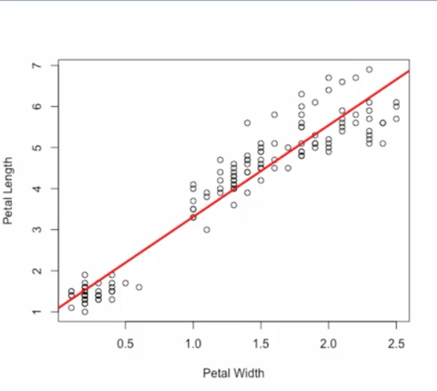
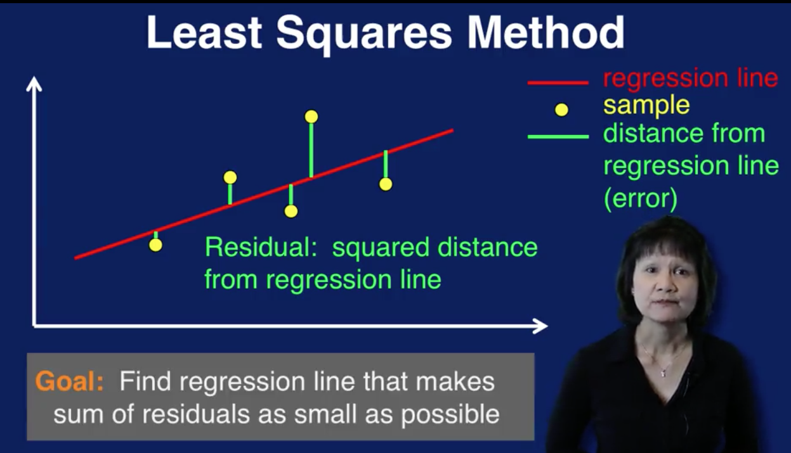
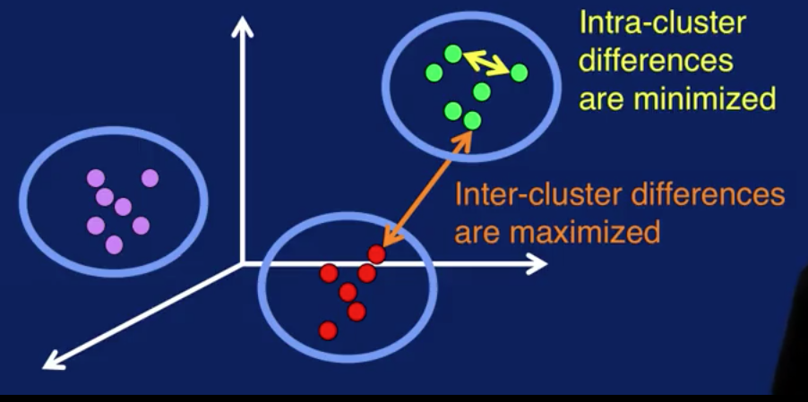
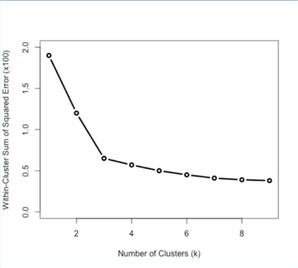

# Week 5: Regression, Cluster Analysis and Association Analysis

## Linear Regression

A linear regression model captures the relationship between a numerical output and the input variables. The relationship is modeled as a linear relationship hence the linear in linear regression.

To see how linear regression works, let's take a look at an example from the Iris flower dataset, which is a commonly used dataset for machine learning. This dataset has samples of different species of iris flowers along with measurements such as petal width and petal length. Here we have a plot with petal width measurements in centimeters on the x axis, and petal length measurements on the y axis. Let's say that we want to predict petal length based on petal width.

Then the regression task is this, given a measurement for petal width predict the petal length.

We can build a linear regression model to capture this linear relationship between the input petal width and the output petal length. The linear relationship for this samples is shown as the red line on the plot.

From this example we see that linear regression works by finding the best fitting straight line, through the samples. This is called the regression line.

In the simple case with just one input variable, the regression line is simply a line. The equation for a line is y = mx + b, where m determines the slope of the line and b is the y intercept or where the line crosses the y axis. M and b are the parameters of the model.

Training a linear regression model means adjusting these parameters to fit the regression line to the samples. The regression line can be determined using what's referred to as the least squares method.

This plot illustrates how the least squares method works. The yellow dots are the data samples. The red line is the regression line, the straight line that goes through the samples. This line represents the model's prediction of the output given the input. Each green line indicates the distance of each sample from the regression line. So the green line represents the error between the prediction, which is the value of the red regression line and the actual value of the sample. The square of this distance is referred to as the residual associated with that sample. The least squares method finds the regression line that makes the sum of the residuals as small as possible. In other words, we want to find the line that minimizes the sum of the squared errors of prediction. 

The goal of linear regression then is to find the best fitting straight line through the samples using the least squares method.

## Cluster Analysis

In cluster analysis, the goal is to organize similar items in your data set into groups or clusters. By segmenting your data into clusters, you can analyze each cluster more carefully. Note that cluster analysis is also referred to as clustering.

Cluster analysis divides all the samples in a data set into groups. In this diagram, we see that the red, green, and purple data points are clustered together. Which group a sample is placed in is based on some measure of similarity.

The goal of cluster analysis is to segment data so that differences between samples in the same cluster are minimized, as shown by the yellow arrow, and differences between samples of different clusters are maximized, as shown by the orange arrow. Visually, you can think of this as getting samples in each cluster to be as close together as possible, and the samples from different clusters to be as far apart as possible.

Cluster analysis requires some sort of metric to measure similarity between two samples. Some common similarity measures are Euclidean distance, which is the distance along a straight line between two points, A and B, as shown in this plot.

Manhattan distance, which is calculated on a strictly horizontal and vertical path, as shown in the right plot. To go from point A to point B, you can only step along either the x-axis or the y-axis in a two-dimensional case. So the path to calculate the Manhattan distance consists of segments along the axes instead of along a diagonal path, as with Euclidean distance.

Cosine similarity measures the cosine of the angle between points A and B, as shown in the bottom plot.

Since distance measures such as Euclidean distance are often used to measure similarity between samples in clustering algorithms, note that it may be necessary to normalize the input variables so that no one value dominates the similarity calculation. Essentially, scaling the input variables puts the variables on the same scale so that all variables have equal weighting in the calculation to determine similarity between samples. Scaling is necessary when you have variables that have very different scales.

Unlike classification or regression, in general, cluster analysis is an unsupervised task. This means that there is no target label for any sample in the data set. In general, there is no correct clustering results. The best set of clusters is highly dependent on how the resulting clusters will be used. There are numerical measures to compare two different clusters, but since there are no labels to determine whether a sample has been correctly clustered, there is no ground truth to determine if a set of clustering results are truly correct or incorrect.

Clusters don't come with labels. You may end up with five different clusters at the end of a cluster analysis process, but you don't know what each cluster represents. Only by analyzing the samples in each cluster can you come out with reasonable labels for your clusters. Given all this, it is important to keep in mind that interpretation and analysis of the clusters are required to make sense of and make use of the results of cluster analysis.

There are several ways that the results of cluster analysis can be used. The most obvious is data segmentation and the benefits that come from that.

Clusters can also be used to classify new data samples. When a new sample is received, compute the similarity measure between it and the centers of all clusters, and assign a new sample to the closest cluster. The label of that cluster, manually determined through analysis, is then used to classify the new sample

Once cluster labels have been determined, samples in each cluster can be used as labeled data for a classification task. The samples would be the input to the classification model. And the cluster label would be the target class for each sample. This process can be used to provide much needed labeled data for classification.

Yet another use of cluster results is as a basis for anomaly detection. If a sample is very far away, or very different from any of the cluster centers, like the yellow sample here, then that sample is a cluster outlier and can be flagged as an anomaly. However, these anomalies require further analysis. Depending on the application, these anomalies can be considered noise, and should be removed from the data set.

### k-Means Clustering

k-means is a classic algorithm used for cluster analysis. The algorithm is very simple. The first step is to select k initial centroids. A centroid is simply the center of a cluster. Next, assign each sample in a dataset to the closest centroid. This means you calculate the distance between the sample and each cluster center and assign a sample to the cluster with the closest centroid. Then you calculate the mean, or average, of each cluster to determine a new centroid. These two steps are then repeated until some stopping criterion are reached.

Here's an illustration of how k-Means works. (a) shows the original data set with some samples. And (b) illustrates centroids initially selected. (c) shows the first iteration. Here, samples are assigned to the closest centroid. In (d), the centroids are recalculated. (e) shows the second iteration. Samples are assigned to the closer centroid. Note that some samples changed their cluster assignments. And in (f), the centroids are recalculated again. Cluster assignments and centroid calculations are repeated until some stopping criteria is reached. And you get your final clusters, as shown in (f).

How are the initial centroids selected? The issue is that the final cluster results are sensitive to initial centroids. This means that cluster results with one set of initial centroids can be very different from results with another set of initial centroids. There are many approaches to selecting the initial centroids for k-means varying in levels of sophistication. The easiest and most widely used approach is to apply k-means several times with different initial centroids randomly chosen to cluster you dataset. And then select the centroids that give the best clustering results.

To evaluate the cluster results, an error measure, known as the within cluster sum of squared error, can be used. The error associated with a sample within a cluster is the distance between the sample and the cluster centroid. The squared error of the sample then, is the squared of that distance. We sum up all the squared errors for all samples for a cluster to the get the squared error for that cluster. We then do the same thing for all clusters to get the final calculation for the within-cluster sum of squared error for all clusters in the results of a cluster analysis run.

Given two clustering results, the one with the smaller within-cluster sum of squared error, or WSSE for short, provides the better solution numerically. However, as we've discussed before, there is no ground truth to mathematically determine which set of clusters is more correct than the other.

In addition, note that increasing the number of clusters, that is, increasing the value for k, always reduces WSSE. So WSSE should be used with caution. It only makes sense to use WSSE to compare two sets of clusters with the same value for k and generate it from the same dataset.

Choosing the optimal value for k is always a big question in using k-means. There are several methods to determine the value for k. Visualization techniques can be used to determine the dataset to see if there are natural groupings of the samples. Scatter plots and the use of dimensionality reduction are useful here, to visualize the data.

A good value for k is application-dependent. So domain knowledge of the application can drive the selection for the value of k. For example, if you want to cluster the types of products customers are purchasing, a natural choice for k might be the number of product categories that you offer. Or k might be selected to represent the geographical locations of respondents to a survey. In which case, a good value for k would be the number of regions your interested in analyzing.

There are also data-driven method for determining the value of k. These methods calculate symmetric for different values of k to determine the best selections of k. One such method is the elbow method.

The elbow method for determining the value of k is shown on this plot. As we saw in the previous slide, WSSE, or within-cluster sum of squared error, measures how much data samples deviate from their respective centroids in a set of clustering results. If we plot WSSE for different values for k, we can see how this error measure changes as a value of k changes as seen in the plot. The bend in this error curve indicates a drop in gain by adding more clusters. So this elbow in the curve provides a suggestion for a good value of k.

Note that the elbow can not always be unambiguously determined, especially for complex data. And in many cases, the error curve will not have a clear suggestion for one value, but for multiple values. This can be used as a guideline for the range of values to try for k.

Let's now look at when to stop. How do you know when to stop iterating when using k-means? One obviously stopping criterion is when there are no changes to the centroids. This means that no samples would change cluster assignments. And recalculating the centroids will not result in any changes. So additional iterations will not bring about any more changes to the cluster results.

The stopping criterion can be relaxed to the second stopping criterion listed here. Which is when the number of sample changing clusters is below a certain threshold, say 1% for example. At this point, the clusters are changing by only a few samples, resulting in only minimal changes to the final cluster results. So the algorithm can be stopped here.

At the end of k-means we have a set of clusters, each with a centroid. Each centroid is the mean of the samples assigned to that cluster. You can think of the centroid as a representative sample for that cluster. So to interpret the cluster analysis results, we can examine the cluster centroids. Comparing the values of the variables between the centroids will reveal how different or alike clusters are and provide insights into what each cluster represents.

## Association Analysis

In association analysis, the goal is to come up with a set of rules to capture associations between items or events. The rules are used to determine when items or events occur together. 

A common application of association analysis is referred to as market basket analysis. This is used to understand the purchasing behavior of customers. The idea is that you're looking into the shopping basket of customers when they are at the market, and analyzing that data to understand what items are purchased together. This information can be used to place related items together, or to have sales on items that are often purchased together.

Another application of association analysis is to recommend items that a customer may be interested in, based on their purchasing or browsing history. This is very commonly used on companies' websites to get customers to buy more items.

There are medical applications as well. Analysis of patients and treatments may reveal associations to identify effective treatments for patients with certain medical histories. 

This diagram illustrates how association analysis works. The data set is a collection of transactions. Each transaction contains one or more items. This is referred to as the item set. From the given items sets, generate association rules that capture which item tend occur together. Rules that could be generated from this data set are shown at the bottom. For example, the first rule states that if bread and milk are bought together, then diaper is also bought. The second rule state that if milk is bought, then bread is also bought.

The association analysis process consist of the following steps:

1. The first step is to create item sets. Item sets are generated for sets with one item, two items, three items and so on. Item sets have different sizes which need to be created. We will color code the items so that each one is easier to pick out from the transactions table.
    
    
    
    We start out with just 1-item sets, that is, sets with just one item. The left table is the dataset of transactions. The right table contains the 1-item sets that can be created from this dataset. As each item set is created, we also need to keep track of the frequency at which these item set occurs in the dataset. This is referred to support for the item set and is calculated by dividing the number of times the item set occurs in the dataset by the total number of transactions. This is what is in the Support column in the right table. The Support for each item set will be used to identify frequent item sets in the next step, specifically, the Support issues to prune, or remove, item sets that do not occur frequently. 
    
    The support of each item set will be used to identify frequent item sets in the next step. Specifically, the support is used to prune or remove item sets that do not occur frequently. For example, the minimum support threshold is set to 3/5. So looking at the 1-item sets table We can remove any item set with the support of less than 3/5. We only consider items that were in the one item sets, that were not pruned.
    
    The two item sets are shown in the right table. We, again, need to keep track of the support for these item sets, just as we did with the one item sets
    
    
    
    For example, for the last item set, with beer, and diaper, we see, by looking at the left table, that beer and diaper occur together three times In transactions two, three and four. So with support is 3/5. Again, we need to prune item sets with low support. The ones highlighted in pink in the two item sets table. Those would be the item set with bread and beer and the item set with milk and beer.
    
    
    
    Let's look now at creating three item sets. The only three item sets that has a support value greater than minimum support is the one shown in the right table. Namely the items start with bread, milk and diaper.
    
2. The second step in association analysis is to identify the frequent item sets. But note that the process that we just described for creating item sets already identifies frequent item sets. A frequent item set is one whose support is greater than or equal to the minimum support. So by keeping track of the support of each item set as it is being created and removing item sets with low support, we are already identifying frequent item sets.
    
    
    
3. The last step is to generate the rules to capture associations that we see in the data. Let's first define some terms we'll need to discuss association rules. The format of an association rule is shown at the top. It's written as X arrow Y and is read as if X, then Y. The X part is called the antecedent and the Y part is called the consequent of the rule. X and Y are item sets.
    
    An important term in rule generation is the rule confidence. This is to find as a support for X and Y together divided by the support for X only. So rule confidence calculates the frequency of instances to which the rule applies.
    
    Recall that the support for X is the frequency of item set X and is defined as the number of transactions containing items in X divided by the total number of transactions. The rule confidence measures how frequently items in Y appear in the transaction that contain X. In other words, the confidence measures the reliability of the rule by determining how often, if X and Y is found to be true in the data.
    
    
    
    Association rules are generated from the frequent item sets created from the data. Each item in an item set can be used as a part of the antecedent or consequent of the rule. And you can have many ways to combine items to form the antecedent and consequent. So if we just simply generate rules from each frequent item set, we would end up with lots and lots of rules. Each item set with k items can generate 2 to the k-2 rules. That's a lot of rules. And the majority of those rules would not be found in the data. This is where rule confidence comes in. We can use rule confidence to constrain the number of rules to keep. Specifically, a minimum confidence threshold is set and only rules with confidence greater than or equal to the minimum confidence are significant and only those will be kept.
    
    Let's look at how this works with our example dataset. We call that only one three item set was created from the transactions. That three items that contains items bread, milk and diaper as shown at the top. With these three item set let's see how we can generate rules from it and determine which rules to keep and which one to prune. Let's set the minimum confidence to 0.95. And here again is the definition for confidence. 
    
    
    
    For candidate rule if bread and milk then diaper, we can calculate it's confidence as follows the support for both antecedent and consequent is the number of times we see bread, milk and diaper together in the data, divided by the total number of transactions. Items bread, milk and diaper appear together in transaction 1, 4 and 5 so the support is 3/5. The support for just the antecedent is the number of times we see bread and milk together divided by the total number of transactions. Items bread and milk appear together also in transactions 1, 4, and 5. So the support is 3/5. The confidence of this rule is then 1, or 100%. This means that the rule is correct 100%. Every time bread and milk are bought together, diaper is bought as well. For candidate rule if bread and diaper than milk, we calculate its confidence the same way. The support for bread, diaper and milk is 3/5 as before. Items bread and diaper are paired together in transactions 1, 2, 4 and 5. So the support for the items set with bread and milk is 4/5. Then the confidence with this rule is 0.75 or 75%. Since the minimum confidence is 0.95 or 95%, the first rule is kept and the second rule is removed from consideration.
    

There are several algorithms for association analysis. Each uses a different set of methods to make frequent items set creation and rule generation efficient. The more popular algorithms are Apriori, FP Growth and Eclat.

Like cluster analysis, each transaction does not have a label to specify which item set or rule it belongs to. So, association analysis is an unsupervised task. You may end up with many rules at the end of the analysis. But, whether those rules are interesting, useful, or applicable, requires interpretation using domain knowledge of the application. In addition, the association analysis process will not tell you how to apply the rules. This also requires knowledge of the application. So as with cluster analysis, interpretation and analysis are required to make sense of the resulting rules that you get from association analysis.