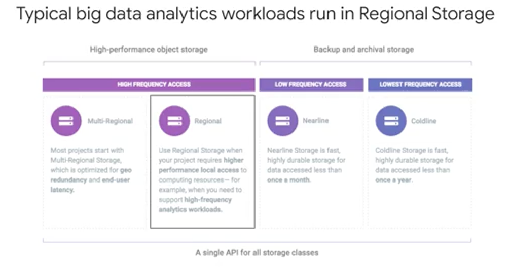
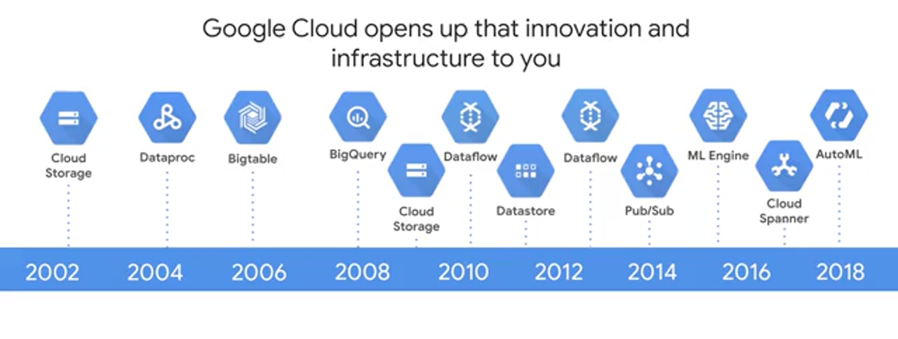

# Week 1: Introduction to Data Engineering, Big Data and Machine Learning on GCP


# Introduction

According to McKinsey research, by 2020, we'll have 50 billion devices connected in the Internet of Things. These devices will cause the supply of data to double every two years. Unfortunately though, only about one percent of the data generated today is actually analyzed. This state of affairs provides a wide open opportunity because there's a lot of value in data.

I believe that the ability to build applications that handle large amounts of data and derive insights from that data in an automated manner. This ability is a skill that will be well rewarded in the marketplace. Individuals who have this skill will have many opportunities open to them and companies that develop this skill will become more successful.

> That said, if you're an analyst, an ML engineer, or a tech lead for your team, it's a valuable skill to know how all the big data and ML products interact to solve some of the most common challenges that data engineers face. What are those challenges? Those challenges are migrating your existing big data workloads to an environment where you can effectively analyze all of your data, interactively analyzing large and by large I mean terabytes to petabytes; analyzing large datasets of historical data. Third, building scalable pipelines that can handle streaming data, so that your business can make data-driven decisions more quickly. Finally, building machine learning models so that you're not just reacting to data, you're able to make predictive forward-looking actions using your data.
> 

# Google Cloud Infrastructure


There are four fundamental aspects of Google's core infrastructure and a top layer of products and services that you will interact with most often. The base layer that covers all of Google's applications and therefore Google Cloud's too, is security. On top of that, are compute, storage, and networking. These allow you to process, store, and deliver business changing insights, data pipelines, and machine learning models. Finally, while running your big data applications on bare metal virtual machines as possible, Google has developed a top layer of big data and ML products to abstract away a lot of the hard work of managing and scaling that infrastructure for you.

# GCP Compute Power

If you consider the total number of floating-point values representing a single frame of high-res video, it's a product of the number of channel layers multiplied with the area of each layer, which with modern cameras can easily be in the millions. An eight megapixel camera creates images of eight million pixels each, approximately. Multiply that by three-channel layers and you get over 23 million data points per image frame. There are 30 frames per second of video. You can quickly see how a short video becomes over a billion data points to feed into the model. From 2018 estimates, roughly 1.2 billion photos and videos are uploaded to the Google Photos service everyday. That is 13 plus petabytes of photo data in total. For YouTube, which also has machine learning models for video stabilization and other models for automatically transcribing audio. You're looking at over 400 hours of video uploaded every minute. That's 60 petabytes every hour.


Google trains its production machine learning models on its vast network of data centers and then deploys smaller trained versions of these models to the hardware on your phone for predictions on your video. You can, therefore, leverage Google's AI research with pre-trained AI building blocks. Running that many sophisticated ML models on large structured and unstructured datasets for Google's own products, required a massive investment in computing power.

That's why Wired says, "This is what makes Google Google. Its physical network, its thousands of fiber miles, and those many thousands of servers that in aggregate, add up to the mother of all clouds."

In essence, Google has been doing distributed computing for over 10 years for its own applications, and now, has made that compute power available to you through Google Cloud.


Here's an interesting rough calculation by Jeff Dean who leads Google's AI division. He realized years ago that if everybody wanted to use voice search on their phones and used it for only three minutes, we would need to double our computing power. Historically, compute problems like this could be addressed through Moore's Law. Moore's Law was a trend in computing hardware that describe the rate at which computing power doubled. For years, computing power was growing so rapidly that you could simply wait for it to catch up to the size of your problem. Although computing power was growing rapidly, even as recently as eight years ago, in the past few years, growth has slowed dramatically as manufacturers run up against fundamental physics limits. Compute performance has hit a plateau.


One solution is to limit the power consumption of a chip, and you can do that by building Application-Specific Chips or ASICs. One kind of application is machine learning. Google's designed new types of hardware specifically for machine learning. The Tensor Processing Unit or TPU is an ASIC specifically optimized for ML. It has more memory and a faster processor for ML workloads than traditional CPUs or GPUs. Google has been working on the TPU for several years and has made it available to other businesses like yours through Google Cloud for really big and challenging machine learning problems.

# GCP Compute Engine

Services for deploying workstations. Can communicate with preinstalled gsutil to storage buckets:

```bash
gsutil ls gs:://bigdata-ml-295100 #bucket name
gsutil cp earthquakes.* gs:://bigdata-ml-295100
```

# Google Cloud Storage

Using the GCP CLI, create a storage bucket:

```bash
gsutil mb -p [PROJECT_NAME] -c [STORAGE_CLASS] -l [BUCKET_LOCATION] gs://[BUCKET_NAME]/
```



For big data analytic workloads, the most common thing is to use a regional cloud storage bucket for staging your data.


Now that you have a Google Cloud Storage bucket created, how do you get your data on the cloud, and work with the data once it's there in the bucket? In the demo, I used gsutil commands. Specifically, we can use cp for copy and specify a target bucket location. If you spin up a Compute Engine instance, the command-line tool gsutil is already available and we can do gsutil copy. On your laptop, you can download the Google Cloud SDK, so that you can get gsutil

# Account Management Logistics


Starting from the most granular objects, you see that resources like a Cloud Storage bucket or Compute Engine instance, these resources belong to specific projects. Bucket names have to be globally unique and GCP assigns your project ID that's globally unique too, and so you can use that project ID a unique name for your bucket. But what's a project? A project is a base-level organizing entity for creating and using resources and services for managing billing APIs and permissions. Zones and regions, physically organize the GCP resources you use. Whereas projects logically organize them. Projects can be created, managed, deleted, even recovered from accidental deletions. Folders are another logical grouping, you can have for collections of projects. Having an organization is required to use folders. But what's an organization? The organization is a root node of the entire GCP hierarchy. While it's not required, an organization is quite useful, because it allows you to set policies that apply throughout your enterprise to all the projects and all the folders that are created in your enterprise. Cloud Identity and Access Management, also called IAM or IAM, lets you fine tune access control to all the GCP resources you use. You define IAM policies that control user access to resources. Remember, if you want to use folders, you must have an organization.

# Networking

Google's high-quality private network, petabit bisectional bandwidth, and Edge points-of-presence are combined using state- of-the-art software- defined networking to deliver a powerful solution.


First, the private network. Google has laid thousands of miles of fiber optic cable that crosses oceans with repeaters to amplify optical signals. Google's data centers around the world are interconnected by this private Google network, which by some publicly available estimates, carries as much as 40 percent of the world's internet traffic everyday. This is the largest network of its kind on Earth and it continues to grow. 

Second, the petabit bisectional bandwidth. One of the teams we will discuss in this course is a separation of compute and storage. You no longer need to do everything on a single machine or even a single cluster of machines with their own dedicated storage. Why? Well, if you have a fast-enough network, you can perform computations on data located elsewhere like many distributed servers.

Google's Jupiter Network can deliver enough bandwidth to allow 100,000 machines to communicate amongst each other. So for any machine to communicate with any other machine in the data center at over 10 gigabits per second. This full duplex bandwidth means that locality within the cluster is not important. If every machine can talk to every other machine at 10 Gbps, racks don't matter for data analytics and machine learning.

But you need to ingest data probably from around the world. You need to serve out the results of your analytics and predictions, perhaps to users who are all around the world. This is where Edge points of presence come in. The network, Google's Network, interconnects with the public Internet at more than 90 internet exchanges and more than 100 points of presence worldwide. When an Internet user sends traffic to a Google resource, Google responds to the user's request from an Edge network location that will provide the lowest delay or latency. Google's Edge caching network places content close to end-users to minimize latency. Your applications in GCP, like your machine learning models, can take advantage of this Edge network too.

# Security


When you build an application on your on-premises infrastructure, you are responsible for the entire stack's security, from the physical security of the hardware and the premises in which they're housed through the encryption of the data on disk, the integrity of your network, and all the way up to securing the content stored in those applications. But when you move an application to GCP, Google handles many of the lower layers of security like, the physical security of the hardware and its premises, the encryption of data on disk, and the integrity of the physical network.

The upper layers of the security stack, including the securing of data, remain your responsibility. But even here Google provides tools like Cloud IAM to help you implement the policies that you define at these layers. Communications over the internet to our public cloud services are encrypted in transit. Google's network and infrastructure have multiple layers of protection to defend our customers against denial of service attacks.

Stored data is automatically encrypted at rest and distributed for availability and reliability. This helps guard against unauthorized access and service interruptions.


Data in a BigQuery table is encrypted using a data encryption key. Then, those data encryption keys are themselves encrypted with key encryption keys. This is known as envelope encryption and it provides additional security. BigQuery also allows you to provide your own encryption keys. These are called Customer Managed Encryption Keys. Inside BigQuery, you can monitor your team's BigQuery usage and running queries, and proactively limit access to data at a row and a column level.

# Big Data and ML Products



One of the interesting things about Google is that historically, we have faced issues related to large data sets, fast changing data and varied data, what is commonly called big data earlier than the rest of the industry. Having to index a World Wide Web will do that, and so as the Internet grew, Google invented new data processing methods. In 2002, Google created GFS, or the Google File System to handle sharding and storing petabytes of data at scale. GFS is the foundation for cloud storage and also for what would become BigQuery managed storage. One of Google's next challenges was to figure out how to index the exploding volume of content on the web. To solve this in 2004, Google invented a new style of data processing known as MapReduce to manage large-scale data processing across large clusters of commodity servers. MapReduce programs are automatically parallelized and executed on a large cluster of these commodity machines. A year after Google published a white paper describing the MapReduce framework, Doug Cutting and Mike Cafarella created Apache Hadoop. Hadoop has moved far beyond its beginnings in web indexing, and is now used in many industries for a huge variety of tasks that all share the common theme of volume, velocity and variety of structured, and unstructured data. As Google's needs grew, we faced the problem of recording and retrieving millions of streaming user actions with high throughput, that became Cloud Bigtable which was an inspiration behind Hbase or MongoDB. One issue with MapReduce is that developers have to write code to manage all of the infrastructure of commodity servers. Developers couldn't just focus on their application logic. So between 2008 and 2010, Google started to move away from MapReduce to process and query large data sets, and instead they started moving towards new tools. Tools like Dremel. Dremel took a new approach to big data processing where Dremel breaks data into small chunks called shards, and compresses them into a columnar format across distributed storage. It then uses a query optimizer to farm out tasks between the many shards of data and the Google data centers full of commodity hardware to process a query in parallel and deliver the results. The big leap forward here was that the service, automanagers data imbalances, and communications between workers, and auto-scales to meet different query demands, and as you will soon see, Dremel became the query engine behind BigQuery. Google continued to innovate to solve its big data and ML challenges, and created Colossus as a next-generation distributed data store, Spanner as a planet scale relational database. Flume and Millwheel for data pipelines, Pub/Sub for messaging, TensorFlow for machine learning plus there are specialized TPU hardware we saw earlier, and Auto ML that's going to come later. The good news for you is that Google has opened up these innovations as products and services for you to leverage as part of the Google Cloud platform


Google Cloud Public Datasets

[public_datasets_one_pager.pdf](week_1_introduction_to_data_engineering_big_data/public_datasets_one_pager.pdf)

# Choosing the Right Approach

## Compute


The service that might be the most familiar to newcomers is Compute Engine which lets you run virtual machines on demand in the Cloud. It's Google Cloud's Infrastructure as a Service or IaaS solution. It provides maximum flexibility for people who prefer to manage server instances themselves. GKE, Google Kubernetes Engine is different. Where Compute Engine is about individual machines running native code, GKE is about clusters of machines running containers. Containers have code packaged up with all its dependencies. So GKE enables you to run containerized applications in a Cloud environment that Google manages for you under your administrative control. Containerization is a way to package code that's designed to be highly portable and to use resources very efficiently. Since most use cases involve multiple programs that need to execute and communicate with each other, you need a way to orchestrate the containers running these separate programs. That's what Kubernetes does. Kubernetes is a way to orchestrate code that's running in containers. All the Kubernetes in GKE are outside the scope of this course, are linked to our cloud architecture specializations in the course resources. App Engine is GCP's fully managed Platform as a Service or PaaS framework. That means it's a way to run code in the Cloud without having to worry about infrastructure. You just focus on your code and let Google deal with all the provisioning and resource management. You can learn a lot more about App Engine in the specialization Developing Applications in Google Cloud Platform. Cloud Functions is a completely serverless execution environment or Functions as a Service, FaaS. It executes your code in response to events whether those events occur once a day or many times a second. Google's scales resources as required but you only pay for the service while your code runs. What's the difference between App Engine and Cloud Functions? Typically, App Engine is used for long-lived Web applications that can autoscale to millions, to billions of users. Cloud Functions are used for code that's triggered by an event such as a new file hitting Cloud storage.

## Storage


Most applications need a database of some kind. If you've built a cloud application, you can install and run your own database for it on a virtual machine in Compute Engine. You simply start up the virtual machine, install your database engine, and set it up just like in a datacenter. Alternatively, you can use Google's fully-managed database and storage services. What all these - Bigtable, Cloud Storage, Cloud SQL, Spanner, Datastore - what all these have in common is that they reduce the work it takes to store different kinds of data. GCP offers relational and non-relational databases and worldwide object storage

## Big Data and ML


GCP also offers fully- managed big data and machine learning services. Just as with storage and database services, you could build and implement these services yourself. But why manage the infrastructure for compute and storage where it can be fully managed by Google Cloud?


Here's a complete list of big data and ML products organized by where you would likely find them in a typical data processing workload. On the left, you will see the foundation to where your raw data is stored. If your data isn't stored on GCP yet, you can ingest it using the tools that you see next. After your data is on GCP, you can analyze it using the tools in the third column and run machine learning on it with the tools in the fourth column. The last column is how you can serve out your data and ML insights out to your users.

# Solution Exploration

Must answer these:

1. What were the barriers or challenges the customer faced? The challenges are important, you want to understand what they were.
2. How were these challenges solved with a cloud solution? What products did they use? 
3. What was the business impact?

But the most critical factor to the success of your future big data and ML projects, is your team itself. The people and the core skill sets required, will make or break your next innovation.

You need data engineers to build the pipelines and get you clean data. Decision makers, to decide how deep you want to invest in a data-driven opportunity while weighing the benefits for the organization. Analysts, to explore the data for insights and potential relationships that could be useful as features in a machine learning model. Statisticians, to help make your data-inspired decisions become true data-driven decisions, with their added rigor. Applied machine learning engineers, who have real-world experience building production machine learning models from the latest and best information and research by the researchers. Data scientists, who have the mastery over analysis, statistics, and machine learning. Analytics managers to lead the team. Social scientists and ethicists to ensure that the quantitative impact is there for your project and, it's the right thing to do.


A single person might have a combination of these roles, but this depends on the size of your organization. Your team size is one of the biggest drivers in whether you should hire for a specific skill set, up-skill from within, or combine the two.

# Module Resources

La nube es un entorno en constante cambio y Google Cloud Platform no deja de evolucionar ni de lanzar funciones y productos nuevos. Le recomendamos agregar los siguientes vínculos a favoritos para mantenerse al tanto de las novedades:

- [Blog de Google Cloud Platform](https://cloud.google.com/blog/products)
- [Lista de productos para macrodatos de GCP](https://cloud.google.com/products/big-data/?hl=es-419)
- [Casos de éxito y clientes de GCP](https://cloud.google.com/customers/?hl=es-419#/)

¿Necesita más práctica con SQL?

- [Guía de SQL estándar de BigQuery](https://cloud.google.com/bigquery/docs/reference/standard-sql/?hl=es-419)
- [Quest de BigQuery en Qwiklabs para analistas de datos](https://www.qwiklabs.com/quests/55?hl=es-419&locale=es)

Más información sobre la infraestructura de macrodatos:

- Compute Engine: [https://cloud.google.com/compute/](https://cloud.google.com/compute/?hl=es-419)
- Storage: [https://cloud.google.com/storage/](https://cloud.google.com/storage/?hl=es-419)
- Precios: [https://cloud.google.com/pricing/](https://cloud.google.com/pricing/?hl=es-419)