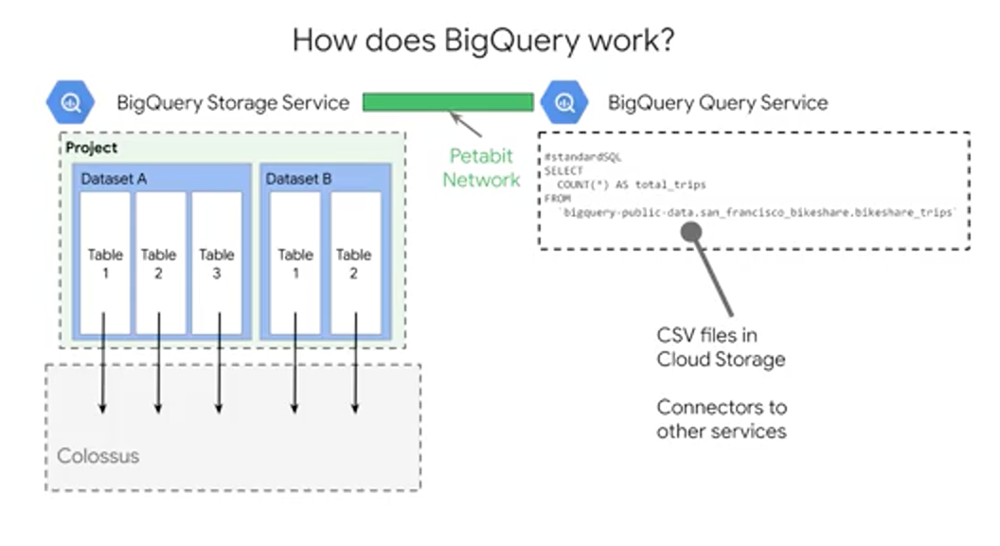
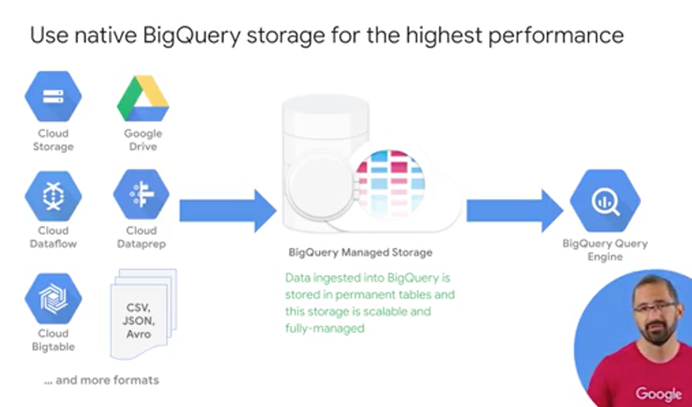
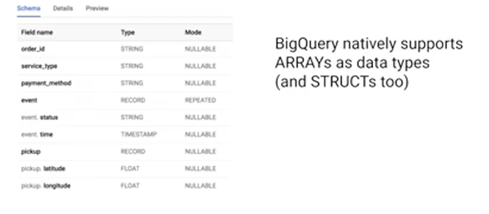
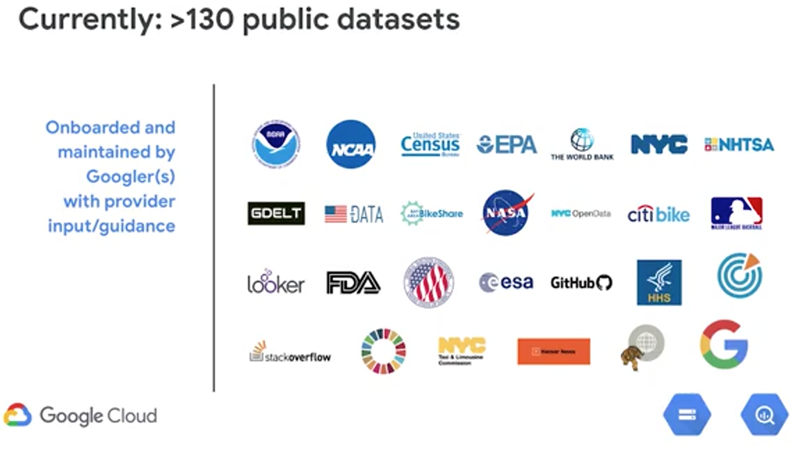
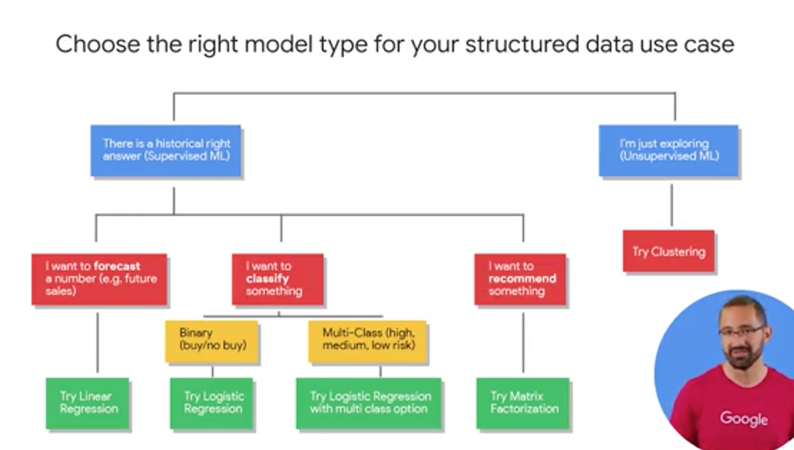
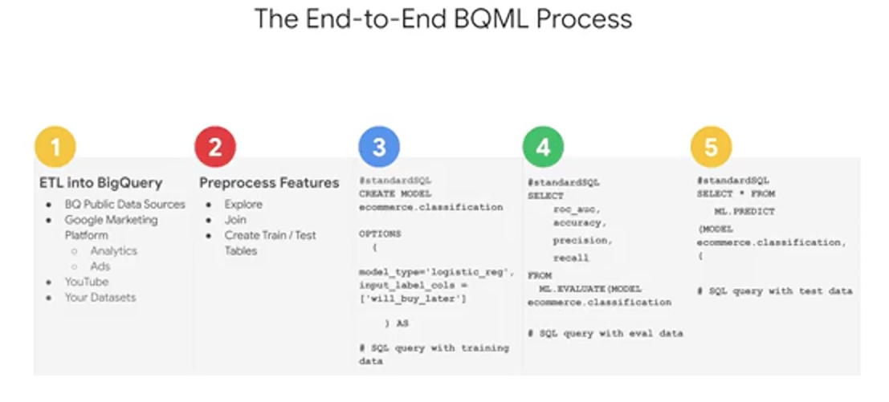
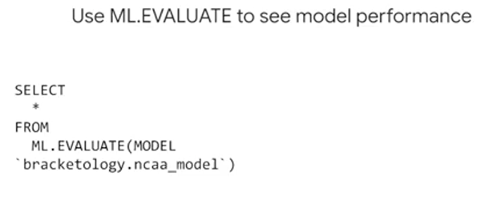
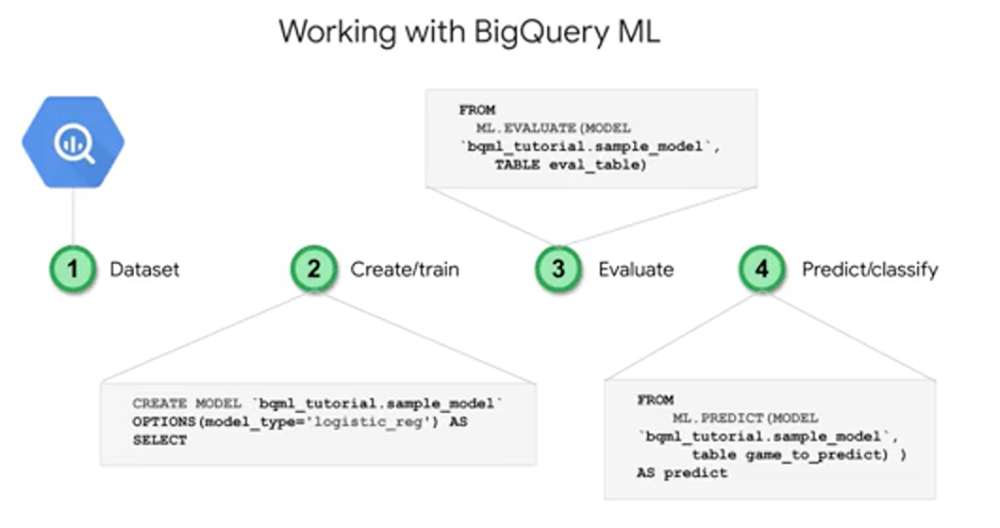

# Week 3: SQL Machine Learning


# Introduction to BigQuery

BigQuery as a service which allows you to have a petabyte-scale, analytics data warehouse. You'll soon learn that BigQuery is actually two services in one, a fast SQL Query Engine and fully managed data storage.


BigQuery is designed to be an easy-to-use data warehouse. We can focus on writing SQL statements on small or large datasets without worrying about infrastructure. So that's point Number 1, it's serverless. 

BigQuery's default pricing model is pay as you go. Where you pay for the number of bytes of data that your query processes and any other permanent data that's stored inside of BigQuery. Now there is some magic built-in like automatic caching of query results, so you don't end up paying for the same query returning the same data twice, which is cool.

Data in BigQuery is encrypted at rest by default. You can also specify the geographic locality of your data if you need to meet things like regulatory requirements. Controlling access to your data can be as granular as specific columns, say any column tag with PII, Personally Identifiable Information or specific rows. BigQuery works in tandem with Cloud IAM to set these roles and permissions at a project level, and then inherited down to the BigQuery level. We'll discuss data access in detail a bit more later.

BigQuery as both a data warehouse and an Advanced Query Engine is foundational for your AI and ML workloads. It's common for data analysts, engineers, and data scientists to use BigQuery to store, transform, and then feed those large datasets directly into your ML models. This is a huge leap over training ML models on just a few small samples of your data locally on your laptop or desktop. You can now train on all the data that you have available. That's the elastic data warehouse nature of BigQuery for ML datasets. Beyond that, as you've seen in the demo, you can now write ML models directly in BigQuery using SQL. This is a great start for modeled prototyping, as you can quickly engineer what features to use right where your data lives.


For ML engineers, once your dataset is in BigQuery, you can easily call it from your IPython ML notebooks in the cloud with just a few commands. If you're a business intelligence analyst, you can connect out to visualization tools like: Data Studio, Tableau, Looker, QlikView, and more. Lastly, and worth mentioning here, if you have a team of analysts who prefers to work in spreadsheets, you can now query your smaller huge BigQuery datasets directly, all of that data directly from Google Sheets and perform common operations like PivotTables, and more on the entirety of your dataset. So no more limitations of rows inside of sheets. BigQuery is a common sink or staging area for your data analytics workloads. Once your data is there, your data analysts, business intelligence developers, and ML engineers can then be granted access to your data to start creating their very own insights.

So how does BigQuery actually work? Well it's actually two services in one as we hinted at earlier. It's both a Fast SQL Query Engine, and also a fully managed storage layer for loading and storing your datasets.



First step, is the BigQuery storage service. The storage service automatically manages the data that you ingest into the platform. Data is contained within a project, in what are called datasets, which could have zero to many tables or views. The tables are stored as highly-compressed columns, each column of that table highly compressed and Google's internal Colossus file system which provides durability and global availability. This is the same data backend that powers some of Google's most popular applications like Google Photos and Gmail. All the data stored here is only accessible to you and your project team as governed by your access policy. The storage service can do both bulk data ingestion and streaming data ingestion. So it'll work with huge amounts of data and also real-time data streams. The Query service runs interactive or batch queries that are submitted through the console, the BigQuery web UI, the BQ command line tool, or via the REST API. The REST API supported for many common programming languages. There are BigQuery connectors to other services such as Cloud Dataproc and Cloud Dataflow, which simplify creating those complex workflows between BigQuery and other GCP data processing services. The Query service can also run query jobs and data contained in other locations. So get this, you can run queries on tables that are a CSV file, for example, that are hosted somewhere else in Cloud Storage. But, before we get too excited about running queries on data that's not in BigQuery, like Google Sheets, you should know that BigQuery is most efficient when it's working off of data contained within its own what's called, Native BigQuery storage. The storage service and the Query service work together to internally organize the data to make your queries and run efficiently on terabytes and petabytes. They even optimize your SQL statements syntax, whenever possible after you hit that Run Query button. One of the most important controls you have over the resource consumption and costs, is controlling the amount of data that your query ultimately processes. In general, you only want to select the columns of data that you actually want to process in return as part of your output. A good rule of thumb is to start broad when you're first exploring the dataset, and then zoom in on just those critical fields and rows that you need. Keep in mind, at the time of this recording, BigQuery gives you one terabyte of query processing of bytes processed at no charge every month, and 10 gigabytes of storage as well to start you off.

Now, if you remember your SQL, what's one of the things that you can do to get the most? First, you can do an order by which is going to be a sort, and you can order by the alias as we see here. Now, that you actually can't filter in a where clause by an alias field because it actually doesn't exist when the query engine goes out and performs that where clause. So keep that in mind. That's where you can use things like temporary tables.

## DEMO: SQL Data Exploration

```sql
# top 10 stations by trip volume
CREATE OR REPLACE TABLE bike_insights.top_trips_2018_and_beyond AS
# CREATE OR REPLACE VIEW bike_insights.top_trips_2018_and_beyond_vw AS
SELECT 
	start_station_name,
	COUNT(trip_id) AS num_trips
FROM
	'bigquery-public-data.san_francisco_bikeshare.bikeshare_trips'
WHERE start_date > '2017-12-31 00:00:00 UTC'
GROUP BY
	start_station_name
ORDER BY
	nim_trips DESC
LIMIT
	10
```

# Data Quality


A lot of the time you aren't really sure of the quality of the data in your dataset, so you can use SQL to explore and filter for anomalies. Here, we filtered for those customer records who did not provide a birthday by setting "member birth year is not null" as a filter.


If you prefer to use a UI to inspect the quality of your datasets, consider using Cloud Dataprep, which is a GCP product offered in partnership with Trifacta. Using Dataprep, you can load in a sample of your BigQuery dataset into an exploration view, which will then provide you with some neat column histogram charts as you see here. Now, this specific dataset in this visual is the location of all the weather stations around the world for this specific dataset. The histograms in the state column on the right, they highlight the data that skewed towards three or so values. Which we can infer means that there are some states that have many, say a lot of weather stations. What I've highlighted here on the horizontal bar graph is how well the values in a column of data mapped to the expected data type for that column. Dataprep knows what the allowable or enumerated values for US states should be, and it is telling us that 19,940 missing or null values for state. Why do you think that could be? Well as you might've guessed, these weather station readings could come in from all over the world, and state is an optional field.


The main advantage to Cloud Dataprep is for teams want to use a UI for data exploration, and want to spend minimal time coding to build their pipelines. Lastly, with Dataprep you can schedule your pipeline to run at regular preset intervals. But, if you prefer to do all of your SQL and exploration work inside of BigQuery, you can also now use SQL to setup scheduled queries by using the @run_time parameter, or the query scheduler and the BigQuery UI.

# Data Security


As you see here in this table, BigQuery inherits data security roles that you and your teams set up in Cloud IAM. For example, if you're an overall project viewer in Cloud IAM, you can start BigQuery jobs, but you cannot create new datasets yourself. If you're an editor you can create datasets, and if you are an owner, you can also delete datasets. Keep in mind that default access datasets can be overridden on a per dataset basis. Beyond Cloud IAM, you can also set up very granular controls over your columns and rows of data in BigQuery using the new data catalog service and some of the advanced features in BigQuery, such as authorized views. 

Data security is more than simply applying the right project permissions in roles during your dataset creation. You should also have a written and circulated Data Access Policy for your organization, and it should specify how and when and why data should be shared, and with whom.

One first step to ensure healthy data access controls is to periodically audit the users and groups associated with your Google Cloud Platform project in your individual datasets. Do these users need to really be owners or admins or would a more restrictive roles suffice for their job duties? A second pitfall is working with testing and editing datasets only in production. Much like with code, it's often wise to have a completely separate GCP project or dataset for testing different environments, to prevent unintentional data loss or accidental errors.

# BigQuery Managed Storage



In addition to super fast query execution times, BigQuery also manages the storage and the metadata for your data sets. BigQuery can ingest data sets from a variety of different formats. Once inside BigQuery native storage, your data is then fully managed by the BigQuery team here at Google and it's automatically replicated, backed up, and set up to autoscale for your query needs. You can even recover recently deleted tables within a certain period too. 


You also have the option of querying external data sources directly as we talked about, which bypasses BigQuery's managed storage. For example, if you have a raw CSV file in Google Cloud Storage or a Google Sheet, you can write a query against it without having to ingest the data into BigQuery first. A common use case for this is having external data source that is relatively small but constantly changes, like say a price list for commodities that another team maintains and continually updates. 

But there are a few reasons why you maybe should consider not doing this. The first is that the data consistency coming in from that external or federated data source is not guaranteed. If the external data source changes mid-flight, BigQuery doesn't guarantee that those updates were actually captured. If you're concerned about that, consider building a streaming data pipeline into BigQuery with Cloud Dataflow.

In addition to ingesting data sets as a batch, like uploading a CSV, you can also stream records into BigQuery via the API. Note that there are a few coder restrictions that you should be aware of. The max row size for a streaming insert is one megabyte and the maximum throughput is 100,000 records per second per project. If you need higher throughput, say in the order of millions of records per second, for use cases you can consider it like application logging or real-time events tracking. Consider using Cloud Bigtable as a data sync instead.

Before you start streaming thousands of records into BigQuery and the API, consider the other options you could have for your streaming solution. If you have data that needs to be transformed or aggregated mid-flight into table and row format, or joined against other data sources as side inputs midstream, or if you want to take just a window or a segment of that data, you should really consider using Cloud Dataflow for your streaming data pipeline.


Lastly, if you're familiar with database design, you've likely heard of the concept of normalization which is the act of breaking up one huge master table into component child tables. So you're storing one fact in one place and not repeating yourself across records. What would you need to do to bring all these data sources together for reporting? If you said do one massive big SQL join, that's absolutely right. But while breaking apart database tables into silos is a common practice for relational databases, like mySQL or SQL Server. For data warehousing and reporting, let me show you a cool new way to structure your reporting tables.



First, you've just one row of data. But it looks like you have four, what's going on? Well, event.time, that field is actually an array datatype. You can have multiple data values, in this case, timestamp for a single taxi booking in that single row. Likewise, with the corresponding array of status values at that timestamp. So already in one table, you get the high-level, if you wanted of total number of orders, but you could also get the number of completed orders without having to do any of those complex joins. The second insight is a bit more hidden. It's that some of the column names look almost like a family name, event.status, event.time or destination.latitude, destination.longitude. These grouped fields are part of a SQL data type known as a STRUCT. If you were to inspect this schema for this table, you'd notice that for the event field datatype, it's of datatype record which indicates that this is a data type of a STRUCT. You can think of a STRUCT as essentially a collection of other fields, kind of like a table. From a reporting standpoint, you can have many nested STRUCTs within a single table, which is conceptually like having many other tables pre-joined. Pre-joined for you means faster queries for larger data sets and no more of those complex 15 table joins. Now, a huge benefit of doing it this way is that you have a single table which has all the fields in a single place for you to analyze. You don't need to worry about the join keys or differing levels of table granularity anymore.

# Geographic Data Statistics


BigQuery natively supports GIS, or Geographic Information System functions. For gleaning insights from your geographic data points, like longitude and latitude. Let's examine how you can put these into practice. In this SQL query that you see here, we are plotting the path of a hurricane using SQL and GIS functions. We first create a geographic point based on lat long data. We also bring in other useful fields, like wind speed, the distance the hurricane is to land or landfall, and the radius of the hurricane. We query all this raw data from the BigQuery public dataset from NOAA on hurricanes, and filter for one hurricane in particular. You can see that in the Where clause, that's hurricane Maria in 2017. Then, we geographically bound the points that we care about with the "GIS within" function to ensure that it'll fit on the map or the area of focus. So we can visualize these points. Lastly, we explore our points using Geo Viz, which is a web tool for visualization of geospacial data in BigQuery, but it uses the Google Maps APIs.

One of the best ways to get better at data analysis is by practicing in a variety of data sets. The BigQuery Public Datasets program partners with companies and organizations to host their datasets in BigQuery, and then make them available for analysis by the public. Currently, there are well over a 100 different datasets for you to explore, and you can find them all in the BigQuery web UI under Explore Data, which is located right above your own datasets. 

# GCP Public Datasets



# Choose the Right Model Type for Structure Data



The first question is, what kind of activity that you're engaging in? Is there a right answer or a ground truth that exists in your historical data that you want to model and predict? If so, you want to start with supervised learning. Alternatively, if you're interested in just ruminating and exploring the data for unknown relationships, you're welcome to try unsupervised learning with maybe a clustering model to start.

The majority of the problems we're going to tackle here are in these three areas: First, forecasting. That's like predicting the next month's sales figures, the demand for your product. Second, classifying. Like high medium or low risk events or buy or no buy decisions. Third, maybe you recommending something like a product for a given user. An easy way to tell if you're forecasting or classifying, is to look at the type of label or special column of data that you're predicting. Generally, if it's a numeric datatype like units sold or profits earned, you're doing forecasting. If it's a string value, you're typically doing classification. This row is either in this class or this other class, and if you have more than two classes or buckets like high, low, medium, you're doing what's called multi-class classification. Now, once you have your problem outlined, it's time to go shopping for models which will be the tools to help you achieve your goal. Now there are many different model types for you to choose from for these problems. We're recommending you start with the simpler ones which can still be highly accurate to see if they meet your benchmark. By the way, you're ML benchmark is the performance threshold that you're willing to accept from your model before you even allow it to be near your production data. It's critical that you set your benchmark before you train your model. So you can really be truly objective in your decision making to use the model or not.

For forecasting, try a linear regression. For classification, try logistic regression. By the way it's called binary logistic regression. If you have a just two classes or buckets that an observation could fall into or multi-class if it's more than two. For recommendations, try matrix factorization which is a commonly used algorithm for problems involving a matrix of users and items.

It's my overall recommendation that even if you know how to build advanced models, that you start with the simpler ones first. Because they often train faster and they give you an indication of whether not ML is even a viable solution for your problem.

# Create Models in BigQuery

If you've worked with ML models before, you know that building and training them can be very very time intensive. For common data scientists, you must first export small amounts of data from your datastore into your IPython Notebook and into data handling frameworks like pandas for Python. If you're building a custom model, you first need to transform preprocess all that data and perform all that feature engineering before you can even feed the model data in. Then, finally, after you've built your model in say, TensorFlow and other similar library, then you train it locally on your laptop or on a VM. Doing that with a small model then requires you to go back and create more new data features and improve performance and you repeat and repeat and repeat.


Take a look at how you can perform ML and BigQuery with just a few steps. Step one, you create the model with just a SQL statement. Here, we'll use a bike share dataset. Step number two, write a SQL prediction query and invoke ML.predict. Step number three, profit, that's it. You've got a model and then you can review the results. Well, in reality, there are more than three steps. You have to evaluate the model, but the main point is that, if you know basic SQL, you can now do machine learning which is pretty cool. 


BigQuery ML was designed with simplicity in mind. To that end, in order to define the ML hyperparameters, which is a fancy way of saying the knobs that are set on the model before the training starts, things like the learning rate or even a split between training and test data which is critical. BigQuery ML automatically does that for you with default values. In addition, with the model options, if you wanted to, you could also set yourself those regularization or different strategies for splitting or testing that data and manually setting the learning rate and other different parameters hyperparameters.


So what do you get out of the box? First, BigQuery ML runs on standard SQL, it's inside of BigQuery. So you can use normal SQL syntax like UDFs, user-defined functions, sub-queries and joins across other different tables to create your training datasets to feed into the model. Now, for model types, right now you can either choose for linear regression for forecasting or binary multiclass logistic regression and a team is busy, very busy adding more types as we speak. So I'll provide a link so you can stay on top of that documentation. As part of your model evaluation, you also get access to fields like the ROC curve as well as accuracy, precision, and recall - this is for classification models that you can simply select from where the SQL statement after your model is trained or if you don't want to write any code you can click on the UI click on that trained model, which is now an object inside of your dataset and there's a tab for that evaluation that you can take a look at as well. One of my favorite things is you can also inspect the weights of the model and perform a feature distribution analysis.

# ML Project Phases

What you'll find is that writing the code to create the actual model, is going to be the really easy part. Getting all the right data into a model is always the hard part.



First, we need to bring our data into BigQuery, if it isn't there already. Here again, you can enrich your existing data warehouse with other data sources by simply using SQL Joins. If you're already using other data products like AdWords or YouTube, you can look out for those easy connectors to get that data into BigQuery before you go off and build your own pipeline. Next is the feature selection and pre-processing step which is similar to what you've been exploring so far as part of this course. Here is where you put all your good SQL skills to the test in creating a great training set for your model to learn from. Keep in mind again as we mentioned, that BigQuery ML does some of the preprocessing for you like the one-hot encoding of your categorical variables into those numeric values that your model actually is expecting. After that, here's the actual syntax for creating a model inside of BigQuery, and short enough, that I can fit it all inside this one tiny little box of code. You simply say "Create model," give it a name, specify the mandatory option like model type, and pass in your SQL query with your training dataset, then hit "RunQuery" and watch your model run. After your model is trained, you'll see it as a new dataset object in BigQuery which you can actually click on and look at all its cool metadata stats. Or if you want to write the query against it to look at the evaluation, then you use ML.evaluate to evaluate the performance of your train model against the evaluation dataset. Here you can analyze loss metrics like Root Mean Squared Error, MSE, or RMSE for forecasting models, and other metrics like area under the curve, accuracy, precision recall for your classification models like the one that you see here. Once you're happy with your model's performance, you can then predict with it. With this even shorter query. Just write in and invoke that ML.predicts command on your newly trained model, and then you'll get back predictions as well as the model's confidence in those predictions. Now you'll notice a new field in the results when you run this query, where you see your label field with the word "predicted" added to the field name, and that's your model's prediction for that label.

# BigQuery ML Key Features


Recall that you can create a model with just CREATE MODEL. If you do want to override an existing model, you can do CREATE OR REPLACE MODEL. Models, again, take options which you can specify if you want. The most important and the only required one is that model type.


You can inspect the importance the model placed on each feature by looking at the weights it learned. You do this by using the ML.WEIGHTS in filtering on a given input column. In the output, each feature column will have a weight from -1 to 1. The closer the number is to -1 or 1 means the more useful that field is in the model size to predicting the value for that label. 



To evaluate the models performance, next you could just run simply ML.EVALUATE against a trained model. You'll get different performance metrics as we covered depending upon the type of model that you choose. Also you can look at the model's performance in the UI just by clicking on the model object and your dataset and taking a look at all that available metadata.


Making predictions is as simple as calling ML.PREDICT on a trained model and passing through the dataset that you want to predict on.


First, in BigQuery ML. You need to have a field in your training dataset titled label. Or, you need to specify which field or fields are your labels by using the input_ label_cols in your model options. Second, your model features are simply the data columns that are part of your SELECT statement after your CREATE MODEL statement. After a model is trained, you can use ML.FEATURE_INFO to get statistics and metrics about that column for additional analysis.

Next is the model object itself. You train many different models, which will all be based on objects stored inside your BigQuery dataset, much like your data tables and views. Try clicking on a model object and you can view information about when it was last updated or how many training runs it completed.

Creating a new model is as easy writing CREATE MODEL, choosing that model type, and passing in a training dataset. And again, if you're predicting in a numeric field, like sales for next year, consider looking at linear regression for forecasting. If it's a discrete class like high, medium, or low, spam or not spam, consider using logistic regression for classification.

While the model's running, and even after it's complete, you could view training progress with ML.TRAINING_INFO. As we mentioned previously, you can see what the model learned about the importance of each feature as it relates to the label that you're predicting.

You can see how well the model did against this evaluation dataset by using ML.EVALUATE.

Lastly, it's as simple as writing ML.PREDICT in referencing your trained model, and then your prediction dataset to return back predictions. An important note here is that when using ML.PREDICT in passing in a new dataset with an unknown label that you can now add other columns that you didn't want to train on initially. The model is not being retrained naturally during prediction. Note that if you do happen to remove or rename columns from your prediction dataset, that the model is expecting and it saw in training, you'll be given an error.



# Module Resources

[Documentación de Cloud Pub/Sub](https://cloud.google.com/pubsub/?hl=es-419) y [blog con notas de la versión](https://cloud.google.com/pubsub/docs/release-notes?hl=es-419)

[Documentación de Cloud Dataflow](https://cloud.google.com/dataflow/?hl=es-419), [blog con notas de la versión](https://cloud.google.com/blog/products/data-analytics/) y [plantillas](https://cloud.google.com/dataflow/docs/guides/templates/provided-templates?hl=es-419)

[Documentación de Data Studio](https://developers.google.com/datastudio/?hl=es-419)

[Blog: Cómo usar Hojas de cálculo de Google con BigQuery](https://cloud.google.com/blog/products/g-suite/connecting-bigquery-and-google-sheets-to-help-with-hefty-data-analysis)