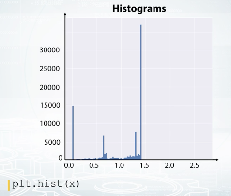
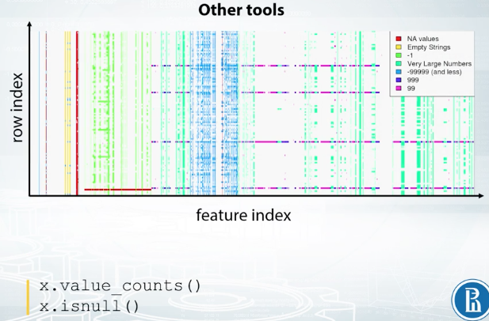
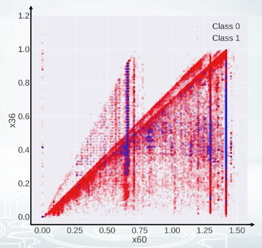
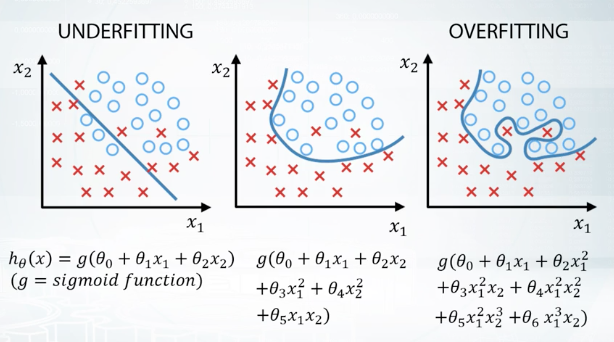
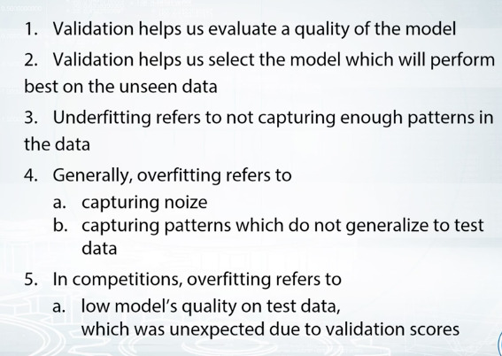
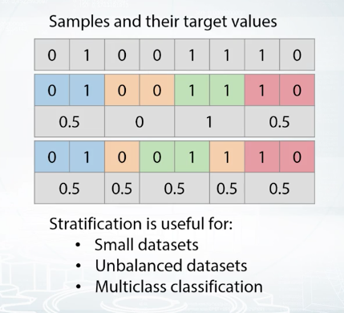

# Week 2

# Exploratory Data Analysis

It's basically a process of looking into the data, understanding it and getting comfortable with it. Getting comfortable with a task, probably always the first thing you do. To solve a problem, you need to understand a problem, and to know what you are given to solve it. In data science, complete data understanding is required to generate powerful features and to build accurate models. In fact while you explore the data, you build an intuition about it. And when the data is intuitive for you, you can generate hypothesis about possible new features and eventually find some insights in the data which in turn can lead to a better score.

One of the main EDA tools is Visualization. When we visualize the data, we immediately see the patterns. And with this, ask ourselves, what are those patterns? Why do we see them? And finally, how do we use those patters to build a better model? It also can be another way around. Maybe we come up with a particular hypothesis about the data. What do we do? We test it by making a visualization.

There are several important steps namely, the first, getting domain knowledge step, second, checking if data is intuitive, and finally, understanding how the data was generated.

## Exploring Anonymized Data

I will refer to Anonymized data as to any data which organizers intentionally changed.

Previously, we were working with the data for which we had a nice description. That is, we knew what the features were, and the data was given us as these without severe modifications. But, it's not always the case. The data can be anonymized, and obfuscated. Sometimes we can decode the data, or if we can not we can try to guess, what is the type of feature. Sometimes the organizers really want some information to be reviewed. So, they make an effort to export competition data, in a way one couldn't get while you're out of it. Yet all the features are preserved, and machinery model will be able to do it's job. For example, if a company wants someone to classify its document, but doesn't want to reveal the document's content. It can replace all the word occurrences with hash values of those words. In fact, it will not change a thing for a model based on bags of words.

In computations with tabular data, companies can try to hide information each column stores.

First, we don't have any meaningful names for the features. The names are replaced with some dummies, and we see some hash like values in columns x1 and x6. Most likely, organizers decided to hash some sensitive data. There are several things we can do while exploring the data in this case.

First, we can try to decode or de-anonymize the data, in a legal way of course. That is, we can try to guess true meaning of the features. Sometimes de-anonymization is not possible, but what we almost surely can do, is to guess the type of the features, separating them into numeric, categorical, and so on. Then, we can try to find how features relate to each other. That can be a specific relation between a pair of features, or we can try to figure out if the features are grouped in some way.

So, as long as we don't know what the data is, we can probably build a quick baseline. Let's import Random Forest Classifier. Yeah, of course we need to drop target label from our data frame, as it is included in there. We'll fill null values with minus 999, and let's encode all the categorical features, that we can find by looking at the types. Property of our data frame. We will encode them with Label Encoder, and it is easier to do with function factorize from Pandas. 

## Visualizations

EDA is kind of an art, but we have a bunch of tools for it. 

Histograms split feature edge into bins and show how many points fall into each bin. Note that histograms may be misleading in some cases, so try to overwrite its number of bins when using it. Also, know that it aggregates in the data, so we cannot see, for example, if all the values are unique or there are a lot of repeated values. 

We can also build the plot where on X axis, we have a row index, and on the Y axis, we have feature values. It is convenient not to connect points with line segments but only draw them with circles. Now, if we observe horizontal lines on this kind of plot, we understand there are a lot of repeated values in this feature. Also, note the randomness over the indices. That is, we see some horizontal patterns but no vertical ones. It means that the data is properly shuffled. We can also color code the points according to their labels.

Here, we see that the feature is quite good as it presumably gives a nice class separation. And also, we clearly see that the data is not shuffled here. It is, in fact, sorted by class label.

It is useful to examine statistics with Pandas' describe function. You can see examples of its output on the screenshot. It gives you information about mean, standard deviation, and several percentiles of the feature distribution. Of course, you can manually compute those statistics. In Pandas' nan type, you can find functions named by statistics they compute. Mean for mean value, var for variance, and so on, but it's really convenient to have them all in once. 

And finally, as we already discussed in the previous video, there is value_counts function to examine the number of occurrences of distinct feature values, and a function is null, which helps to find the missing values in the data.

Exploration of feature relations. It turns out that sometimes, it's hard to make conclusions looking at one feature at a time. So let's look at the pairs. The best two here is a scatter plot. With it, we can draw one sequence of values versus another one. And usually, we plot one feature versus another feature. So each point on the figure correspond to an object with the feature values shown by points position. If it's a classification task, it's convenient to color code the points with their labels like on this picture. The color indicates the class of the object. For regression, the heat map light coloring can be used, too. Or alternatively, the target value can be visualized by point size. We can effectively use scatter plots to check if the data distribution in the train and test sets are the same.

In this example, the red points correspond to class zero, and the blue points to class one. And on top of red and blue points, we see gray points. They correspond to test set. We don't have labels for the test set, that is why they are gray. And we clearly see that the red points are mixed with part of the gray ones, and that that is good actually. But other gray points are located in the region where we don't have any training data, and that is bad. If you see some kind of discrepancy between colored and gray points distribution, you should probably stop and think if you're doing it right. It can be just a bug in the code, or it can be completely overfitted feature, or something else that is for sure not healthy.

Now, take a look at this scatter plot. Say, we plot feature X1 versus feature X2. What can we say about their relation? The right answer is X2 is less or equal than one_minus_X1. Just realize that the equation for the diagonal line is X1 + X2 = 1, and for all the points below the line, X2 is less or equal than one_minus_X1. So, suppose we found this relation between two features, how do we use this fact? Of course, it depends, but at least there are some obvious features to generate. For tree-based models, we can create a new features like the difference or ratio between X1 and X2.

Now, take a look at this scatter plot. It's hard to say what is the true relation between the features, but after all, our goal is not to decode the data here but to generate new features and get a better score. And this plot gives us an idea how to generate the features out of these two features. We see several triangles on the picture, so we could probably make a feature to each triangle a given point belongs, and hope that this feature will help.

When you have a small number of features, you can plot all the pairwise scatter plots at once using scatter metrics function from Pandas. t's also nice to have histogram and scatter plot before the eyes at the same time as scatter plot gives you very vague information about densities, while histograms do not show feature interactions.

We can also compute some kind of distance between the columns of our feature table and store them into a matrix of size number of features by a number of features. For example, we can compute correlation between the counts. It's the most common type of matrices people build, correlation metric. But we can compute other things than correlation. For example, how many times one feature is larger than the other? I mean, how many rows are there such that the value of the first feature is larger than the value of the second one? Or another example, we can compute how many distinct combinations the features have in the dataset. With such custom functions, we should build the metrics manually, and we can use matshow function from Matplotlib to visualize it like on the slide you see.

If the metrics looks like a total mess like in here, we can run some kind of clustering like K-means clustering on the rows and columns of this matrix and reorder the features. This one looks better, isn't it?

Feature groups. And it's what we see here. There are groups of very similar features, and usually, it's a good idea to generate new features based on the groups. Again, it depends, but maybe some statistics could collated over the group will work fine as features. Another visualization that helps to find feature groups is the following: We calculate the statistics of each feature, for example, mean value, and then plot it against column index. This plot can look quite random if the columns are shuffled. So, what if we sorted the columns based on this statistic?

Feature and mean, in this case. It looks like it worked out. We clearly see the groups here. So, now we can take a closer look to each group and use the imagination to generate new features.

Finally in this video, we we're talking about the tools and functions that help us with data exploration. For example, to explore features one by one, we can use histograms, plots, and we can also examine statistics. To explore a relation between the features, the best tool is a scatter plot. Scatter metrics combines several scatter plots and histograms on one figure. Correlation plot is useful to understand how similar the features are. And if we reorder the columns and rows of the correlation metrics, we'll probably find feature groups. And feature groups was the last topic we discussed in this lesson. We also saw a plot of sorted feature statistics and how it can reveal as feature groups.

## Dataset Cleaning

t is important to understand that the competition data can be only apart of the data organizers have. The organizers could give us a fraction of objects they have or a fraction of features. And that is why we can have some issues with the data. For example, we can encounter a feature which takes the same value for every object in both train and test set. This could be due to the sampling procedure.

For example, the future is a year, and the organizers exported us only one year of data. So in the original data that the organizers have, this future is not constant, but in the competition data it is constant. And obviously, it is not useful for the models and just occupy some memory. So we are about to remove such constant features. In this example data set feature of zero is constant.

Sometimes there are duplicated numerical features that these two columns are completely identical. In our example data set, these columns f2 and f3. Obviously, we should leave only one of those two features since the other one will not give any new information to the model and will only slow down training. From a number of features, it's easy to check if two columns are the same. We just can compare them element wise. We can also have duplicated categorical features. The problem is that the features can be identical but their levels have different names. That is it can be possible to rename levels of one of the features and two columns will become identical. For example features f4 and f5. If we rename levels of the feature f5, C to A, A to B, and B to C. The result will look exactly as feature f4. But how do we find such duplicated features? Fortunately, it's quite easy, it will take us only one more line of code to find them. We need to label and code all the categorical features first, and then compare them as if they were numbers.

The most important part here is label encoding. We need to do it right. We need to encode the features from top to bottom so that the first unique value we see gets label 1, the second gets 2 and so on. For example for feature f4, we will encode A with 1, B with 2 and C with 3. Now feature f5 will encode it differently C will be 1, A will be 2 and B will be 3. But after such encodings columns f4 and f5 turn out to be identical and we can remove one of them. Another important thing to check is if there are any duplicated rows in the train and test.

Finally, it is very useful to check that the data set is shuffled, because if it is not then, there is a high chance to find data leakage. We'll have a special topic about date leakages later, but for now we'll just discuss that the data is shuffled. What we can do is we can plug a feature or target vector versus row index. We can optionally smooth the values using running average. On this slide rolling target value from pairs competition is plotted while mean target value is shown with dashed blue line. If the data was shuffled properly we would expect some kind of oscillation of the target values around the mean target value. But in this case, it looks like the end of the train set is much different to the start, and we have some patterns. Maybe the information from this particular plot will not advance our model. But once again, we should find an explanation for all extraordinary things we observe.

# Validation and Overfitting

In the nutshell, we want to check if the model gives expected results on the unseen data. For example, if you've worked in a healthcare company which goal is to improve life of patients, we could be given the task of predicting if a patient will be diagnosed a particular disease in the near future. Here, we need to be sure that the model we train will be applicable in the future. And not just applicable, we need to be sure about what quality this model will have depending on the number of mistakes the model make. And on the predictive probability of a patient having this particular disease, we may want to decide to run special medical tests for the patient to clarify the diagnosis. So, we need to correctly understand the quality of our model. But, this quality can differ on train data from the past and on the unseen test data from the future. The model could just memorize all patients from the train data and be completely useless on the test data because we don't want this to happen. We need to check the quality of the model with the data we have and these checks are the validation. So, usually, we divide data we have into two parts, train part and validation part. We fit our model on the train part and check its quality on the validation part. Beside that, in the last example, our model will be checked against the unseen data in the future and actually these data can differ from the data we have. So we should be ready for this.

First, train data with all target values. And second, test data without target values. As in the previous example, we should split the data with labels into train and validation parts. Furthermore, to ensure the competition spirit, the organizers split the test data into the public test set and the private test set. When we sent our submissions to the platform, we see the scores for the public test set while the scores for the private test set are released only after the end of the competition.

This also ensures that we don't need the test set or in terms of a model do not overfit. Let me draw you an analogy with the disease projection, if we already divided our data into train and validation parts. And now, we are repeatedly checking our model against the validation set, some models, just by chance, will have better scores than the others. If we continue to select best models, modify them, and again select the best from them, we will see constant improvements in the score. But that doesn't mean we will see these improvements on the test data from the future. By repeating this over and over, we could just achieve the validation set or in terms of a competition, we could just cheat the public leaderboard. But again, if it overfit, the private leaderboard will let us down. This is what we call overfitting in a competition. Get an unrealistically good scores on the public leaderboard that later result in jumping down the private leaderboard.

So, we want our model to be able to capture patterns in the data but only those patterns that generalize well between both train and test data. Let me show you this process in terms of underfitting and overfitting. So, to choose the best model, we basically want to avoid underfitting on the one side and overfitting on the other. Let's understand this concept on a very simple example of a binary classification test. We will be using simple models defined by formulas under the pictures and visualize the results of model's predictions. Here on the left picture, we can see that if the model is too simple, it can't capture underlined relationship and we will get poor results. This is called underfitting. Then, if we want our results to improve, we can increase the complexity of the model and that will probably find that quality on the training data is going down. But on the other hand, if we make too complicated model like on the right picture, it will start describing noise in the train data that doesn't generalize the test data. And this will lead to a decrease of model's quality. This is called overfitting. So, we want something in between underfitting and overfitting here. And for the purpose of choosing the most suitable model, we want to be able to evaluate our results. Here, we need to make a remark, that the meaning of overfitting in machine learning in general and the meaning of overfitting competitions in particular are slightly different. In general, we say that the model is overfitted if its quality on the train set is better than on the test set. But in competitions, we often say, that the models are overfitted only in case when quality on the test set will be worse than we have expected.

## Validation Strategies

It's a simple data split which divides data into two parts, training data frame, and validation data frame. And the important note here is that in any method, holdout included, one sample can go either to train or to validation. So the samples between train and the validation do not overlap, if they do, we just can't trust our validation. This is sometimes the case, when we have repeated samples in the data. And if we are, we will get better predictions for these samples and more optimistic all estimation overall. It is easy to see that these can prevent us from selecting best parameters for our model. For example, over fitting is generally bad. But if we have duplicated samples that present, and train, and test simultaneously and over feed, validation scores can deceive us into a belief that maybe we are moving in the right direction.

### Holdout

Here we fit our model on the training data frame, and evaluate its quality on the validation data frame. Using scores from this evaluation, we select the best model. When we are ready to make a submission, we can retrain our model on our data with given labels. Thinking about using holdout in the competition. It is usually a good choice, when we have enough data. Or we are likely to get similar scores for the same model, if we try different splits.

### K-fold

K-fold can be viewed as a repeated holdout, because we split our data into key parts and iterate through them, using every part as a validation set only once. After this procedure, we average scores over these K-folds. Here it is important to understand the difference between K-fold and usual holdout or bits of K-times. While it is possible to average scores they receive after K different holdouts. In this case, some samples may never get invalidation, while others can be there multiple times. On the other side, the core idea of K-fold is that we want to use every sample for validation only once. This method is a good choice when we have a minimum amount of data, and we can get either a sufficiently big difference in quality, or different optimal parameters between folds.

### Leave-one-out

Basically it is a special case of Kfold when K is equal to the number of samples in our data. This means that it will iterate through every sample in our data. Each time usion came in a slot minus one object is a train subset and one object left is a test subset. This method can be helpful if we have too little data and just enough model to entrain.

---

We usually use holdout or K-fold on shuffle data. By shuffling data we are trying to reproduce random trained validation split. But sometimes, especially if you do not have enough samples for some class, a random split can fail.  Let's consider, for an example. We have binary classification tests and a small data set with eight samples. Four of class zero, and four of class one. Let's split data into four folds. Done, but notice, we are not always getting 0 and 1 in the same problem. If we'll use the second fold for validation, we'll get an average value of the target in the train of two third instead of one half. This can drastically change predictions of our model. What we need here to handle this problem is stratification. It is just the way to insure we'll get similar target distribution over different faults. If we split data into four faults with stratification, the average of each false target values will be equal to one half. 

It is easier to guess that significance of this problem is higher, first for small data sets, like in this example, second for unbalanced data sets. And for binary classification, that could be, if target average were very close to 0 or vice versa, very close to 1. And third, for multiclass classification tasks with huge amount of classes. For good classification data sets, stratification split will be quite similar to a simple shuffle split. That is, to a random split.

The main rule you should know — *never use data you train on to measure the quality of your model*. The trick is to split all your data into *training* and *validation* parts.

Below you will find several ways to validate a model.

***a) Holdout scheme:***

1. Split train data into two parts:  and .
    
    partA
    
    partB
    
2. Fit the model on , predict for .
    
    partA
    
    partB
    
3. Use predictions for  for estimating model quality. Find such hyper-parameters, that quality on  is maximized.
    
    partB
    
    partB
    

***b) K-Fold scheme:***

1. Split train data into K folds.
2. Iterate though each fold: retrain the model on all folds except current fold, predict for the current fold.
3. Use the predictions to calculate quality on each fold. Find such hyper-parameters, that quality on each fold is maximized. You can also estimate mean and variance of the loss. This is very helpful in order to understand significance of improvement.

***c) LOO (Leave-One-Out) scheme:***

1. Iterate over samples: retrain the model on all samples except current sample, predict for the current sample. You will need to retrain the model N times (if N is the number of samples in the dataset).
2. In the end you will get LOO predictions for every sample in the trainset and can calculate loss.

Notice, that these are *validation* schemes are supposed to be used to estimate quality of the model. When you found the right hyper-parameters and want to get test predictions don't forget to retrain your model using all training data.

## Data Splitting Strategies

Let's now categorize most of these splitting strategies and competitions. Most splits can be united into three categories: a random split, a time-based split and the id-based split.

### Random Split

The most common way of making a train/test split is to split data randomly by rows. This usually means that the rows are independent of each other. For example, we have a test of predicting if a client will pay off alone. Each row represents a person, and these rows are fairly independent of each other. Now, let's consider that there is some dependency, for example, within family members or people which work in the same company. If a husband can pay a credit probably, his wife can do it too. That means if by some misfortune, a husband will will present in the train data and his wife will present in the test data. We probably can explore this and devise a special feature for that case. For in such possibilities, and realizing that kind of features is really interesting.

### Time-based Split

In that case, we generally have everything before a particular date as a training data, and the rating after date as a test data. This can be a signal to use special approach to feature generation, especially to make useful features based on the target. For example, if we are to predict a number of customers for the shop for each day in the next week, we can came up with something like the number of customers for the same day in the previous week, or the average number of customers for the past month.

A special case of validation for the time-based split is a moving window validation. 

### ID-based Split

ID can be a unique identifier of user, shop, or any other entity. For example, let's imagine we have to solve a task of music recommendations for completely new users. That means, we have different sets of users in train and test. If so, we probably can make a conclusion that features based on user's history, for example, how many songs user listened in the last week, will not help for completely new users.

# Example Notebooks

## Exploratory Data Analysis

[EDA_video2.ipynb](week_2/eda_video2.ipynb)

[EDA_video3_screencast.ipynb](week_2/eda_video3_screencast.ipynb)

[EDA_Springleaf_screencast.ipynb](week_2/eda_springleaf_screencast.ipynb)

# Additional Material

## Visualization tools

- [Seaborn](https://seaborn.pydata.org/)
- [Plotly](https://plot.ly/python/)
- [Bokeh](https://github.com/bokeh/bokeh)
- [ggplot](http://ggplot.yhathq.com/)
- [Graph visualization with NetworkX](https://networkx.github.io/)

## Others

- [Biclustering algorithms for sorting corrplots](http://scikit-learn.org/stable/auto_examples/bicluster/plot_spectral_biclustering.html)

- [Validation in Sklearn](http://scikit-learn.org/stable/modules/cross_validation.html)
- [Advices on validation in a competition](http://www.chioka.in/how-to-select-your-final-models-in-a-kaggle-competitio/)

- [Perfect score script by Oleg Trott](https://www.kaggle.com/olegtrott/the-perfect-score-script) -- used to probe leaderboard
- [Page about data leakages on Kaggle](https://www.kaggle.com/docs/competitions#leakage)
- [Another page about data leakages on Kaggle](https://www.kaggle.com/dansbecker/data-leakage)