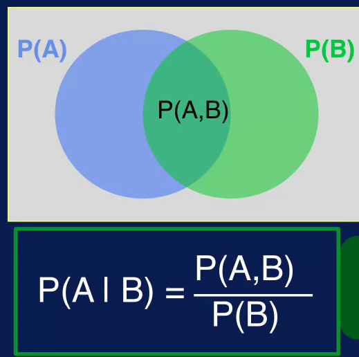
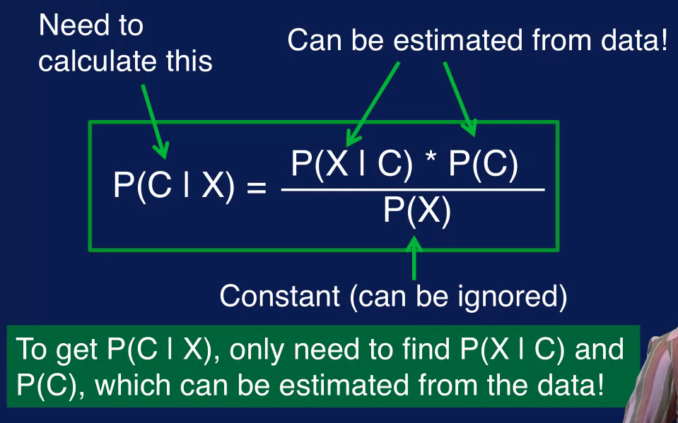

# Week 3: Classification

# Classification

Classification is one type of machine learning problems. In the classification problem, the input data is presented to the machine learning model and the task is to predict the target corresponding to the input data. The target is a categorical variable, so the classification task is to predict the category or label of the target given the input data.

For example, the input data can consist of measurements like temperature, relative humidity, atmospheric pressure, wind speed, wind direction, etc. So, given specific values for temperature, relative humidity, atmospheric pressure, etc., the task for the model is to predict if the weather will be sunny, windy, rainy, or cloudy for the day.

Since a target is provided, we have labeled data and so classification is a supervised task. Recall that in a supervised task, the target or desired output for each sample is given. Note that the target variable goes by many names such as target, label, output, class variable, category, and class.

A classification problem can be binary or multi-class. With binary classification the target variable has two possible values, for example yes and no. With multi-class classification the target variable has more than two possible values. For example, the target can be short, medium and tall. Multi-class classification is also referred to multinomial or multi-label classification.

## Building and Applying a Classification Model

A machine learning model is a mathematical model. In the general sense, this means that the model has parameters and uses equations to determine the relationship between its inputs and outputs. The parameters are used by the model to modify the inputs to generate the outputs. The model adjusts its parameters in order to correct or refine this input, output relationship. It maps input values to output values. And it adjusts the parameters in order to correct or refine this input-output mapping. The parameters of a machine learning model are adjusted or estimated from the data using a learning algorithm.

This, in essence, is what is involved in building a model. This process is referred to by many terms, such as model building, model creation, model training and model fitting. In building a model, we want to adjust the parameters in order to reduce the model's error. In the case of supervised tasks, such as classification, this means getting the model's outputs to match the targets or desired outputs as much as possible.

Since the classification task is to predict the correct category or class, given the input variables, you can think of the classification problem visually as carving out the input space as regions corresponding to the different class labels. Boundaries are referred to as decision boundaries.

Building a classification then means using the data to adjust the model's parameters in order to form decision boundaries to separate the target classes. In general, building a classification model, as well as other machine learning models, involves two phases.

The first is the training phase, in which the model is constructed and its parameters adjusted using as what referred to as training data. Training data is the data set used to train or create a model. In a training phase, the learning algorithm uses the training data to adjust the model's parameters to minimize errors. At the end of the training phase, you get the trained model.

The second is the testing phase. This is where the learned model is applied to new data. That is, data not used in training the model. In the testing phase, the trained model is applied to test data. Test data is separate from training data and is previously unseen by the model. The model is then evaluated on how it performs on the test data.

# Classification Algorithms

There are many algorithms to build a classification model. In this course, we will cover the following algorithms, kNN or k Nearest Neighbors, decision tree, and naive Bayes.

## kNN

kNN stands for k Nearest Neighbors. This technique relies on the notion that samples with similar characteristics, that is samples with similar values for input, likely belong to the same class. So classification of a sample is dependent on the target values of the neighboring points.

The basic idea is to classify a sample based on its neighbors. So when you get a new sample, the class label for that sample is determined by looking at the labels of its neighbors. KNN relies on the notion of the so-called duck test. That is if it looks like a duck, swims like a duck and quacks like a duck, then it probably is a duck. In the classification context, this means that samples with similar input values likely belong to the same class. So, samples with similar input values should be labeled with the same target label. This means that classification of a sample is dependent on the target labels of the neighboring points.

Given a new sample, look for the samples in the training data that are closest to the new sample. These are the neighbors. Use the labels of this neighboring points to determine the label for the new sample.

This figure illustrate how kNN works. The problem here is to determine if a sample should be classified as a blue square or red triangle. The green circle is the new sample. To determine a class label for this new sample, look at its closest neighbors. These neighbors are the samples within the dashed circle. Two blue squares and one red triangle. The class labels of the neighboring samples determine the label for the new sample.

The value of k determines the number of nearest neighbor to consider. So if k equals 1, then only the closest neighbor is examined to determine the class of the new sample as shown in the left figure. If k equals 2, then the 2 nearest neighbors are considered as seen in the middle figure. If k equal 3, then the 3 nearest neighbors are considered. If k equal 1 and only 1 neighbor is used, then the label for the new sample is simpler the label of the neighbor. When multiple neighbors are considered, then a voting scheme is used. Majority of vote is commonly used, so the label associated with the majority of the neighbors is used as the label of the new sample.

With two neighbors labeled as A and one as B, the majority of vote determines that the new sample should be labeled as A. In case of a tie which could be possible if the value of k is even, then some tight breaking rule is needed. For example, the label of the closer neighbor is used or the label is chosen randomly among the neighbors.

With kNN, some measure of similarity is needed to determine how close two samples are together. This is necessary to determine which samples are the nearest neighbors. Distance measures such as distance are commonly used. Other distance measures that can be used, include Manhattan and hemming distance.

kNN is a very simple classification technique. Note that there is no separate training phase. There is no separate part where a model is constructed and its parameter is adjusted. This is unlike most other classification algorithms. KNN can generate complex decision boundaries allowing for complex classification decisions to be made. It can be susceptible to noise,however, because classification decisions are made using only information about a few neighboring points instead of the entire dataset. KNN can be slow, however, since the distance between a new sample and all sample points in the data must be calculated in order to determine the k-Nearest Neighbors.

## Decision Tree

A decision tree is a classification model that uses a treelike structure to represent multiple decision paths. Traversing each path leads to a different way to classify an input sample. The idea behind decision trees for classification is to split the data into subsets where each subset belongs to only one class. This is accomplished by dividing the input space into pure regions, that is regions with samples from only one class.

With real data completely pure subsets may not be possible. So the goal is to divide the data into subsets that are as pure as possible. That is each subset contains as many samples as possible from a single class.

Graphically this is equivalent to dividing the input space into regions that are as pure as possible. Boundaries separating these regions are called decision boundaries. And the decision tree model makes classification decisions based on these decision boundaries.

A decision tree is a hierarchical structure with nodes and directed edges. The node at the top is called the root node. The nodes at the bottom are called the leaf nodes. Nodes that are neither the root node or the leaf nodes are called internal nodes. The root and internal nodes have test conditions, each leaf node has a class label associated with it.

A classification decision is made by traversing the decision tree starting with the root node. At each node the answer to the test condition determines which branch to traverse to. When a leaf node is reached the category at the leaf node determines the classification decision.

The depth of a node is the number of edges from the root node to that node. The depth of the root node is 0. The depth of a decision tree is the number of edges in the longest path from the root node to the leaf node. The size of a decision tree is the number of nodes in the tree.

A decision tree is built by starting with all samples at a single node, the root node. Additional nodes are added when the data is split into subsets. At a high level, constructing a decision tree consists of the following steps.

1. Start with all samples at a node
2. Partition the samples into subsets based in the input variables. The goal is to create subsets of records that are purest, that is each subset contains as many samples as possible, belonging to just one class.
3. Repeatedly partition data into successively purer subsets until some stopping criterion is satisfied.

An algorithm for constructing a decision tree model is referred to as an induction algorithm. So you may hear the term tree induction used to describe the process of building a decision tree.

Note that at each split the induction algorithm only considers the best way to split that particular portion of the data. This is referred to as a greedy approach. Greedy algorithms solve a subset of the problem at a time, and as a necessary approach when solving the entire problem is not feasible. This is the case with decision trees. It is not feasible to determine the best tree given a data set, so the tree has to be built in piecemeal fashion by determining the best way to split the current node at each step. And combining these decisions together to form the final decision tree.

Therefore, we need a way to measure the purity of a split in order to compare different ways to partition a set of data. It turns out that it works out better mathematically if we measure the impurity rather than the purity of a split. So the impurity measure of a node specifies how mixed the resulting subsets are. Since we want the resulting subsets to have homogeneous class labels, not mixed class labels, we want the split that minimizes the impurity measure.

A common impurity measure used for determining the best split is the Gini Index. The lower the Gini Index the higher the purity of the split. So the decision tree will select the split that minimizes the Gini Index. Besides the Gini Index, other impurity measures include entropy, or information gain, and misclassification rate.

The other factor in determining the best way to partition a node is which variable to split on. The decision tree will test all variables to determine the best way to split a node using a purity measure such as the Gini index to compare the various possibilities.

Recall that the tree induction algorithm repeatedly splits nodes to get more and more homogeneous subsets. So when does this process stop? When does the algorithm stop growing the tree? There's several criteria that can be used to determine when a node should no longer be split into subsets.

The induction algorithm can stop expanding a node when all samples in the node have the same class label. This means that this set of data is as pure as possible, and further splitting will not result in any better partition of the data. Since getting completely pure subsets is difficult to achieve with real data, this stopping criterion can be modified. To when a certain percentage of the samples in the node, say 90% for example, have the same class labels.

The algorithm can stop expanding a node when the number of samples in the node falls below a certain minimum value. A this point the number of samples is too small to make much difference in the classification results with the further splitting.

The induction algorithm can stop expanding a node when the improvement in impurity measure is too small to make much of a difference in classification results.

The algorithm can stop expanding a node when the maximum tree depth is reached. This is to control the complexity of the resulting tree.

You may have noticed that the decision boundaries of a decision tree are parallel to the axes formed by the variables, this is referred to as being rectilinear. The boundaries are rectilinear because each split considers only a single variable. There are variance of the tree induction algorithm that consider more than one attribute when splitting a note. However, each split has to consider all combinations of combined variables and so such induction algorithms are much more computationally expensive.

There are a few important things to note about the decision tree classifier.

The resulting tree is often simple to understand and interpret. This is one of the biggest advantages of decision trees for classification. It is often possible to look at the resulting tree to see which variables are important to the classification problem and understand how the classification is performed. For this reason, many people will start out with the decision tree classifier to get a feel for the classification problem. Even if they end up using more sophisticated models later on.

The tree induction algorithm as described in this lesson is relatively computationally inexpensive. So training a decision tree for classification can be relatively fast.

The greedy approach used by tree induction algorithm determines the best way to split the portion of the data at a node but does not guarantee the best solution overall for the entire data set.

Decision boundaries are rectilinear. This can limit the expressiveness of the resulting model which means that it may not be able to solve complicated classification problems that require more complex decision boundaries to be formed.

In summary, the decision tree classifier uses a tree like structure to specify a series of conditions that are tested to determine the class label for a sample.

## Naive Bayes

A naive Bayes model uses a probabilistic approach to classification. Baye's Theorem is used to capture the relationship between the input data and the output class. Simply put, the Baye's Theorem compares the probability of an event in the presence of another event.

What this means is that the relationships between the input features and the class is expressed as probabilities. So given the input features for a sample, the probability for each class is estimated. The class with the highest probability then, determines the label for the sample. In addition to using a probabilistic framework for classification, the Naive Bayes classifier also uses what is known as Bayes' theorem. The application of Bayes' theorem makes estimating the probabilities easier.

Naive Bayes assumes that the input features are statistically independent of one another. This means that, for a given class, the value of one feature does not affect the value of any other feature. This independence assumption is an oversimplified one that does not always hold true, and so is considered a naive assumption. The naive independence assumption and the use of Bayes theorem gives this classification model its name.

### Probability

Probability is the measure of how likely an event is, the probability of an event A occurring is denoted P and in parenthesis A. It is calculated by dividing the number of ways event A can occur, by the total number of possible outcomes.

There's also a joint probability, the joint probability specifies the probability of event A and event B occurring together. The joint probability of A and B is denoted, P(A,B) for an example of joint probability.

If the two events are independent, then the joint probability is simply the result of multiplying the probabilities of the individual events together. In this case then, we have the probability of rolling a six for each die is one over six so the joint probability is one over 36, this leads us to conditional probability

The conditional probability is the probability of event A occurring Given that event B has already occurred. Another way to say this is that event A is conditioned on event B. The conditional probability is the noted P and in parentheses A, vertical line B and is read as, probability of A Given B.

As before, the blue circle is the probability of event A occurring, the green circle is the probability of event B occurring. The overlap is a joint probability of A and B. The conditional probability, P(A given B) then is calculated as the join probability divided by the probability of B. The conditional probability is an important concept in classification as we will see later. It provides the means to specify the probability of a class label, given the input values.

The relationship between conditional probabilities P of B given A and P of A given B can be expressed through Bayes' Theorem. This theorem is named after a reverend named Thomas Bayes who lived in the 1700s. It is a way to look at how the probability of a hypothesis is affected by new evidence gathered from data. Bayes' theorem expresses the relationship between probability of B given A and probability of A given B as shown in this equation

### Probabilistic Classification

With the probabilistic framework the classification task is defined as follows.

Capital X is the set of values for the input features in the sample, given a sample with features X, predict the corresponding class C.

Another way to state this is, what is the class label associated with the feature vector X or how should the feature vector x be classified? To find the class label C we need to calculate the conditional probability of class C, given X for all classes and select a class with the highest probability.

So for classification, we want to find the value of C that maximizes the probability of C given X. The problem is that it is difficult to estimate this probability, because we would need to enumerate every possible combination of feature values and to know the conditional probability. The classification problem can be reformulated using Bayes' theorem to simplify the classification problem. Specifically, using Bayes' theorem, the probability of c given x, can be expressed using other probability quantities, which can be estimated from the data.

Probability of C I X is referred to as the posterior probability since it is the probability of the class label being C after observing input features X. 

Probability of X given C is the probability of observing input features X given that c is the class label. This is the class conditional probability since it is conditioned on the class.

Probability of c is the probability of the class label being C, this is the probability of each class prior to observing any input data. And so is referred to as the prior probability.

The probability of X is the probability of observing input features X regardless of what the class label is.

So for classification we want to calculate the posterior probability P(C | X) for each class C. From Bayes' theorem P(C | X) is related to the P(X | C) P(C And probability of X. Probability of X does not depend on the class C, therefore, it is a constant value, given the input X. Since it the same value for all classes, the probability of X can be removed from the calculation of probability of C, given X.

So estimating the probability of C given X boils down to estimating the probability of X given C and probability of C. The nice thing is that probability of X given C and probability of C can be estimated from the data. So now we have a way to calculate probably of C given X which is what we need for classification.

To the estimate the probability of C which is the probability of the class of C before observing any input data. We simply calculate the fraction of samples with that class label C in the training data.

For this example, there are four samples labeled as green circles out of 10 samples, so probability of green circle is 4 out of 10, or 0.4. Similarly, the fraction of samples labeled as red triangles is 6 out of 10, or 0.6. So estimating the prior probabilities is a simple count of number of samples with each class label divided by the total number of samples in the training data center.

In estimating probability of X given C which is the probability of observing feature factor X given that the class is C, we can use the independent assumption to simplify the problem.

The Independence Assumption of the Naive Bayes classifier assumes that each feature X sub I in the featured vector X is conditionally independent of every other feature, given the class C. This means that we only need to estimate the probability of X sub i given C, instead of having to estimate the probability of the entire feature X given C. For every combination of values for the features in X then we would simply multiply these individual probabilities together to get the probability of the entire feature vector X. Given the class C to estimate the probability of X sub I, given C, we count up the number of times a particular input value is observed for the class c in the training data.

For example, the number of times that we see the value of yes for the future home owner, when the class label is no it's three as indicated by the green arrows. This is divided by the number of samples with no as the class label which is seven. This fraction, three out of seven, is the probability that home owner is Yes given that the class is No. Similarly, the samples with the value of Single for the feature Marital Status when it crosses Yes are indicated by the red arrows. And the probability that Marital Status is Single, given that the class label is Yes is 2/3 or 0.67.

Some things to know about the Naive Bayes classification model are it is a fast and simple algorithm. The algorithm boils down to calculating counts for probabilities and performing some multiplication, so it is very simple to implement. And the probabilities that are needed can be calculated with a single scan of the data set and stored in a table.

Either two processing of the data is not necessary as with many other machine learning algorithms. So model building and testing of both task, it scales well. Due today independent assumption, the probability for each feature can be independently estimated. These means that featured probability is can be calculated in parallel, this also means that the data set size does not have to grow exponentially with a number of features. This avoids the many problems associated with the curse of dimensionality, this also means that you do not need a lot of data to build the model.

The number of parameters scales linearly with the number of features.

The Independence assumption does not hold true in many cases. In practice however, the Naive Bayes classifier still tends to perform very well this is because even though Naive Bayes may not provide good estimates of the correct class probabilities. As long as the correct class is more probable than any other class, the correct classification results will be reached.

The independence assumption also prevents the naive base classifier to model interactions between features which limits its classification power. The increased risk of smoking in a history of cancer would not be captured, for example. The Naive Bays classifier has been applied to many real world problems including spam filtering, document classification, and sentiment analysis.